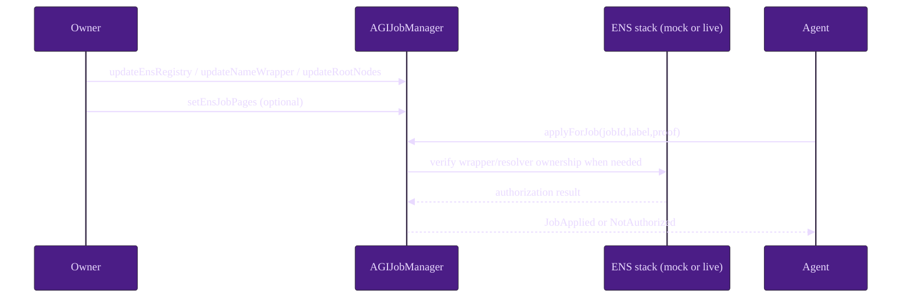
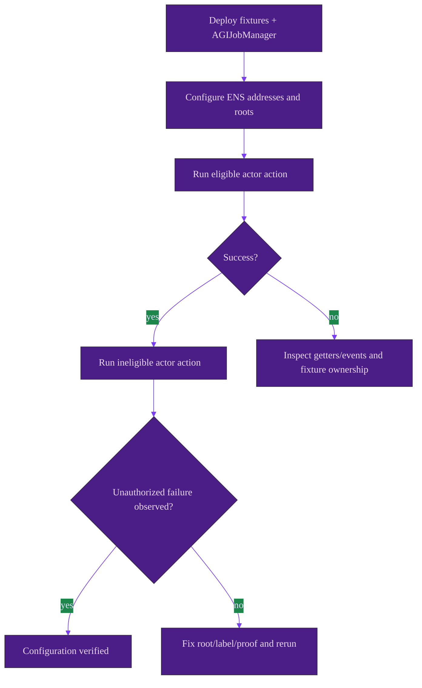

# ENS Integration Use Case (Canonical)

This is a deterministic operator walkthrough for ENS wiring, verification, and safe-failure validation.

## A) Local deterministic walkthrough (no external RPC)

This repository already contains deterministic local ENS fixtures and ENS-focused test suites:
- [`contracts/test/MockENS.sol`](../../contracts/test/MockENS.sol)
- [`contracts/test/MockNameWrapper.sol`](../../contracts/test/MockNameWrapper.sol)
- [`contracts/test/RevertingENSComponents.sol`](../../contracts/test/RevertingENSComponents.sol)
- [`test/ensLabelHardening.test.js`](../../test/ensLabelHardening.test.js)
- [`test/mainnetHardening.test.js`](../../test/mainnetHardening.test.js)
- [`test/invariants.libs.test.js`](../../test/invariants.libs.test.js)

### Step table

| Step | Actor | Action (function/script) | Preconditions | Expected outcome | Events/reads to verify |
| --- | --- | --- | --- | --- | --- |
| 1 | Operator | `npm run build` | Dependencies installed | Contracts compile cleanly | Successful compile output |
| 2 | Operator | `truffle test test/invariants.libs.test.js` | Local toolchain ready | ENS ownership library paths validated | Wrapper + resolver ownership assertions pass |
| 3 | Operator | `truffle test test/ensLabelHardening.test.js` | Same | Successful + failing ENS authorization behavior validated | Pass path succeeds, invalid label / unauthorized paths fail as expected |
| 4 | Operator | `truffle test test/mainnetHardening.test.js` | Same | ENS degradation paths validated | URI fallback and malformed/reverting target protections pass |
| 5 | Owner | Deploy/configure `AGIJobManager` (`updateEnsRegistry`, `updateNameWrapper`, `updateRootNodes`) | Escrow and bonds are zero | Identity wiring updated | `ens()`, `nameWrapper()`, root getters, update events |
| 6 | Owner | Optional `setEnsJobPages(address)` then `setUseEnsJobTokenURI(true/false)` | Hook target deployed | Hook target and URI mode configured | `ensJobPages()`, `EnsJobPagesUpdated`, minted `tokenURI` behavior |
| 7 | Eligible agent | `applyForJob(jobId,label,proof)` | Job open; identity conditions met | Agent assignment succeeds | `JobApplied` |
| 8 | Ineligible agent | `applyForJob(jobId,badLabel,proof)` | Same job conditions | Revert `NotAuthorized` (or `InvalidENSLabel` where applicable) | Failed tx with expected custom error |
| 9 | Owner | Optional `lockIdentityConfiguration()` | All identity wiring verified | Identity config permanently frozen | `lockIdentityConfig()==true`, `IdentityConfigurationLocked` |

### Happy path sequence diagram

### Configuration and verification flow

### Expected state checkpoints

1. **Post-deploy**: identity fields equal constructor inputs.
2. **Post-config**: getter values and update events match expected addresses/nodes.
3. **Authorization-pass**: eligible actor can execute ENS-gated action.
4. **Authorization-fail**: non-owner/non-proof actor reverts with `NotAuthorized` or `InvalidENSLabel` depending on input validity.
5. **Post-lock (optional)**: guarded setters revert with `ConfigLocked`.

## B) Testnet/mainnet operator checklist (no secrets)

### Preflight

1. Confirm chain ID, contract addresses, and multisig ownership.
2. Validate ENS Registry + NameWrapper contract addresses for target chain.
3. Precompute and peer-review root node constants and Merkle roots.
4. Confirm maintenance window where identity-config updates are safe (empty escrow required).

### Execution checklist

1. Read current state (`ens`, `nameWrapper`, roots, Merkle roots, lock flag).
2. If needed, submit owner transactions: `updateEnsRegistry`, `updateNameWrapper`, `updateRootNodes`, `setEnsJobPages`.
3. Run positive/negative role-gating checks with known addresses.
4. If using ENS URI mode, mint/settle a sample job and verify `NFTIssued` URI output.
5. Only then consider `lockIdentityConfiguration`.

### Robustness checks (required before lock)

- Intentionally test a misconfigured label/root and confirm safe `NotAuthorized` or `InvalidENSLabel` failure.
- Validate that settlement flows remain operational even if ENS hook target is unavailable.
- Confirm fallback policy (Merkle and allowlists) can admit intended participants.

### Locking checklist

- All identity addresses and root nodes verified on-chain.
- Emergency policy path (Merkle/allowlists/blacklists) tested.
- Stakeholders sign-off complete.
- Irreversibility acknowledged.

> **Operator note**
> Keep ENS integration as a policy enhancement, not a single point of operational liveness.
