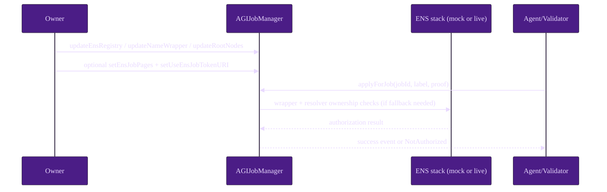
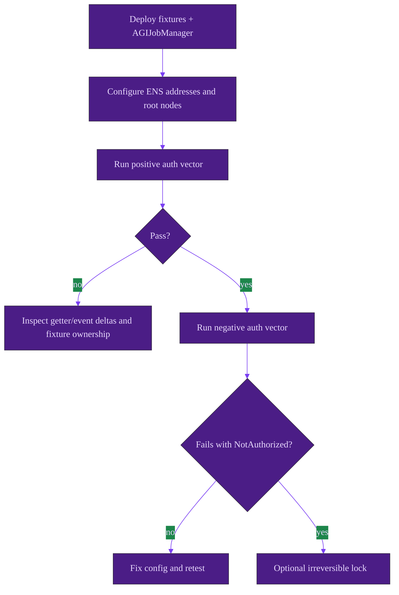

# ENS Integration Use Case (Canonical, Deterministic)

This walkthrough gives a complete setup and verification path for ENS integration with deterministic local execution plus production checklist discipline.

## A) Local deterministic walkthrough (no external RPC)

Local ENS fixtures already exist in this repo test suite (`MockENS`, `MockNameWrapper`, `MockResolver`, optional mock hooks). Use the existing Truffle harness under `test/`.

### Step table

| Step | Actor | Action (function/script) | Preconditions | Expected outcome | Events/reads to verify |
| --- | --- | --- | --- | --- | --- |
| 1 | Operator | `npm test -- test/adminOps.test.js` | Node deps installed; local chain from Truffle test harness | ENS wiring admin controls and lock behavior validated | `EnsRegistryUpdated`, `NameWrapperUpdated`, `RootNodesUpdated`, `IdentityConfigurationLocked` assertions |
| 2 | Operator | `npm test -- test/mainnetHardening.test.js` | Same | ENS hook + URI hardening and best-effort behavior validated | hook/URI assertions pass; no settlement-side regressions |
| 3 | Owner | Deploy AGIJobManager with initial ENS addresses and roots (repo deployment flow) | constructor args prepared | Contract starts with expected identity wiring | reads: `ens()`, `nameWrapper()`, root node getters |
| 4 | Owner | Optional: `setEnsJobPages(address)` and `setUseEnsJobTokenURI(bool)` | hook target deployed and reviewed | optional ENS pages/URI path enabled | read `ensJobPages()`, observe `NFTIssued` URI semantics |
| 5 | Eligible actor | `applyForJob(jobId, subdomain, proof)` or validator vote with valid identity | open job + role requirements | successful ENS-eligible action | `JobApplied` / validator vote event |
| 6 | Ineligible actor | same action with wrong label/ownership/proof | same business-state preconditions | fail-closed authorization | revert `NotAuthorized` |
| 7 | Owner | Optional `lockIdentityConfiguration()` | all wiring and negative tests complete | identity wiring permanently frozen | `lockIdentityConfig()==true`, `IdentityConfigurationLocked` |

### Happy path sequence diagram

### Configuration and verification flow

### Expected state checkpoints

1. **Checkpoint 1 (post-deploy):** `ens`, `nameWrapper`, root nodes match deployment parameters.
2. **Checkpoint 2 (post-config):** update events emitted and getter values match signed change set.
3. **Checkpoint 3 (positive auth):** eligible ENS owner succeeds in ENS-gated action.
4. **Checkpoint 4 (negative auth):** ineligible actor fails with `NotAuthorized`.
5. **Checkpoint 5 (optional lock):** identity rewiring setters revert due to `ConfigLocked`.

## B) Testnet/mainnet operator checklist (no secrets)

### Preflight checklist

1. Confirm chain ID, contract addresses, and owner/multisig controls.
2. Confirm ENS Registry and NameWrapper addresses for target network.
3. Verify root node constants and Merkle roots in a signed change request.
4. Confirm empty-escrow maintenance window for identity rewiring functions.
5. Prepare rollback plan (if unlocked) and fallback plan (Merkle + allowlists).

### Configuration steps

1. Read current state: `ens`, `nameWrapper`, root node getters, Merkle roots, `lockIdentityConfig`, `ensJobPages`.
2. Submit owner txs in minimal batches: `updateEnsRegistry`, `updateNameWrapper`, `updateRootNodes`, optional `setEnsJobPages`.
3. If enabling ENS URI mode, call `setUseEnsJobTokenURI(true)` only after hook target validation.

### Verification steps

1. Confirm emitted events: `EnsRegistryUpdated`, `NameWrapperUpdated`, `RootNodesUpdated`, optional `EnsJobPagesUpdated`.
2. Execute one known-good and one known-bad authorization vector.
3. If URI mode enabled, verify `NFTIssued` and `tokenURI(tokenId)` against expected behavior.

### Robustness checks (before lock)

- Intentionally test a wrong label/root scenario and confirm `NotAuthorized`.
- Validate settlement flow remains live when hook target is unset/reverting.
- Validate Merkle/allowlist fallback can onboard intended actors.

### Locking checklist (irreversible action)

- All identity wiring reads confirmed on-chain.
- Positive/negative authorization vectors pass as expected.
- Emergency fallback controls tested and documented.
- Multisig governance sign-off recorded.
- Execute `lockIdentityConfiguration()` only after explicit acknowledgement of irreversibility.

> **Safety warning**
> If locked too early, identity wiring cannot be modified in-place. Maintain a migration runbook before locking.
