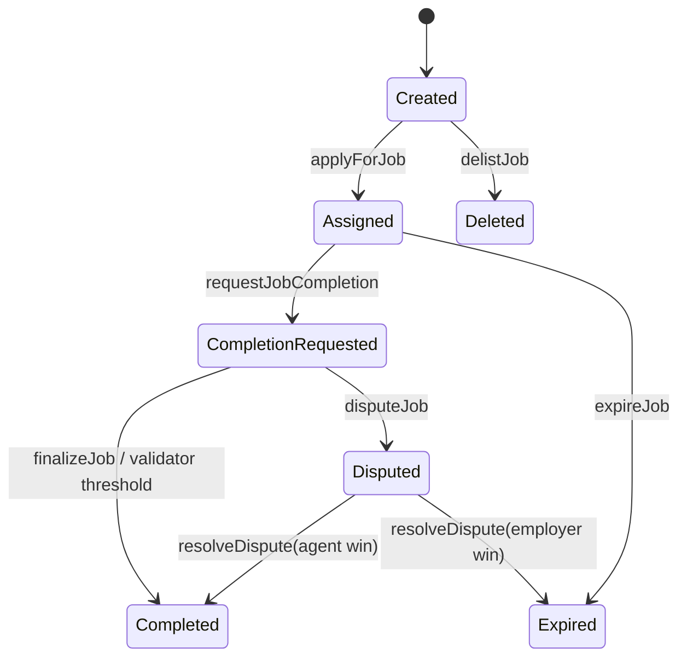
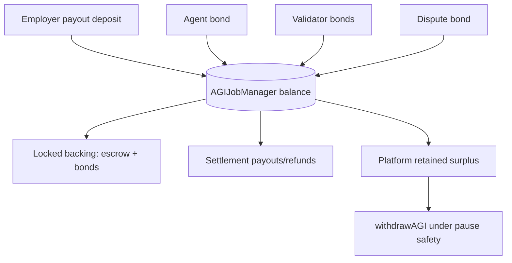
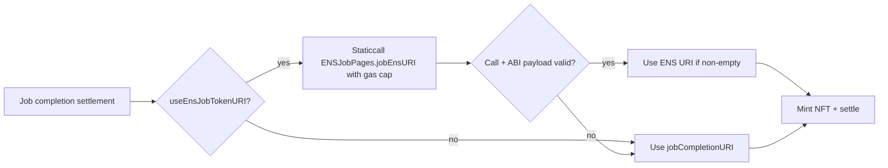

# Mainnet Operations Runbook (Business-Operated Deployment)

## Explicit mainnet assumptions

- **Production AGI token**: `AGIALPHA` at `0xa61a3b3a130a9c20768eebf97e21515a6046a1fa`.
- **Token behavior assumption**: OpenZeppelin-standard ERC20 exact transfer semantics (no fee-on-transfer, no rebasing).
- **Operational dependency**: token-level pause on `AGIALPHA` must be **unpaused** for normal protocol operations.
- **ENS integration model**: ENS hooks and ENS ownership checks are best-effort mirrors; settlement and escrow correctness must not depend on ENS call success.

## Deploy day sequence

1. Deploy `ENSJobPages`.
2. Deploy `AGIJobManager` with final constructor config (token + ENS registry + NameWrapper + roots + Merkle roots).
3. Wire contracts:
   - `setEnsJobPages(ENSJobPages)`
   - `setUseEnsJobTokenURI(false)` initially (enable only after hook smoke tests).
4. Configure governance/ops:
   - moderators
   - additional agents/validators (if used)
   - validator/agent bond parameters
   - validator threshold parameters
   - AGI types (ERC721 contracts + payout percentages)
5. Configure identity gating roots (Merkle and ENS roots).
6. Smoke test all lifecycle actions with small payout jobs.
7. Verify contracts on Etherscan + confirm bytecode-size gate.
8. Transfer ownership to multisig (`transferOwnership`) and archive signer runbook.
9. Call `lockIdentityConfiguration()` only after ENS / token / root wiring is fully verified.
10. Unpause rollout:
    - keep `settlementPaused=false`
    - `unpause()` execution flows
    - optionally enable `setUseEnsJobTokenURI(true)` after ENS URI checks.

## Post-deploy verification checklist

- Constructor addresses match signed deployment plan.
- `withdrawableAGI()` is non-negative and escrow-backed invariants hold.
- `scripts/check-contract-sizes.js` passes and runtime bytecode is under EIP-170.
- Ownership is multisig-held and emergency signers tested.
- ENS hooks produce expected events without blocking settlement.

## Incident response

### Pause / unpause

- `pause()` for emergency entry freeze and admin-safe treasury actions.
- Keep `settlementPaused=false` when you need participants to settle/finalize during pause windows.
- Use `setSettlementPaused(true)` only for full settlement freeze incidents.
- Recovery order: diagnose root cause -> revert unsafe config -> `setSettlementPaused(false)` -> `unpause()`.

### Rescue functions

- `rescueETH(amount)` exists to recover forced ETH (for example via `selfdestruct`) and forwards to `owner()`.
- `rescueToken(token, data)` is an owner-only low-level emergency path for **non-AGI** tokens only; it rejects `agiToken` directly and validates return data so broken ERC20 integrations fail closed.
- AGI treasury recovery remains `withdrawAGI(amount)` only, with `whenPaused` + `whenSettlementNotPaused` + `withdrawableAGI()` escrow-solvency enforcement.

### Disable AGI types safely

- Use `setAGITypeStatus` / AGI type update controls to disable compromised NFT dependencies.
- Do not change payout percentages in a way that violates validator reward headroom constraints.

## Admin function safety matrix

| Function | Safe during normal ops | Safe during pause | Notes |
| --- | --- | --- | --- |
| `pause` / `unpause` | Yes | Yes | Primary incident toggle. |
| `setSettlementPaused` | Yes (careful) | Yes | Freezes/unfreezes settlement path. |
| `withdrawAGI` (AGI only) | No | Yes (only if settlement not paused) | Treasury path for AGI surplus only. |
| `rescueETH` / `rescueToken` | Yes (owner only) | Yes | Never use with `agiToken`; AGI must use `withdrawAGI` safeguards. |
| `lockIdentityConfiguration` | One-way | One-way | Finalize only after full config verification. |

## Recommended parameter ranges (mainnet)

| Parameter | Recommended range | Rationale |
| --- | --- | --- |
| `requiredValidatorApprovals` | 2-5 | Small enough for liveness, large enough for confidence. |
| `requiredValidatorDisapprovals` | 2-5 | Match approvals to reduce asymmetry. |
| `voteQuorum` | >= max(approvals, disapprovals) | Prevent low-participation outcomes. |
| `validationRewardPercentage` | 5-15% | Keeps validator incentives healthy without starving agent payout. |
| `completionReviewPeriod` | 1-7 days | Gives validators reaction window. |
| `disputeReviewPeriod` | 3-21 days | Moderator liveness + evidence window. |
| Agent/validator bond bps | 100-2000 bps | Enough economic skin-in-game without hurting participation. |

## Job lifecycle state machine



## Funds flow



## ENS hook best-effort flow




## Emergency operations flowchart

```mermaid
flowchart TD
    A[Detect incident] --> B{Need full freeze?}
    B -- Yes --> C[setSettlementPaused(true)]
    B -- No --> D[pause()]
    C --> E[Diagnose + patch config]
    D --> E
    E --> F{Foreign assets trapped?}
    F -- None/unsupported --> I[Skip rescue]
    I --> J[Verify escrow solvency + withdrawableAGI]
    J --> K[setSettlementPaused(false)]
    K --> L[unpause and monitor]
```
