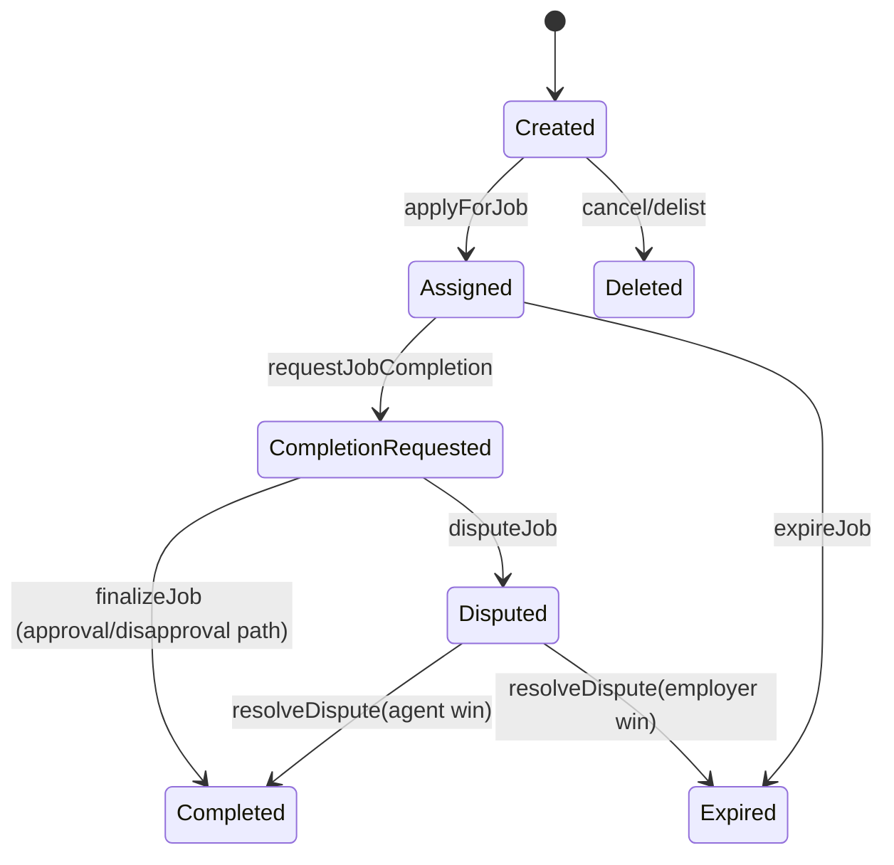
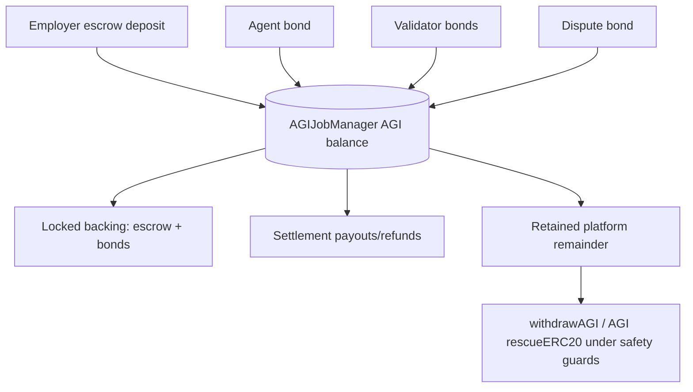

# Mainnet Operations (Institutional Runbook)

## Mainnet context (current production assumptions)

- **AGIALPHA token**: `0xa61a3b3a130a9c20768eebf97e21515a6046a1fa`.
- **Token semantics**: OpenZeppelin-style ERC20 exact-transfer accounting (no fee-on-transfer, no rebasing).
- **Operational dependency**: AGIALPHA token-level pause must be **unpaused** for day-to-day create/apply/settlement flows.
- **ENS posture**: ENS checks and ENS job-page hooks are **best-effort only**. Settlement correctness and liveness must not depend on ENS success.
- **Completion NFT minting**: uses direct `_mint` to preserve EIP-170 bytecode headroom; contract employers without `IERC721Receiver` support may custody NFTs manually.

---

## Deploy-day runbook

### 1) Deploy and verify prerequisites

1. Deploy (or confirm) ENS dependencies used by your integration (ENS registry, NameWrapper, resolver addresses).
2. Deploy optional ENS mirror (`ENSJobPages`) if used.
3. Deploy `AGIJobManager` with constructor args:
   - `agiTokenAddress`
   - `baseIpfs`
   - `[ensAddress, nameWrapperAddress]`
   - `[clubRootNode, agentRootNode, alphaClubRootNode, alphaAgentRootNode]`
   - `[validatorMerkleRoot, agentMerkleRoot]`

Expected: contract deployment succeeds and emits the standard ERC721 initialization behavior.

### 2) Post-deploy owner configuration calls (in order)

1. `setEnsJobPages(<ensJobPages | 0x0>)`
2. `setUseEnsJobTokenURI(false)` initially
3. add operators:
   - `addModerator(...)`
   - `addAdditionalAgent(...)` / `addAdditionalValidator(...)` as emergency backstops
4. economic params:
   - `setRequiredValidatorApprovals(...)`
   - `setRequiredValidatorDisapprovals(...)`
   - `setVoteQuorum(...)`
   - bond/slash/review period setters as required
5. identity params:
   - root-node and Merkle-root setters
6. `addAGIType(<erc721>, <payoutPct>)`
7. run smoke test lifecycle (small payout)
8. if ENS mirror behavior is clean: `setUseEnsJobTokenURI(true)`
9. transfer ownership to multisig: `transferOwnership(<multisig>)`
10. permanently freeze identity wiring once validated: `lockIdentityConfiguration()`

### 3) Smoke-test lifecycle checklist

Execute: create -> apply -> request completion -> vote -> finalize, then assert:

- `JobCompleted` and `NFTIssued` are emitted.
- locked accounting returns to expected post-settlement values.
- `withdrawableAGI()` remains consistent with `balance - lockedTotals`.

### 4) Release gates before enabling production traffic

- Bytecode size gate passes (`node scripts/check-contract-sizes.js`).
- Test suite passes (`npm test`).
- Etherscan verification complete and constructor args archived.
- Owner is a production multisig (not EOA).

---

## Roles and administrative functions

| Function | Role | Safety posture | Notes |
| --- | --- | --- | --- |
| `pause` / `unpause` | Owner | Critical | Pausable controls user entry and vote paths. |
| `setSettlementPaused` | Owner | Critical | Freezes settlement exits when needed. |
| `withdrawAGI` | Owner | Paused-only + settlement-not-paused | Withdraws only non-escrow AGI backing (`withdrawableAGI`). |
| `rescueETH` | Owner | NonReentrant | Recovers forced ETH (e.g., selfdestruct dust). |
| `rescueERC20` (AGI) | Owner | Same safety posture as treasury path | Enforces pause + settlement-not-paused + `amount <= withdrawableAGI()`. |
| `rescueERC20` (non-AGI) | Owner | NonReentrant | Recover unrelated ERC20s accidentally sent to contract. |
| `rescueToken` | Owner | NonReentrant | Generic calldata rescue for non-AGI assets (e.g., ERC721/ERC1155). |
| `lockIdentityConfiguration` | Owner | One-way | Permanently locks token/ENS/root-node identity wiring. |

---

## Parameter guide (recommended ranges + invariants)

| Parameter | Suggested range | Invariant / rationale |
| --- | --- | --- |
| `requiredValidatorApprovals` | 2-5 | Keep validator threshold reachable for liveness. |
| `requiredValidatorDisapprovals` | 2-5 | Keep symmetric with approvals. |
| `voteQuorum` | >= max(approvals, disapprovals) | Avoid low-participation finality. |
| `validationRewardPercentage` | 5-15% | Incentivize validators while preserving agent payout headroom. |
| `completionReviewPeriod` | 1-7 days | Time for validator participation. |
| `disputeReviewPeriod` | 3-21 days | Time for moderator evidence review. |
| Agent/validator bond params | risk-adjusted | Keep participation viable while pricing malicious behavior. |

Hard safety invariant:

`AGI balance >= lockedEscrow + lockedAgentBonds + lockedValidatorBonds + lockedDisputeBonds`

---

## Incident response

### Pause semantics

- `pause()` blocks new user-flow actions.
- `setSettlementPaused(true)` blocks settlement/finalization paths guarded by `whenSettlementNotPaused`.
- Use `pause()` alone when you want to freeze ingress but allow settlement exits.

### ENS degradation runbook

If ENS mirror or ENS ownership infrastructure degrades:

1. Keep core settlement active unless token economics are at risk.
2. Disable mirror URI mode: `setUseEnsJobTokenURI(false)`.
3. Continue operations using allowlists (`additionalAgents`/`additionalValidators`) and/or Merkle roots.
4. Repair ENS infra off-path; re-enable URI mode only after smoke testing.

### Rescue procedure

1. Confirm escrow solvency invariant.
2. For forced ETH dust: call `rescueETH(amount)`.
3. For non-AGI ERC20: call `rescueERC20(token, to, amount)`.
4. For AGI treasury recovery: ensure `pause()==true`, `settlementPaused==false`, then call `rescueERC20(agiToken, to, amount)` or `withdrawAGI(amount)`.
5. For accidentally sent NFTs/multi-tokens: use `rescueToken` with explicit calldata.

---

## Diagrams

### Job lifecycle (state machine)



### Funds flow



### ENS hook flow (best effort)

```mermaid
flowchart LR
    S[Settlement path] --> U{useEnsJobTokenURI}
    U -- false --> D[Use jobCompletionURI]
    U -- true --> H[Gas-capped staticcall to ensJobPages.jobEnsURI(jobId)]
    H --> V{ABI payload valid?}
    V -- yes --> E[Use ENS URI]
    V -- no --> D
    E --> M[Mint completion NFT + settle]
    D --> M
```

### Emergency operations flow

```mermaid
flowchart TD
    A[Incident detected] --> B{Freeze settlement?}
    B -- yes --> C[setSettlementPaused(true)]
    B -- no --> D[pause()]
    C --> E[Diagnose + remediate]
    D --> E
    E --> F{Rescue needed?}
    F -- yes --> G[Run rescue procedure]
    F -- no --> H[Skip rescue]
    G --> I[Verify solvency + smoke tests]
    H --> I
    I --> J[setSettlementPaused(false)]
    J --> K[unpause() + monitor]
```

---

## Build reproducibility note

`@openzeppelin/contracts` is pinned to `4.9.6` in `package.json` to avoid accidental OpenZeppelin v5 migration breakage (notably Ownable constructor behavior and import path differences).
