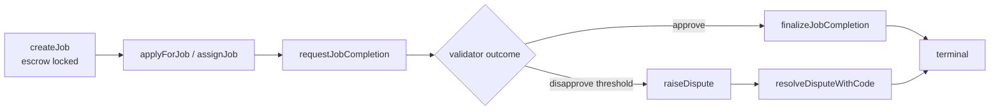
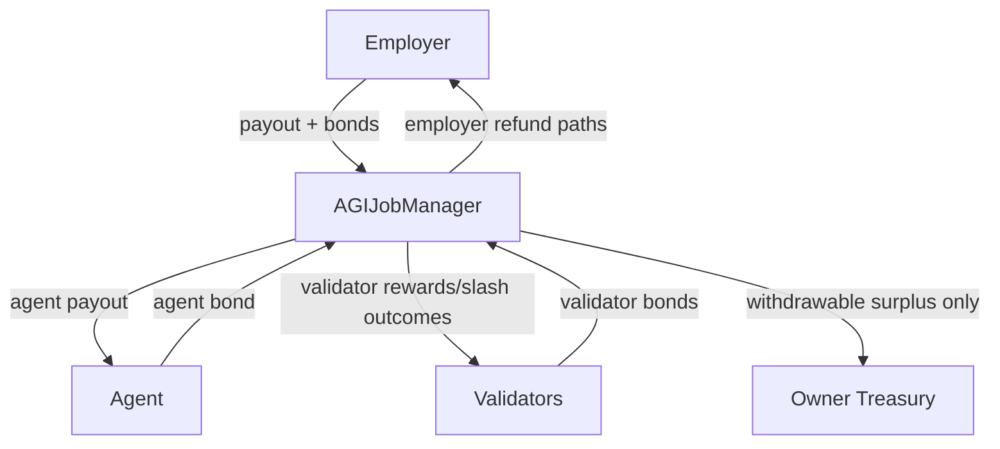
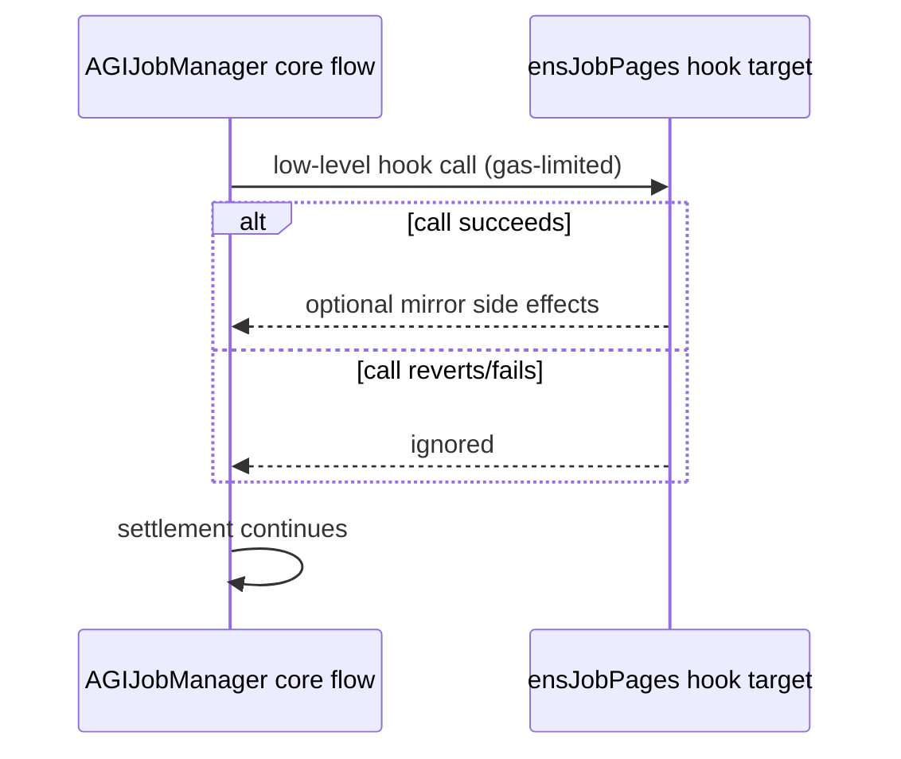
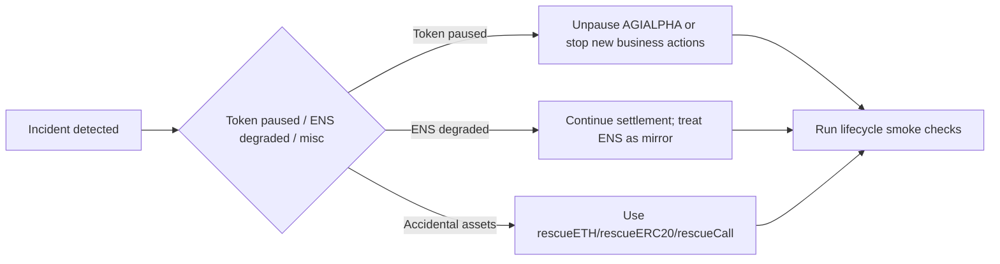

# MAINNET OPS (AGIJobManager)

## Production constants
- **Primary ERC20**: AGI ALPHA AGENT (`AGIALPHA`) at `0xa61a3b3a130a9c20768eebf97e21515a6046a1fa`.
- `AGIALPHA` is expected to behave as a standard ERC20 for transfers (no fee/rebase), but it is token-level **Pausable**.
- Operational dependency: keep `AGIALPHA` **unpaused** for normal escrow, bond, completion, and dispute settlement flows.

## Deploy + post-deploy checklist
1. Deploy `AGIJobManager` with production constructor wiring.
2. Verify runtime bytecode size is below EIP-170 guard (`< 24575`).
3. Configure operational parameters (validators, bond bounds, review windows, payout caps).
4. Configure ENS pointers if used (`ensJobPages`, roots, NameWrapper).
5. Smoke test lifecycle (create/apply/request/finalize and dispute path).
6. Transfer ownership to business-controlled multisig.

> Ownership transfer must remain available via standard OpenZeppelin `Ownable.transferOwnership` semantics.

## ENS operating model
- Treat ENS integrations as **best-effort mirrors** only.
- Lifecycle and settlement should continue even when ENS contracts are out-of-sync, reverting, or malformed.
- If ENS is degraded, continue core escrow operations and recover ENS alignment later.

### ENS degradation playbook
1. Confirm escrow lifecycle still works (create/apply/request/finalize/resolve).
2. Disable optional ENS tokenURI override mode if metadata fetches are unstable.
3. Keep processing settlements first; backfill ENS metadata/mirroring after incident.

## Rescue procedures
### 1) Rescue ETH
- Use `rescueETH(amount)` as owner.
- Intended for accidental ETH transfers to the contract.

### 2) Rescue arbitrary non-AGI tokens
- Use `rescueERC20(token, to, amount)` for normal ERC20s (`token != agiToken`).
- Use `rescueCall(target, data)` for odd token contracts (ERC721, ERC1155, non-standard tokens).
- `rescueCall` safety restrictions:
  - rejects `target == agiToken` (prevents escrow bypass),
  - rejects `target == address(this)` (prevents internal-call abuse),
  - rejects `target == address(0)`.

### 3) AGI token treasury extraction
- Do **not** use arbitrary calls against `agiToken`.
- Use pause-gated treasury controls (`withdrawAGI`) so locked escrow/bonds remain protected.

## Mermaid diagrams

### Job lifecycle

### Funds flow

### ENS hook flow (best-effort)

### Emergency ops

