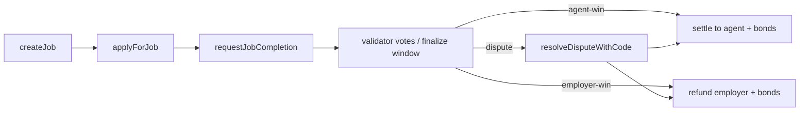
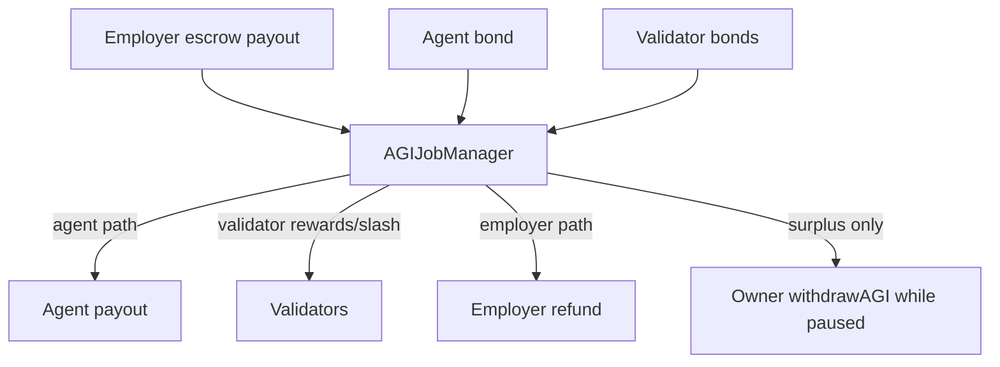
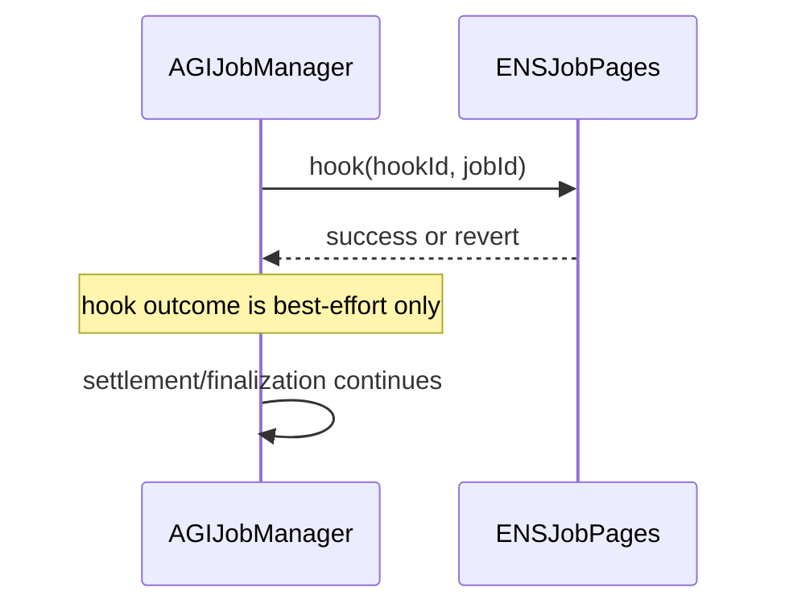

# AGIJobManager Mainnet Ops

## Mainnet constants
- Production AGI token: **AGI ALPHA AGENT (AGIALPHA)** at `0xa61a3b3a130a9c20768eebf97e21515a6046a1fa`.
- AGIALPHA is standard transfer semantics (no fee-on-transfer, no rebasing) but token-level pausable.
- If AGIALPHA is paused, escrow/bond/settlement flows can fail at token transfer boundaries.

## Deployment + post-deploy checklist
1. Deploy `AGIJobManager` with mainnet ENS/namewrapper/root settings.
2. Verify runtime bytecode size guard before shipping artifacts (`npm run size`).
3. Configure moderators, additional agents/validators, and payout/bond params.
4. Set ENS mirror integration (`ensJobPages`) only after validating external contract behavior.
5. Transfer ownership to operational multisig (Ownable `transferOwnership` remains available).
6. Keep `settlementPaused=false` during normal operation.

## ENS integration posture (best-effort)
- ENS hooks are telemetry/mirroring only.
- Settlement/finalization paths are designed to keep progressing when ENS hooks/retrieval fail.
- If ENS is misconfigured/out-of-sync, core escrow lifecycle remains canonical on AGIJobManager state/events.

## Degradation playbook (ENS issues)
- If ENS integration is unstable, disable ENS tokenURI override and/or set `ensJobPages` to `address(0)`.
- Continue using contract events/state as source of truth.
- Reconcile ENS mirror asynchronously after integration is repaired.

## Rescue procedures
- `rescueETH(amount)`: recover accidentally sent ETH to current owner.
- `rescueERC20(token, amount)`: recover non-AGI ERC20 to owner.
- `rescueCall(target,data)`: emergency escape hatch for odd token standards (ERC721/ERC1155/custom), blocked for `agiToken` and `address(this)`.
- AGI token treasury extraction must use `withdrawAGI` pause/solvency posture (escrow cannot be bypassed).

## Emergency operations
- Use `pause()` for broad safety stop.
- Use `setSettlementPaused(true)` only when settlement paths must be frozen.
- Keep an operator runbook entry for unpausing sequence after incident validation.







```mermaid
flowchart LR
  I[Incident detected] --> P[pause]
  P --> T[triage AGIALPHA pause / ENS / config]
  T --> R1[rescueETH/rescueERC20/rescueCall if needed]
  T --> R2[fix config and verify solvency]
  R2 --> U[unpause + setSettlementPaused(false)]
```

## Dependency pinning note
`@openzeppelin/contracts` is pinned to an exact version in `package.json` for reproducible builds and to avoid cross-major API drift (e.g., ownership constructor/semantics changes).
