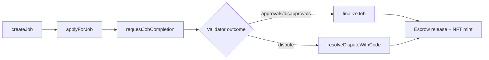
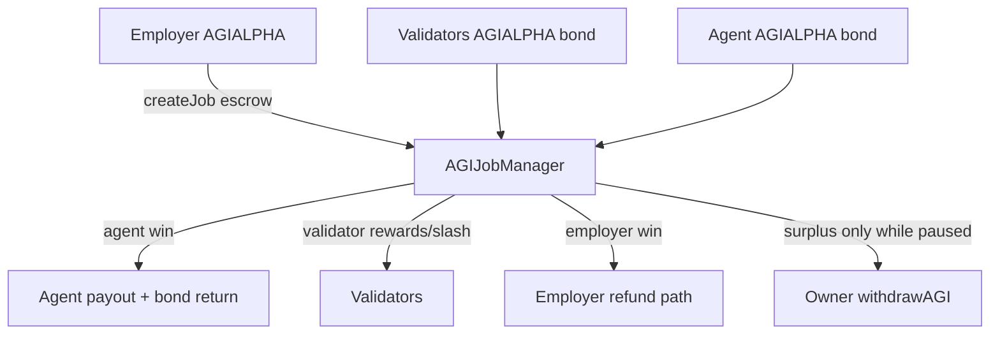
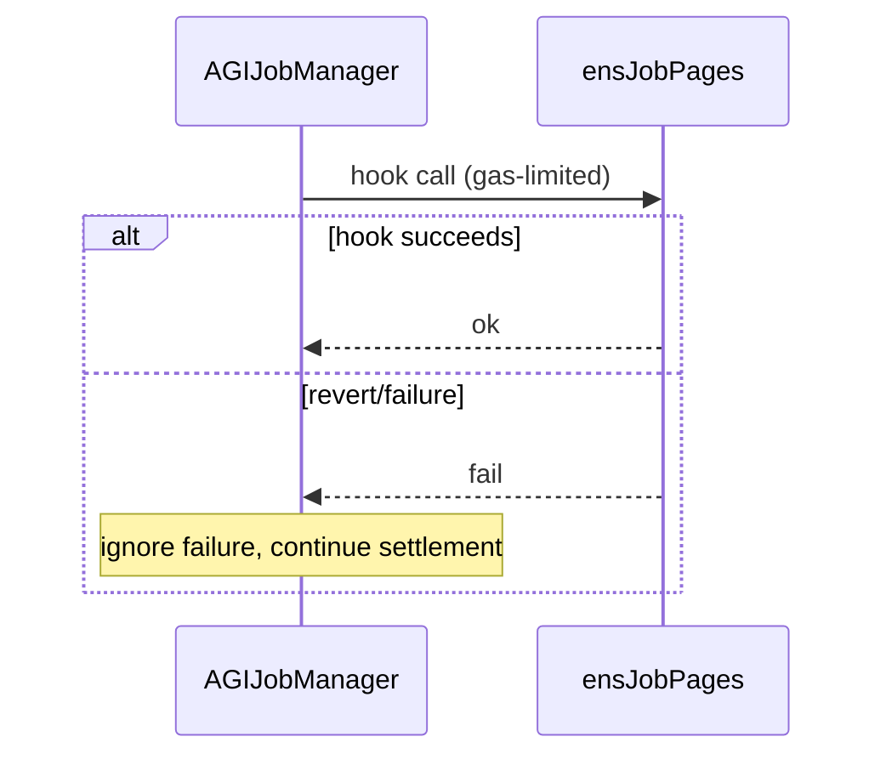
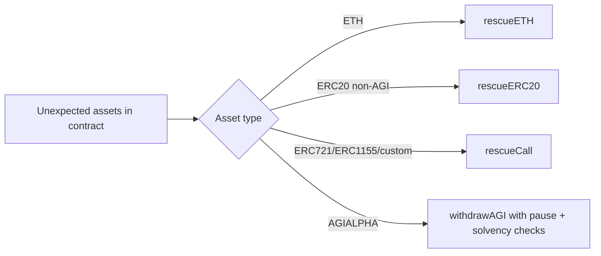

# AGIJobManager Mainnet Ops Runbook

## Production constants
- **Network:** Ethereum mainnet.
- **Production ERC20:** **AGI ALPHA AGENT (AGIALPHA)** at `0xa61a3b3a130a9c20768eebf97e21515a6046a1fa`.
- AGIALPHA transfer semantics are standard ERC20 (no fee/rebase), but token-level **pause** can block transfers.
- Operational requirement: keep AGIALPHA **unpaused** for normal escrow, bond, settlement, and withdrawal flows.

## Deploy + post-deploy checklist
1. Deploy `AGIJobManager` with mainnet wiring (AGIALPHA + ENS + NameWrapper + roots + Merkle roots).
2. Verify bytecode size guard before promotion (`AGIJobManager` runtime must remain `< 24575` bytes).
3. Smoke test lifecycle in production profile:
   - `createJob`
   - `applyForJob`
   - `requestJobCompletion`
   - `validateJob` / `disapproveJob`
   - `finalizeJob` or dispute path
4. Validate treasury controls:
   - `pause` / `unpause`
   - `withdrawAGI` (only while paused)
   - `rescueETH`, `rescueERC20` (non-AGI only), `rescueCall`
5. Transfer ownership to business operator multisig (recommended). `Ownable.transferOwnership` remains the canonical rotation path.

## ENS operational model (best effort)
- ENS hooks and ENS tokenURI overrides are **best-effort mirrors**.
- Settlement/finalization is intentionally tolerant of ENS breakage, malformed responses, or reverts.
- If ENS is unhealthy/out-of-sync:
  - keep core escrow workflow running,
  - continue settlements,
  - use fallback completion URI behavior,
  - repair ENS integration out-of-band.

## Emergency and recovery procedures
- **Forced ETH recovery:**
  - use `rescueETH(amount)` (owner-only).
- **Stray ERC20 (non-AGI):**
  - use `rescueERC20(token, amount)` (owner-only; always sends to `owner()`).
- **Odd token standards (ERC721/ERC1155/custom):**
  - use `rescueCall(target, data)` with encoded calldata.
  - safety guardrails reject `target == agiToken`, `target == address(this)`, and `target == address(0)`.
- **AGIALPHA reserve safety:**
  - `rescueERC20` cannot move AGIALPHA.
  - use `withdrawAGI` for treasury withdrawals under pause + solvency constraints.

## Degradation playbook
- Symptoms: ENS resolver failures, NameWrapper failures, ENS hook reverts, malformed ENS tokenURI returndata.
- Actions:
  1. Keep settlement open (do **not** block finalization solely due to ENS issues).
  2. Optionally disable ENS tokenURI mode (`setUseEnsJobTokenURI(false)`) until dependency recovers.
  3. Continue monitoring solvency and job completion throughput.
  4. Repair ENS infra independently and re-enable optional UX mirrors later.

## Mermaid diagrams

### 1) Job lifecycle

### 2) Funds flow

### 3) ENS hook flow (best effort)

### 4) Emergency ops

