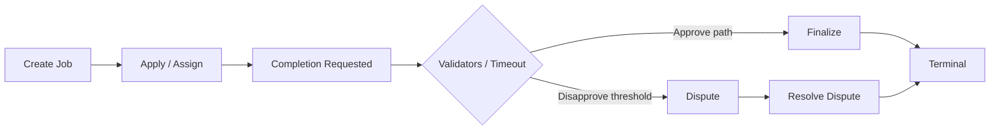
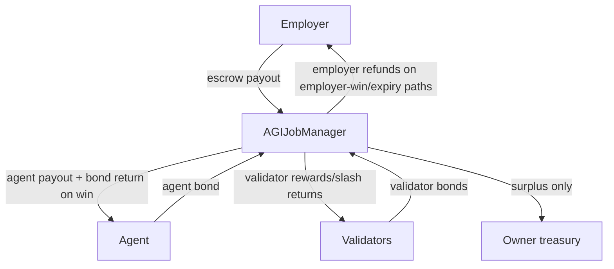
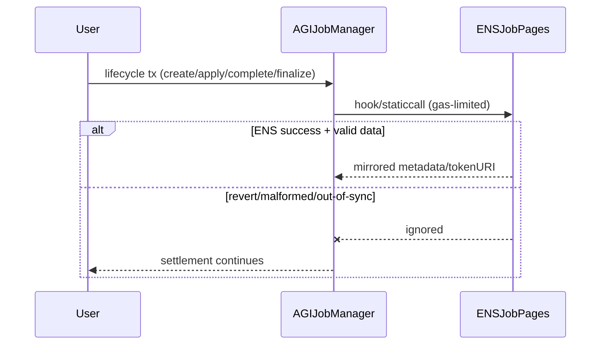

# AGIJobManager Mainnet Ops Runbook

## Mainnet constants
- **Network**: Ethereum mainnet.
- **Production AGIALPHA token**: `0xa61a3b3a130a9c20768eebf97e21515a6046a1fa`.
- **Operational dependency**: AGIALPHA must be **unpaused** for normal escrow, bond, payout, finalize, and dispute settlement flows.

## Post-deploy checklist
1. Verify deployed runtime bytecode is below EIP-170 cap (`< 24575` bytes).
2. Verify constructor wiring:
   - `agiToken` is AGIALPHA mainnet address.
   - ENS registry, NameWrapper, root nodes, and Merkle roots are expected values.
3. Transfer ownership to business operator multisig (recommended), keeping standard `Ownable.transferOwnership` semantics.
4. Configure operational params (validator thresholds, review windows, bond params) and then lock identity config when ready.
5. Run smoke lifecycle: create -> apply -> complete request -> validator/dispute path -> finalize.

## Settlement liveness model
- Settlement/finalization paths are designed to remain live even if ENS mirrors are broken, reverting, or out-of-sync.
- ENS integrations are best-effort indexing/mirroring hooks only.
- Only unavoidable AGIALPHA-level failures (for example token pause or transfer reverts) can block token transfers.

## ENS degradation playbook
1. If ENS hooks fail/revert, keep settlement live; do **not** block operations on ENS parity.
2. If ENS tokenURI override data is malformed, completion NFT minting falls back to the job completion URI.
3. If ENS ownership checks are degraded, authorization should continue via:
   - additional allowlists (`additionalAgents` / `additionalValidators`), and/or
   - Merkle allowlist proofs.
4. Restore ENS wiring later; no settlement replay is required for already-settled jobs.

## Recovery / rescue procedures
### ETH recovery
- Use `rescueETH(amount)` as owner to recover forced ETH (for example dust sent via `selfdestruct`).

### ERC20 recovery
- Use `rescueERC20(token, to, amount)` for accidental non-AGI tokens.
- AGIALPHA rescue remains constrained by treasury safety posture (same as withdraw path): do not drain escrow-backed funds.

### Arbitrary token recovery (ERC721/ERC1155/odd contracts)
- Use `rescueToken(target, calldata)` as owner with encoded token call data.
- On-chain guardrail: target cannot be `agiToken` (enforced by `rescueToken`).
- Operator preflight checks (recommended in runbooks/automation):
  - reject `address(this)` targets,
  - reject zero-address targets,
  - verify calldata selector/args match the intended token standard (ERC721/ERC1155/custom).

## Emergency controls
- `pause()` / `unpause()` for broad admin stop/start.
- `setSettlementPaused(bool)` to specifically gate settlement/finalization operations.
- Keep treasury withdrawals and rescue actions aligned with paused-state safety checks.

## Mermaid references
### Lifecycle


### Funds flow


### ENS hook flow (best-effort)


### Emergency ops
```mermaid
flowchart LR
  Alert[Incident detected] --> P{Need broad stop?}
  P -->|Yes| Pause[pause()]
  P -->|No| SP[setSettlementPaused(true)]
  Pause --> Triage[Triage root cause]
  SP --> Triage
  Triage --> ENSFix[Fix ENS/integration]
  Triage --> TokenFix[Ensure AGIALPHA unpaused]
  Triage --> Recover[Run rescue/recovery if needed]
  ENSFix --> Resume[Resume normal ops]
  TokenFix --> Resume
  Recover --> Resume
```
