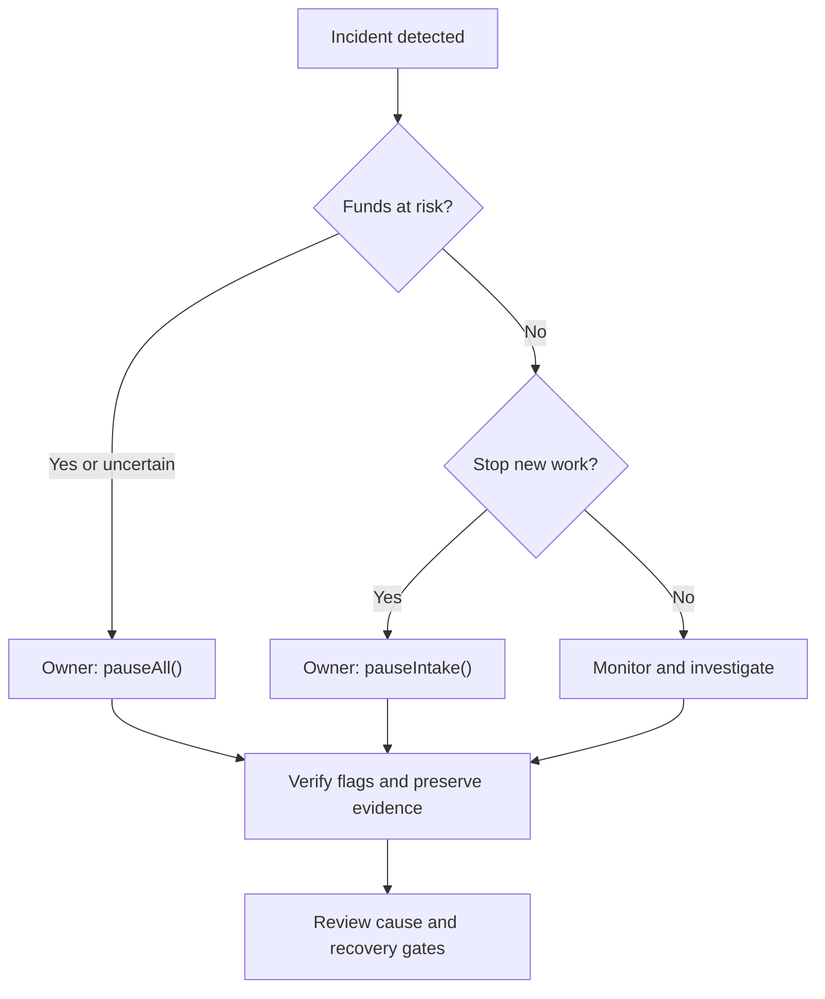

# Incident Response — v0.9.3

For an active exploit or suspected immediate risk to escrow, the authorized owner should call `pauseAll()` and verify **both** `paused()` and `settlementPaused()` are true. `pause()` only stops intake; it leaves settlement paths available. Preserve transaction hashes, block numbers, affected jobs and the observed balances before attempting recovery.

## Select the control that matches the incident

| Control | What it does | What remains possible |
| --- | --- | --- |
| `pauseIntake()` or `pause()` | Sets `paused=true`; prevents `createJob` and `applyForJob` | Existing job settlement remains available when `settlementPaused=false` |
| `setSettlementPaused(true)` | Stops the guarded settlement paths and also prevents create/apply | Does not change `paused`; reads and owner configuration remain available |
| `pauseAll()` | Sets intake and settlement pauses together | Reads and owner administration remain available; it does not revoke a compromised owner's authority |
| `blacklistAgent(address,true)` | Rejects future applications from that address | Does not cancel an assigned job or freeze every action by the address |
| `blacklistValidator(address,true)` | Rejects future votes from that address | Does not erase existing votes or replace settlement containment |

The explicit settlement control flag is `settlementPaused`, changed by `setSettlementPaused(bool)` or the combined pause methods. Settlement pause also blocks moderator/stale-dispute resolution, cancellations and refunds; there is no separate privileged resolution bypass while it is enabled. Job and review deadlines continue to advance during a pause.

## Identity or ENS incident

Do **not** call `lockIdentityConfiguration()` as an incident response. It irreversibly disables protected identity setters, including the ability to replace the optional ENSJobPages pointer; it neither corrects a compromised root nor stops activity.

1. Contain the affected paths first. A compromised authorization route can affect votes as well as new applications, so an intake-only pause may be insufficient.
2. Identify whether the issue concerns ENS authorization, optional job pages, a Merkle root or an additional allowlist. These are distinct controls.
3. If the optional job-page integration is unsafe and identity configuration is unlocked, review disabling its pointer with `setEnsJobPages(address(0))`. `setUseEnsJobTokenURI(false)` only disables ENS-based token-URI presentation; it does not disable ENS authorization.
4. Changes to the ENS registry, wrapper or namespace roots require unlocked identity configuration **and zero outstanding escrow and bonds**. Do not imply that these guards can be bypassed while recovering active jobs.
5. If configuration is already locked, preserve the evidence and assess a new deployment and the available lifecycle paths for old jobs. No owner unlock function exists.

Use the [owner runbook](../OWNER_RUNBOOK.md) and [ENS integration guide](../INTEGRATIONS/ENS.md) to review the exact setter and ownership boundaries. Never burn ENS fuses or lock configuration during unresolved diagnosis.

## USDC issuer restrictions

Check native USDC's pause status and blocklist state for the manager and affected senders/recipients. An issuer pause or blocked recipient can revert the entire settlement; prior transfers and reserve updates in that transaction roll back atomically. Confirm that outcome from on-chain reads rather than treating a failed transaction as partial payment.

Owner recipient rotation requires zero outstanding reserves and cannot redirect a blocked, already-funded job. Rescue functions do not bypass the issuer. Preserve the settlement state, contain new exposure and address the issuer restriction through its legitimate resolution process.

## Communications protocol

1. State the incident scope, affected network/manager and current values of both pause flags.
2. Identify which user actions are unavailable, including refunds or dispute decisions if settlement is paused.
3. Publish verified mitigation transaction hashes, known affected jobs and the next update time. Separate confirmed facts from ongoing investigation.
4. Never request private keys or seed phrases. If the owner signer is compromised, use the established signer-recovery procedure; these contract pauses alone do not remove its authority.

## Recovery gates

- Identify the cause and test the proposed correction against the affected scenario. The deployed manager is non-upgradeable; a software patch does not alter an existing instance.
- Reconcile the manager's USDC balance with `lockedEscrow + lockedAgentBonds + lockedValidatorBonds + lockedDisputeBonds`. Confirm that `withdrawableUSDC()` reports only genuine surplus.
- Review affected deadlines, validator votes, assignments and the moderator queue. Record which jobs can safely continue through their normal lifecycle.
- Verify owner authority, intended recipients, relevant identity controls and USDC transfer availability. Simulate recovery transactions before submitting them.
- Have the authorized owner review the recovery evidence and monitoring plan before reopening any path.

When safe, clear `settlementPaused` **while keeping intake paused** so existing jobs can complete or be refunded. Verify the resulting transfers and reserves before separately calling `unpauseIntake()` to admit new work. Avoid `unpauseAll()` during a staged recovery because it opens both paths together. Do not clear a containment pause merely to perform a withdrawal.
