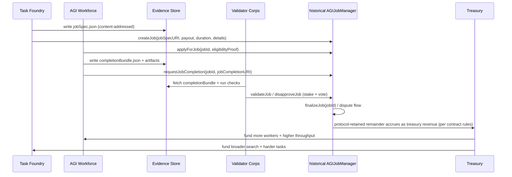
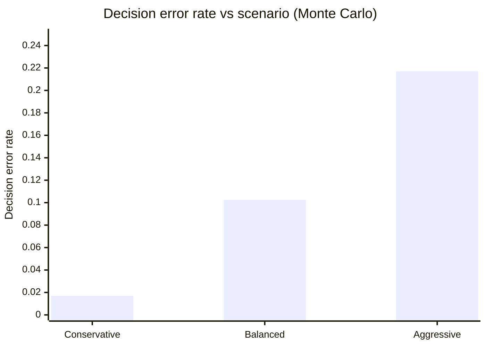
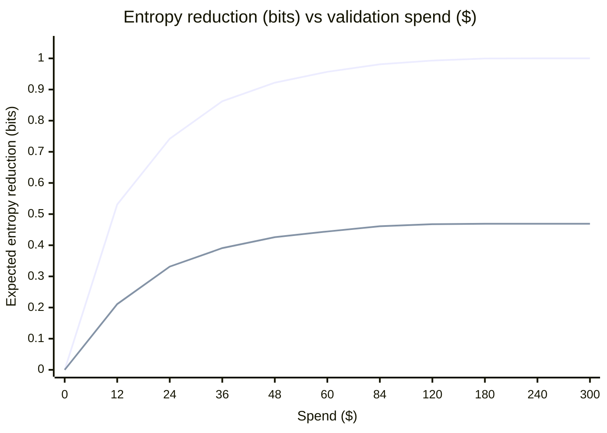

# Operational Blueprint for a Task Foundry → AGI Workforce Flywheel Anchored by the Historical AGIJobManager

## Executive summary

This report specifies a full-stack, operations-ready integration blueprint for a self-reinforcing “work engine” that continuously turns newly discovered tasks into validated outputs, routes value through escrowed settlement, and recycles treasury gains into a larger, more capable AGI Workforce. The settlement anchor is the **historical AGIJobManager**—a verified Ethereum smart-contract system for escrowed AGI work agreements with optional ENS-backed public job pages. citeturn12view0turn8view0

The core loop is:

**Task Foundry** (task generation + prioritization) → **AGI Workforce** (execution) → **Completion Evidence** (standardized bundles) → **Validator Corps** (stake + review) → **historical AGIJobManager** (escrow settlement + disputes) → **Treasury** (revenue + reserves) → funding for **larger AGI Workforce** and more ambitious **Task Foundry** search.

The blueprint’s design choices prioritize:

- **Deterministic settlement and solvency**: escrowed payouts, bonds, and a withdrawal posture that protects locked liabilities; contract verification and operator-first controls on Etherscan are explicitly supported. citeturn8view0turn0search3turn12view3  
- **Open-ended task expansion without drifting into noise**: leverage foundation-model–driven task generation gated by learnability + “interestingness,” and maintain an archive of learned/failed tasks to drive the next proposals. citeturn10view0turn11view0  
- **Evidence-first validation**: validators are paid for resolving uncertainty, not for vibes—completion is a structured, reproducible artifact bundle, and validator rubrics are explicit, versioned, and automatable.  
- **Operational containment**: an “autonomous agents first” operating policy with accountable human oversight (keys, governance, incident response) and strong pause/settlement-freeze procedures. citeturn12view2turn12view3  
- **Economics that scale with adversaries**: Monte Carlo stress tests illustrate how quorum size, bond sizes, and slashing severity change error rates and validator ROI; an entropy–energy framing quantifies diminishing returns in validation spend. citeturn3view0turn4search2turn5search4  

Assumptions: initial budget, jurisdiction, compute capacity, and legal constraints are **unspecified**; this report therefore presents **deployment options** and **risk controls** that are robust across a wide operational range, and flags where local counsel / compliance must tailor policy.

## Source-grounded foundations and constraints

### The historical AGIJobManager as the settlement kernel

The historical AGIJobManager is described publicly as an Ethereum smart-contract system for **escrowed AGI work agreements**, with an optional ENS identity/public page layer via ENSJobPages. citeturn12view0 It is **verified on Etherscan** (exact match), including compiler version and optimization settings, which supports auditability and operator confidence. citeturn8view0turn0search3

Operationally important on-chain facts visible on Etherscan include:

- **Constructor configuration** exposes the escrow token address (“AGI token address”) and a **base IPFS URL** used for URI resolution; this is a strong hint that off-chain specs/completions should be content-addressed and immutable-by-default. citeturn8view3turn7view0  
- The contract is live and actively used (transaction history), and is associated with named identities and token holdings on the explorer page. citeturn7view0  

### Canonical job lifecycle and operator posture

The repository documents a canonical lifecycle: create job → apply/assign → request completion → validator approve/disapprove → finalize; with dispute and expiry branches. citeturn12view1

Crucially, the project’s operating model is explicitly stated as **autonomous AI agents executing routine protocol actions**, with humans serving as **owners/operators** for configuration, key custody, and incident response—not as the default transaction drivers. citeturn12view2turn12view0 This is aligned with the owner runbook’s Etherscan-first, checklist-driven posture (pause, settlement controls, configuration locking preflight, and withdrawal sanity checks). citeturn12view3

### External systems that shape the integration design

This flywheel becomes credible—rather than merely aesthetic—when upstream task generation and downstream execution are both **open-ended** and **operationally bounded**.

- A modern open-ended task generator should maintain a **task archive** (successful + failed), propose new tasks conditioned on that archive, and generate not only task descriptions but also executable environment/reward definitions where relevant. citeturn10view0turn11view0  
- Reward shaping and evaluation code can be generated and iteratively improved via coding-capable foundation models (reward design by code-writing models is now a demonstrated pattern). citeturn4search1turn4search3  
- A scalable workforce should accumulate an executable **skill library** and automatically adjust curriculum difficulty; an existence proof of this pattern is seen in LLM-agent systems that build reusable code skills and an auto-curriculum loop. citeturn2search0turn2search47  
- The agent runtime needs hardened integration points for automation ingress (webhooks), session-bound authority, and multi-agent orchestration (sub-agents vs external harness sessions). OpenClaw’s docs provide direct primitives for authenticated webhook routes bound to a configured session key, rate limiting, and managed task flows—useful as a reference implementation for the “Workforce control plane.” citeturn0search0turn9search4turn9search2  

## End-to-end architecture blueprint

### System architecture

```mermaid
flowchart LR
  subgraph TF[Task Foundry]
    A1[Task Generator\nlearnable + interesting] --> A2[Task Archive\n(success + failed)]
    A2 --> A1
    A1 --> A3[JobSpec Builder\nschemas + rubrics]
  end

  subgraph WF[AGI Workforce]
    B1[Orchestrator\nqueues + assignments] --> B2[Workers\nagents + tools]
    B2 --> B3[Skill Library\nreusable procedures]
    B3 --> B2
  end

  subgraph EV[Completion Evidence]
    C1[Completion Bundle Builder] --> C2[Artifact Store\ncontent-addressed]
    C1 --> C3[Repro Logs\nhashes + traces]
  end

  subgraph VC[Validator Corps]
    D1[Validator Router\npolicy + rota] --> D2[Automated Checks\nlinters/tests/verifiers]
    D1 --> D3[Human Review\nedge cases]
    D2 --> D4[Validator Votes\nsigned + staked]
    D3 --> D4
  end

  subgraph CH[On-chain Settlement]
    E1[Historical AGIJobManager\nescrow + bonds + disputes] --> E2[Treasury\nrevenue + reserves]
  end

  A3 -->|jobSpecURI| C2
  C1 -->|jobCompletionURI| C2

  A3 -->|createJob| E1
  B2 -->|applyForJob\nrequestCompletion| E1
  D4 -->|validate/disapprove\nand disputes| E1

  E2 -->|budget grants| B1
  E2 -->|compute + R&D funding| A1
```

### Lifecycle sequencing



### What makes this “operational,” not theoretical

The historical AGIJobManager docs emphasize a deterministic, checklist-driven workflow and explicit operator controls (deployment tooling, pause, settlement safety, and the reality that some intent is not fully enforced on-chain). citeturn12view1turn12view2turn12view3

Accordingly, the blueprint treats off-chain components as a **governed production system**:

- **Everything important becomes a URI**: job specs, rubrics, completion evidence, and (optionally) validator reports are immutable artifacts referenced by the chain. This matches the contract’s constructor pattern that includes a base IPFS URL and formal job URIs. citeturn8view3turn8view0  
- **Humans hold the keys, agents hold the keyboards**: humans approve configuration changes and emergencies; agents carry out routine calls—consistent with the published “autonomous agents only” policy. citeturn12view2turn12view3  
- **Validation is a product**: you cannot scale trust without standardizing what “evidence” means, and without quantifying validator incentives and failure modes (see the economics section).

## Interfaces and data schemas

The system requires four canonical artifacts: `jobSpec`, `completionBundle`, `validatorRubric`, `treasuryPolicy`. Each is versioned, content-addressable, and designed for both humans and automated validators.

### jobSpec schema

A `jobSpec` is the *contract* in the product sense: it contains what a rational executor needs to do the work, and what a rational validator needs to approve/reject with minimal ambiguity.

```json
{
  "schemaVersion": "1.0.0",
  "kind": "jobSpec",
  "jobSpecId": "js_2026-04-07T12:00:00Z_9d3c",
  "chain": { "chainId": 1, "network": "ethereum" },
  "protocol": {
    "name": "historical-AGIJobManager",
    "address": "0xB3AAeb69b630f0299791679c063d68d6687481d1",
    "jobId": null
  },
  "title": "Produce a reproducible market map for X",
  "summary": "Deliver a structured, cited landscape analysis with a scored opportunity list.",
  "problemStatement": "…",
  "deliverables": [
    { "id": "d1", "type": "report", "format": "markdown", "path": "report.md" },
    { "id": "d2", "type": "data", "format": "csv", "path": "opportunities.csv" }
  ],
  "acceptanceCriteria": [
    "All claims include citations to primary sources.",
    "Methods section includes reproducibility instructions and hashes.",
    "Opportunity list includes scoring rubric and sensitivity analysis."
  ],
  "constraints": {
    "legal": [
      "No insider information.",
      "No requests for regulated advice without compliance review."
    ],
    "security": [
      "No credential sharing.",
      "No vulnerability exploitation."
    ]
  },
  "evaluation": {
    "validatorRubricURI": "ipfs://<cid>/validatorRubric.json",
    "scoring": { "scale": "0-100", "passThreshold": 80 }
  },
  "executionHints": {
    "suggestedTools": ["web-research", "python", "git"],
    "timeBudgetHours": 12,
    "preferredStyle": "executive + technical appendix"
  },
  "metadata": {
    "createdAt": "2026-04-07T12:00:00Z",
    "createdBy": "task-foundry@system",
    "tags": ["research", "strategy"]
  }
}
```

Key design rules:

- **No hidden requirements**: anything not in the spec cannot be required in validation. This reduces disputes and adversarial ambiguity.
- **Rubric pointer is mandatory**: validators must be able to fetch the same evaluation definition every time.
- **Compliance constraints are explicit**: this is how you keep a large workforce from drifting into prohibited or high-risk territory.

### completionBundle schema

A `completionBundle` is a standardized evidence container designed to survive adversarial validation. It is also what allows your future workforce to build on yesterday’s work without re-deriving it.

```json
{
  "schemaVersion": "1.0.0",
  "kind": "completionBundle",
  "job": {
    "chainId": 1,
    "protocolAddress": "0xB3AAeb69b630f0299791679c063d68d6687481d1",
    "jobId": 24722981
  },
  "executor": {
    "agentAddress": "0x…",
    "runtime": { "type": "agent", "orchestrator": "workforce-manager" }
  },
  "artifacts": [
    {
      "path": "report.md",
      "contentType": "text/markdown",
      "sha256": "…",
      "sizeBytes": 183421,
      "uri": "ipfs://<cid>/report.md",
      "description": "Main report with citations."
    },
    {
      "path": "opportunities.csv",
      "contentType": "text/csv",
      "sha256": "…",
      "sizeBytes": 20418,
      "uri": "ipfs://<cid>/opportunities.csv",
      "description": "Scored opportunity list."
    }
  ],
  "reproducibility": {
    "inputs": [
      { "name": "source_list", "sha256": "…", "uri": "ipfs://<cid>/sources.json" }
    ],
    "runs": [
      {
        "step": "analysis",
        "toolchain": { "python": "3.12", "packages": ["pandas==…"] },
        "command": "python build_tables.py",
        "stdoutSha256": "…",
        "logsUri": "ipfs://<cid>/run.log"
      }
    ]
  },
  "integrity": {
    "bundleSha256": "…",
    "timestamp": "2026-04-07T20:25:00Z",
    "signatures": [
      { "type": "eip712", "signer": "0x…", "signature": "0x…" }
    ]
  },
  "notesForValidators": [
    "Reproduction instructions are in appendix A.",
    "All external claims are cited and indexed in sources.json."
  ]
}
```

Minimum viable evidence, if you want disputes to be rare:

- artifact hashes,
- reproducer instructions,
- a trace of what tools were used and what they produced,
- explicit “notes for validators” so they can converge quickly.

### validatorRubric schema

A validator rubric is how you turn “validation” from a social ritual into a scalable instrument.

```json
{
  "schemaVersion": "1.0.0",
  "kind": "validatorRubric",
  "rubricId": "vr_2026-04-07_a11f",
  "jobId": 24722981,
  "checks": [
    {
      "id": "c1",
      "type": "mustPass",
      "description": "All deliverables present and hash-matching declared artifact list.",
      "evidence": ["completionBundle.artifacts"]
    },
    {
      "id": "c2",
      "type": "mustPass",
      "description": "Citations resolve to primary sources and match referenced claims.",
      "method": "spot-check 20 citations + random sample"
    },
    {
      "id": "c3",
      "type": "scored",
      "weight": 0.35,
      "description": "Correctness and internal consistency",
      "scale": { "min": 0, "max": 100 }
    },
    {
      "id": "c4",
      "type": "scored",
      "weight": 0.35,
      "description": "Usefulness and completeness",
      "scale": { "min": 0, "max": 100 }
    },
    {
      "id": "c5",
      "type": "scored",
      "weight": 0.30,
      "description": "Reproducibility and clarity",
      "scale": { "min": 0, "max": 100 }
    }
  ],
  "automation": {
    "recommendedTools": [
      { "name": "bundle-lint", "command": "bundle_lint completionBundle.json" },
      { "name": "hash-verify", "command": "hash_verify --all" }
    ]
  },
  "output": {
    "requiredFields": ["overallScore", "passFail", "confidence", "notes"],
    "confidenceScale": "low|medium|high"
  },
  "conflictPolicy": {
    "mustDeclare": ["financial interest", "prior involvement"],
    "recusalIf": ["direct authorship of deliverable"]
  }
}
```

### treasuryPolicy schema

Treasury policy is governance-in-code (off-chain policy + on-chain enforcement). It is the tool that prevents an early flywheel from collapsing due to reckless spend or key risk.

```json
{
  "schemaVersion": "1.0.0",
  "kind": "treasuryPolicy",
  "policyId": "tp_2026Q2",
  "treasury": {
    "custody": "multisig",
    "signers": 5,
    "threshold": 3,
    "coldStorage": true
  },
  "reserves": {
    "minReserveRatio": 0.35,
    "volatilityBufferRatio": 0.15
  },
  "spend": {
    "categories": [
      { "name": "workforceExpansion", "capPct": 0.40 },
      { "name": "computeAndTooling", "capPct": 0.35 },
      { "name": "securityAndAudit", "capPct": 0.15 },
      { "name": "grantsAndBounties", "capPct": 0.10 }
    ],
    "approval": {
      "under10k": "2-of-5",
      "under100k": "3-of-5",
      "over100k": "4-of-5 + 7-day timelock"
    }
  },
  "riskControls": {
    "maxSingleCounterpartyPct": 0.10,
    "incidentPauseAuthority": "designated-owner-keys",
    "auditCadenceDays": 30
  },
  "transparency": {
    "publishMonthlyReport": true,
    "publishPolicyHashes": true
  }
}
```

This structure mirrors the AGIJobManager operator posture: deliberate, reversible until proven safe, and explicit about pause/withdrawal behaviors. citeturn12view3

## Validator economics stress tests with Monte Carlo and entropy–energy framing

This section provides **operational tuning evidence**, not ideology. Your validator system must withstand:

- honest mistakes,
- low-effort farming,
- cartelized validator capture,
- liveness failures (nobody shows up),
- disputes that stall the pipeline.

### Why stakes and slashing exist

In proof-of-stake systems, “slashing” is a severe penalty designed to make dishonest behavior economically irrational. Ethereum’s own documentation describes slashing as forceful removal and loss of stake under specific dishonest actions. citeturn2search7 While your job-validation system is not Ethereum consensus, the **economic logic** is the same: you pay validators to reduce uncertainty, and you need credible penalties for adversarial behavior.

### Monte Carlo: validator ROI and decision error tradeoffs

We simulated three parameter regimes (Conservative, Balanced, Aggressive) under an abstract “stake + slash + reward” model to stress-test:

- rate of incorrect final decisions (decision error),
- false acceptance of bad work,
- validator ROI distribution.

**Interpretation**: aggressive configurations can “feel productive” early because validators earn more and quorum is easier, but error rates can rise to levels that corrode the entire flywheel.

| Scenario | Validators per job | Malicious fraction | Honest accuracy | Bond ($) | Reward pool ($) | Slash fraction | Decision error rate | False-accept rate | False-reject rate | ROI mean | ROI p5 | ROI p50 | ROI p95 |
|---|---:|---:|---:|---:|---:|---:|---:|---:|---:|---:|---:|---:|---:|
| Conservative | 11 | 0.15 | 0.92 | 150 | 70 | 0.70 | 0.0170 | 0.0011 | 0.0159 | 0.0424 | -0.70 | 0.2074 | 0.4667 |
| Balanced | 7 | 0.20 | 0.90 | 100 | 60 | 0.50 | 0.1025 | 0.0104 | 0.0921 | 0.0857 | -0.50 | 0.1833 | 0.5250 |
| Aggressive | 5 | 0.25 | 0.88 | 60 | 45 | 0.35 | 0.2170 | 0.0219 | 0.1951 | 0.1477 | -0.35 | 0.2750 | 0.9000 |

**What this means operationally**

- Conservative settings dramatically reduce erroneous outcomes but can create validator discouragement if ROI is consistently low (a liveness risk).  
- Aggressive settings create attractive ROI but can tolerate error rates above 20%, which is incompatible with a treasury flywheel—because you’re subsidizing noise and occasionally paying for wrong outputs.  
- Balanced settings are often where programs begin, but they require **identity quality** (anti-sybil controls, allowlists) and **monitoring** so that malicious fractions do not drift upward unnoticed. The AGIJobManager ecosystem explicitly uses eligibility controls like Merkle roots and operator-configured roles, which should be treated as first-class security infrastructure. citeturn8view3turn12view3

#### Mermaid chart: decision error rate by scenario



### Entropy–energy charts: what you’re truly buying

Validation is a process of reducing uncertainty. In Shannon’s framework, entropy quantifies uncertainty, and information reduces it; this is the conceptual bridge between “more evidence” and “more confidence.” citeturn3view0 Modern thermodynamics of information connects information-processing to energetic/entropic costs, especially in small-scale or feedback-controlled systems. citeturn4search2turn5search4

In practice, your “energy” is not literal heat; it is **budget**: validator payments, opportunity cost, and the stake you lock to make votes credible. The key operational insight is **diminishing returns**: the first few independent checks reduce uncertainty sharply; beyond that, you’re paying more for marginal confidence.

#### Mermaid chart: expected entropy reduction vs verification spend

Two curves are shown:

- **prior p=0.5** (high uncertainty jobs: maximum entropy = 1 bit)  
- **prior p=0.9** (most jobs are good: maximum entropy ≈ 0.469 bits)

Assume each validator check costs \$12 (human+compute proxy) and has 90% accuracy.



**How to use this in governance**

- Use **low-cost automated validation** for low-entropy checks (hash verification, linting, reproducibility runs).  
- Reserve **human validator bandwidth** for high-entropy disputes and semantic quality judgments.  
- Increase quorum/bond severity only as the value-at-risk rises; do not “overpay for certainty” on low-stakes jobs, or your treasury flywheel becomes an efficiency trap.

## Launch plan, governance controls, runbooks, and engineering backlog

### Deployment options comparison

The correct deployment option is contextual. This table provides a rational comparison when budget/jurisdiction are unspecified.

| Option | What you deploy/use | Pros | Cons | Time to first mainnet canary |
|---|---|---|---|---|
| Use the existing historical AGIJobManager | Integrate directly with the historical deployment address and its configured token/URI base | Fastest path; public verifiability; mature operator docs and UI entry points (Genesis Console) citeturn12view0turn8view3 | Less freedom on token economics and parameters; governance is not yours | 1–3 weeks |
| Deploy your own instance of AGIJobManager | A new contract deployment + your governance keys | Full control over parameters, allowlists, treasury policy | More security responsibility; higher time-to-trust; you must reproduce audit posture and tooling | 4–8 weeks |
| Use an L2 for cheap throughput | Similar system on an L2 | Lower per-job overhead; more experimentation | Fragmented liquidity/attention; bridging and finality considerations | 3–6 weeks |
| Add a premium discovery layer | Use a two-layer architecture (discovery + settlement) for high-value jobs | Better procurement for high-stakes jobs; separates “selection” from “settlement” | More moving parts; more operational complexity | 6–10 weeks |

### Ninety-day launch plan

This plan assumes: (a) you can run agent orchestration infrastructure, (b) you can staff an initial validator rota (even if small), and (c) you will not skip security posture. If any are false, you must downshift scope.

**Days 1–15: Build the settlement-grade “minimum loop”**

- Implement the canonical job lifecycle end-to-end on a local chain following the repository’s documented workflow (create → apply → completion → validate → finalize; include dispute and expiry paths). citeturn12view1  
- Implement `jobSpec` and `completionBundle` generation, store them content-addressed, and wire their URIs into the create/complete calls (aligning to the contract’s URI model and base IPFS configuration). citeturn8view3turn7view0  
- Stand up the initial Workforce Orchestrator using a hardened agent runtime and explicit session authority boundaries—an approach supported by authenticated webhook routes bound to a session key with rate limiting (reference design). citeturn0search0turn9search1  

Deliverable: a working “Job → Evidence → Validation → Settlement” loop that can run 10 canary jobs without manual heroics.

**Days 16–35: Task Foundry and validator productization**

- Stand up Task Foundry v1: task archive + next-task proposal conditioned on learned/failed tasks and a learnability/interestingness gate. citeturn10view0turn11view0  
- Add reward-and-evaluation code generation patterns where relevant (especially for simulated evaluation harnesses), building on published reward-generation approaches. citeturn4search1turn4search3  
- Implement `validatorRubric` authoring and a “validator workbench” UI that fetches completion bundles, runs automated checks, and produces a signed review packet.

Deliverable: validators can review a job in under 15 minutes with consistent outputs and low ambiguity.

**Days 36–60: Treasury and governance hardening**

- Establish treasury custody (multisig, signers, incident pause authority) and publish the `treasuryPolicy` with policy-hash anchoring.  
- Implement monitoring and alerting for protocol-critical events and pause states, matching the operator runbook posture (pause, settlement freeze, safe withdrawals). citeturn12view3turn12view2  
- Run the Monte Carlo tuning process on your actual planned parameters and update quorum/bond/reward allocations.

Deliverable: a governance-controlled treasury that can take in revenue and fund jobs without compromising solvency.

**Days 61–90: Mainnet canary and scaling the flywheel**

- Execute a low-value mainnet canary job set using operator-first verified interfaces and archived audit artifacts (transactions, URIs, and evidence). The project documents a “Genesis Console” as the fastest operator/reviewer entry point for standalone mainnet UI workflows. citeturn12view0  
- Expand validator rota and implement conflict-of-interest rules, training, and escalation.  
- Scale workforce concurrency and introduce skill library reuse (curriculum + reusable code skills are a proven scaling pattern). citeturn2search0turn2search47  

Deliverable: a stable, revenue-positive or at least learning-positive loop that produces validated artifacts continuously, with measured error rates and an incident playbook that has been rehearsed.

### Risk and governance controls

The published policy posture is clear: autonomous agents operate the system, but **humans remain accountable** for governance, configuration, and incident response, and on-chain enforcement is not guaranteed for policy intent. citeturn12view2

Non-negotiable controls:

- **Key custody and separation of duties**: owner keys, moderator keys, treasury keys, and automation keys are separated; a multisig is used for high-impact treasury actions. citeturn12view3  
- **Pause discipline**: treat pausing as a safety tool, not a panic action; rehearse “stop intake only” vs “freeze settlement” vs full stop. Owner runbooks explicitly describe these modes and their consequences. citeturn12view3  
- **Identity quality / anti-sybil**: validator economics collapse if a malicious fraction silently rises; you must use allowlists, proof systems, and rotation of eligibility roots as live governance. The contract’s Merkle-root constructor args underscore that eligibility is a first-class mechanism. citeturn8view3turn12view3  
- **Evidence integrity**: require hashes and reproducibility; treat all webhook payloads and external inputs as untrusted (hardened webhook routes should be authenticated and rate-limited). citeturn0search0turn9search1  
- **Scope compliance**: forbid tasks that solicit unlawful acts or regulated services without appropriate compliance review; encode those constraints in `jobSpec.constraints`.

### Operational runbooks

These are minimal, day-one runbooks that align with the documented operator posture and can be expanded.

**Operator rota (daily)**  
- Review queue health: jobs created, jobs stalled in completion review, jobs awaiting validator quorum.  
- Confirm evidence integrity: URIs resolve, hashes match.  
- Run “liveness nudges”: if quorum is low, route additional validators; if workforce is blocked, reassign.  
- Escalation triggers: unusually high disapprovals, repeated disputes, failure to finalize beyond expected windows.

**Moderator rota (as-needed, but staffed)**  
- Open a dispute case file: jobSpec, completionBundle, validator notes, timestamps, and any automated check output.  
- Apply resolution codes only with explicit evidence; record rationale and publish a short summary.  
- Post-incident: if disputes spike, pause intake and review parameter changes—exactly the kind of checklist-driven governance represented in the runbooks. citeturn12view3  

**Validator rota (scheduled shifts)**  
- Use rubric-driven checklists; declare conflicts; recuse when required.  
- Prioritize must-pass checks first (artifact integrity, reproducibility), then semantic scoring.  
- Maintain an SLA by job class (e.g., low-risk jobs: 6 hours; high-risk: 24 hours).  
- Track validator accuracy over time and adjust eligibility/weighting.

### Prioritized engineering backlog

High-leverage epics, ordered:

**Settlement integration and artifact plumbing**
- Contract interaction layer with deterministic simulation-first execution.
- URI and content-addressed storage adaptor (IPFS/Arweave/S3 abstraction).
- Event indexer and state machine for job lifecycle.

**Evidence and validation product**
- Completion bundle generator with hash and signature support.
- Validator workbench UI with automated checks and rubric output.
- Dispute case management tooling.

**Workforce orchestration**
- Task queue, assignment policy, retries/backoff, and skill library.
- Safe automation ingress (webhooks) with session-bound authority and rate limiting (reference patterns exist). citeturn0search0turn9search1  
- Multi-agent execution: sub-agent concurrency and/or external harness sessions with explicit runtime boundaries. citeturn9search4turn9search2  

**Task Foundry**
- Task archive + retrieval + next-task generation loop using learnability + interestingness gating. citeturn11view0  
- Reward/evaluation harness generation and iterative refinement when applicable. citeturn4search1turn4search3  
- “Skill demand” signals: tasks that repeatedly fail become skill-building jobs.

**Treasury automation and governance**
- Treasury policy engine (spend caps, reserve ratios, approval workflows).
- Monthly transparency reports and policy-hash anchoring.
- Parameter governance: change tickets, testnet rehearsal, and measured rollouts.

---

This blueprint is intentionally designed so that early success compounds: your Task Foundry becomes better at selecting worthwhile work; your AGI Workforce becomes faster via skill reuse; your Validator Corps becomes more accurate via standardized rubrics and incentives; and the historical AGIJobManager provides deterministic settlement and dispute rails that can be audited publicly. citeturn12view0turn8view0turn12view3