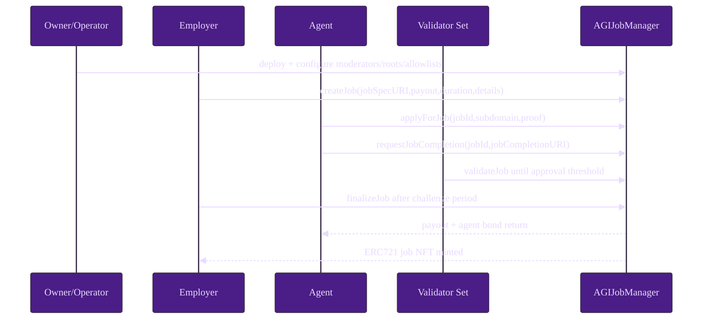
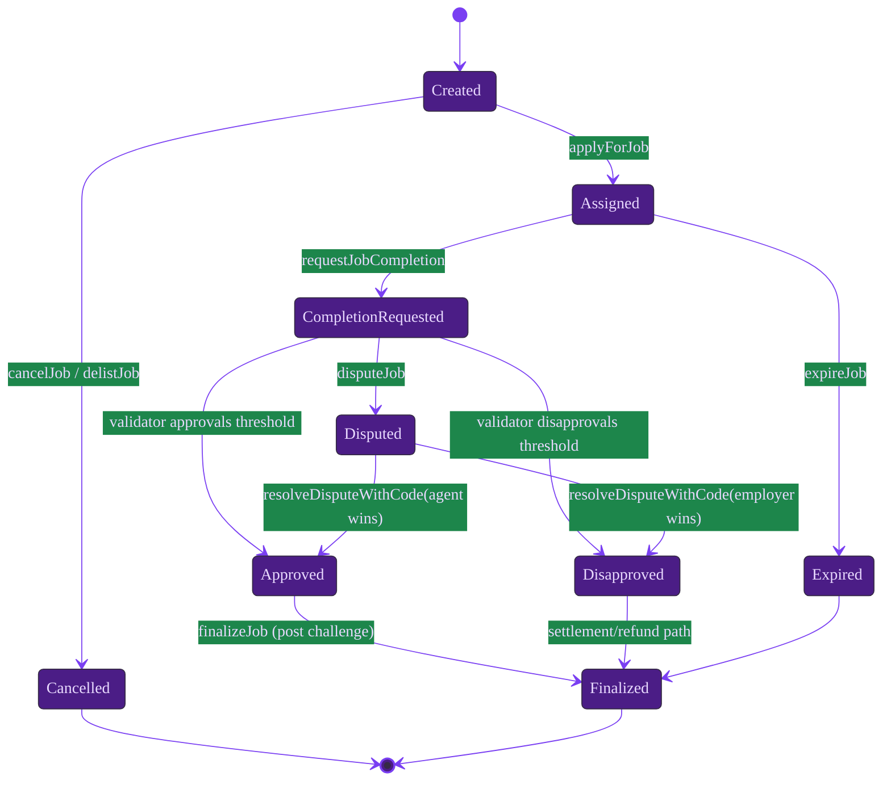

# Quintessential Use Case

This canonical workflow is the deterministic, end-to-end operational scenario for AGIJobManager across local development and production rollouts.

## A) Local walkthrough

### Prerequisites

```bash
npm ci
npm run build
npm test
```

### Step table

| Step | Actor | Function/Command | Preconditions | Expected on-chain outcome | Events emitted | What to verify next |
| --- | --- | --- | --- | --- | --- | --- |
| 1 | Operator | `truffle migrate --network development` | Local chain available; deployer has gas funds | AGIJobManager deployed and initialized | Migration transaction logs | `owner()`, token wiring, and `paused()` baseline |
| 2 | Owner | `addModerator`, `addAdditionalAgent`, `addAdditionalValidator`, `updateMerkleRoots` | Owner signer; vetted identity list/proofs | Role controls and roots committed on-chain | `ModeratorAdded`, `AdditionalAgentUpdated`, `AdditionalValidatorUpdated`, `MerkleRootsUpdated` | `isModerator`, `isEligibleAgent`, `isEligibleValidator` |
| 3 | Employer | `createJob(jobSpecURI,payout,duration,details)` | Employer has AGI balance + allowance; safe URI chosen | New job stored and escrow moved into locked accounting | `JobCreated` | `getJobCore`, `lockedEscrow`, job status = Created |
| 4 | Agent | `applyForJob(jobId,subdomain,proof)` | Job is open; agent eligibility passes allowlist/Merkle/ENS checks | Agent assigned; agent bond locked | `JobApplied` | Assigned agent, `lockedAgentBonds`, status = Assigned |
| 5 | Agent | `requestJobCompletion(jobId,jobCompletionURI)` | Agent is assigned; job active; completion URI prepared | Completion timestamp/URI recorded and review window starts | `JobCompletionRequested` | Review window timestamps and completion metadata getters |
| 6a | Validators | `validateJob(jobId,proof,subdomain)` | Validator eligible; within review window; settlement not paused | Approval count increments and validator bond locked | `JobValidated` | `requiredValidatorApprovals` trajectory, `lockedValidatorBonds` |
| 6b | Validators | `disapproveJob(jobId,proof,subdomain)` | Validator eligible; within review window | Disapproval count increments toward employer-win outcome | `JobDisapproved` | `requiredValidatorDisapprovals` trajectory |
| 7 | Employer/Anyone | `finalizeJob(jobId)` | Review + challenge windows elapsed and threshold reached | Terminal settlement path executes; agent win mints NFT | `JobCompleted` (and `NFTIssued` on agent-win) | Job terminal status, released locks, reputation deltas |
| 8 | Moderator | `resolveDisputeWithCode(jobId,code,reason)` | `disputeJob` already called; moderator signer active | Dispute outcome forcibly resolved (`code=0` permits no-op admin closure policy) | `DisputeResolvedWithCode` | Dispute closed, terminal status, bond/escrow effects |
| 9 | Anyone | `expireJob(jobId)` | Deadline exceeded without valid completion path | Expiry recovery executes (employer recovery + agent slashing path if applicable) | `JobExpired` | Status terminal, escrow unlock, lock-bucket conservation |
| 10 | Operator | Read-model checks + event scan | Any terminal branch reached | Accounting and observability reconciled | Indexer/event pipeline confirmations | `withdrawableAGI()`, `lockedEscrow`, `lockedAgentBonds`, `lockedValidatorBonds`, `lockedDisputeBonds` |

### Happy path sequence



### Lifecycle state map



### Expected state checkpoints

1. **After Step 3:** `getJobCore(jobId)` reflects employer, payout, duration; `lockedEscrow` increased by payout.
2. **After Step 4:** assigned agent is set; `lockedAgentBonds` increased by computed bond.
3. **After Step 5:** completion URI is stored; completion review timer fields are non-zero.
4. **After Step 6:** vote counters and validator-participation flags reflect approvals/disapprovals.
5. **After Step 7/8/9:** terminal status is immutable and lock buckets are released according to outcome.
6. **After Step 10:** `withdrawableAGI()` equals balance net locked buckets (no insolvency drift).

## B) Testnet/Mainnet operator checklist

### Preflight controls (no secrets in repo)

1. Approve change request with owner/moderator signer separation and rollback plan.
2. Confirm `.env` values are loaded only from secure local/CI secret stores; never commit keys.
3. Validate deployment parameters using `node scripts/ops/validate-params.js`.
4. Dry-run deployment on testnet and archive tx hashes + signer addresses.

### Go-live sequence

1. Deploy with repository migration tooling.
2. Configure moderators, allowlists, Merkle roots, and dispute/validation parameters.
3. Verify all config writes with read calls and event confirmations.
4. Run one canary job end-to-end before opening general traffic.
5. Enable event-driven alerts for settlement controls, disputes, and treasury actions.

### Ongoing operations

1. Rehearse incident controls: `pause`, `setSettlementPaused(true)`, blacklist updates, identity lock.
2. Reconcile locked totals and `withdrawableAGI()` on a recurring schedule.
3. Treat URI inputs as untrusted; enforce `ipfs://` or controlled HTTPS endpoints with immutable content addressing where possible.
4. Record all governance actions with rationale, tx hash, and approving authority.
