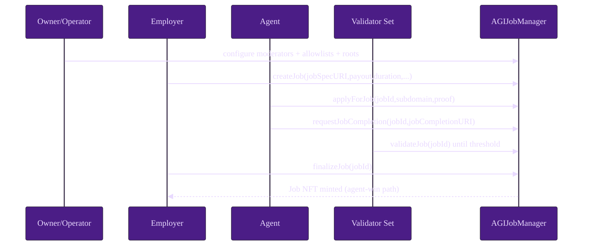
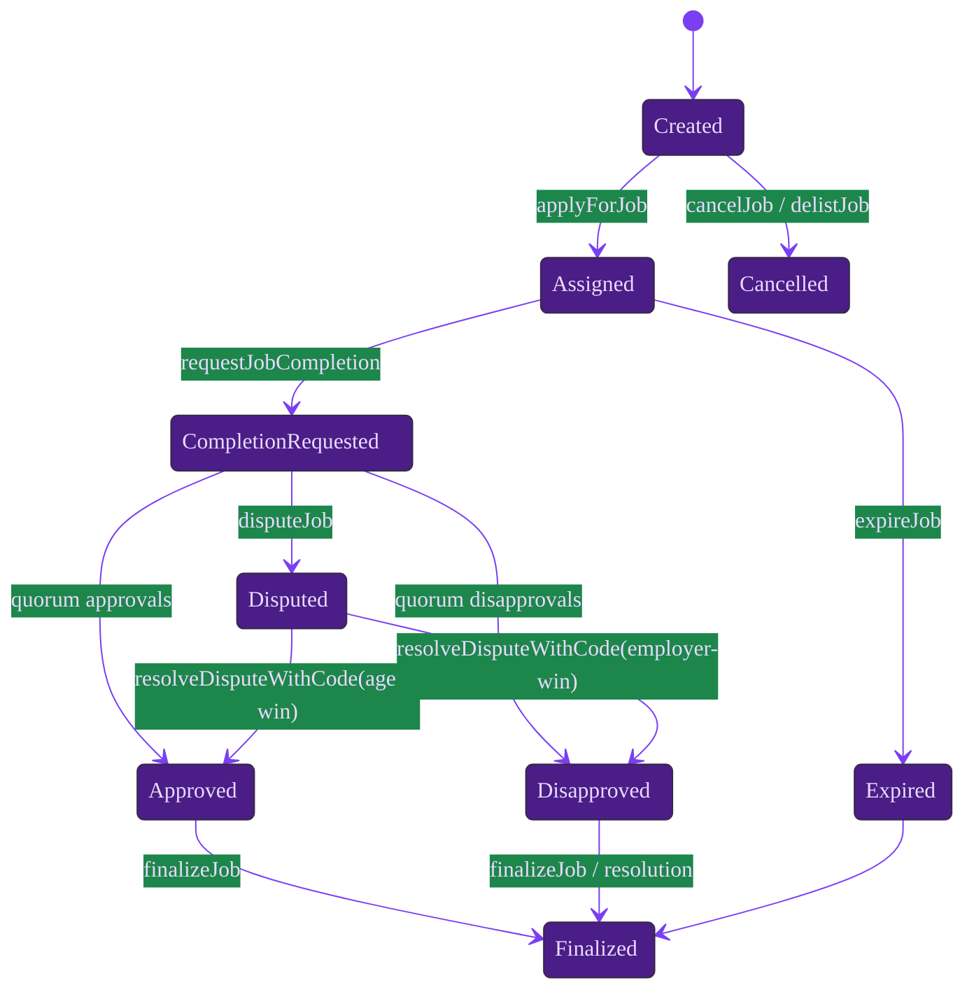

# Quintessential Use Case

A deterministic, operator-safe canonical workflow for AGIJobManager spanning local execution and production controls.

## A) Local dev chain walkthrough

### Prerequisites

```bash
npm ci
npm run build
npm test
```

### Launch and deploy

```bash
npx ganache --wallet.totalAccounts 10 --wallet.defaultBalance 1000 --chain.chainId 1337
truffle migrate --network development --reset
```

Optional: open Truffle console for direct function execution during the walkthrough.

```bash
truffle console --network development
```

### Step table

| Step | Actor | Function/Command | Preconditions | Expected on-chain outcome | Events emitted | What to verify next |
| --- | --- | --- | --- | --- | --- | --- |
| 1 | Operator | `truffle migrate --network development --reset` | Ganache running; deployer funded | AGIJobManager deployed with constructor wiring | Deployment tx logs | Confirm contract address and constructor params from Truffle artifact |
| 2 | Owner | `addModerator`, `addAdditionalAgent`, `addAdditionalValidator`, `updateMerkleRoots` | Owner signer authority | Moderator + eligibility controls configured | `ModeratorAdded`, `AdditionalAgentAdded`, `AdditionalValidatorAdded`, `MerkleRootsUpdated` | Read `moderators(addr)`, `additionalAgents(addr)`, `additionalValidators(addr)` |
| 3 | Employer | `createJob(jobSpecURI,payout,duration,details)` | AGI allowance approved; valid URI | Escrow locked and job enters open/created state | `JobCreated` | Read `getJobCore(jobId)` and locked accounting totals |
| 4 | Agent | `applyForJob(jobId,subdomain,proof)` | Eligibility satisfied (allowlist/proof/ENS) | Agent assigned; agent bond locked snapshot | `JobApplied` | Verify assigned agent + bond via `getJobCore(jobId)` and bond getters |
| 5 | Agent | `requestJobCompletion(jobId,jobCompletionURI)` | Assigned agent; non-empty URI; within duration | Completion metadata and timestamp recorded | `JobCompletionRequested` | Verify completion URI and completion flag/time getters |
| 6 | Validators | `validateJob` or `disapproveJob` | Completion requested; validator bond allowance; review window open | Approval/disapproval counters move toward threshold | `JobValidated` or `JobDisapproved` | Verify vote counters and whether `isDisputed` flips |
| 7 | Anyone/Employer | `finalizeJob(jobId)` | Review/challenge windows satisfied; not disputed | Terminal settlement (agent win or employer refund) | `JobCompleted` and/or terminal accounting events | Reconcile escrow/bond unlocks and NFT issuance when agent wins |
| 8 | Employer/Agent + Moderator | `disputeJob(jobId)` then `resolveDisputeWithCode(jobId,code,reason)` | Completion requested; disputed lane active; moderator signer | Dispute resolved; terminal path (agent win/employer win/no-action) | `JobDisputed`, `DisputeResolvedWithCode` | Verify resolution code semantics and resulting terminal state |
| 9 | Anyone | `expireJob(jobId)` | Deadline elapsed without valid completion path | Employer recovery and terminal expiry state | `JobExpired` | Confirm expiry flag and unlocked liabilities |
| 10 | Operator | Getter checks + event scan | Terminal state reached | Accounting integrity preserved | Monitoring/indexer updates | Verify `withdrawableAGI()` equals balance minus locked totals |

### Happy path sequence diagram



### Lifecycle state diagram



### Expected state checkpoints

- Post-deploy: verify `owner()`, `agiToken()`, namespace roots, and pause flags (`paused`, `settlementPaused`).
- Post-config: verify role maps (`moderators`, additional allowlists) and Merkle roots (`agentMerkleRoot`, `validatorMerkleRoot`).
- Post-create: `getJobCore(jobId)` reflects employer, payout, duration, and unassigned state; `lockedEscrow` increases.
- Post-apply: `assignedAgent` and payout snapshot are set; `lockedAgentBonds` increases.
- Post-completion request: completion metadata is non-empty and timestamped; validator review timer starts.
- Post-voting: approvals/disapprovals and validator bond accounting track expected thresholds.
- Post-finalization/resolution: job is terminal, liabilities unlock, and `withdrawableAGI()` remains solvent against total balance.

## B) Testnet/mainnet operator checklist

1. **Governance preflight**: approve change ticket, define rollback criteria, stage communications owners.
2. **Key hygiene**: use hardware/offline signing workflows; never place secrets in repository files.
3. **Config validation**: validate `migrations/deploy-config.js` with environment values documented in `.env.example`.
4. **Dry run**: deploy and configure on testnet; archive tx hashes, emitted events, and read-back snapshots.
5. **Canonical canary**: execute one full low-value job lifecycle before broader traffic.
6. **Monitoring readiness**: alert on `SettlementPauseSet`, `DisputeResolvedWithCode`, `AGIWithdrawn`, and stalled completions.
7. **Control rehearsals**: rehearse `pause`, `setSettlementPaused`, blacklist actions, and stale-dispute owner recovery path.
8. **Mainnet go/no-go gate**: proceed only after configuration parity checks and operator sign-off.
9. **Post-launch verification**: continuously reconcile locked totals (`lockedEscrow`, `locked*Bonds`) against treasury withdrawals.


### Production-oriented verification checklist

| Checkpoint | Testnet expectation | Mainnet expectation | Verification method |
| --- | --- | --- | --- |
| Chain identity | Approved testnet chain ID (e.g., Sepolia `11155111`) | Ethereum Mainnet `1` | RPC `eth_chainId` + explorer network label |
| Deployment bytecode parity | Matches CI-compiled artifact hash | Matches audited/tagged artifact hash | Compare artifact metadata + on-chain code hash |
| Role roster parity | Moderators/allowlists mirror approved test plan | Moderators/allowlists match signed production change request | Getter reads + emitted role events |
| Parameter envelope | Conservative, low-risk values for rehearsal | Production values signed off in change ticket | `scripts/ops/validate-params.js` + getter readback |
| Monitoring readiness | Alerts tested with synthetic events | Alerts active with pager routing | Event indexer dashboards and alert test logs |

### Operator notes for canonical steps

- **Step 2 (configuration):** run owner configuration in tightly scoped batches and verify each tx by event before sending the next tx.
- **Step 6 (validation outcomes):** explicitly rehearse both approval and disapproval quorum outcomes on testnet before production launch.
- **Step 8 (dispute path):** enforce moderator rationale discipline (`reason` strings must map to case ticket IDs).
- **Step 10 (observability):** maintain a per-job reconciliation ledger linking event stream, getter snapshots, and accounting sanity checks.
