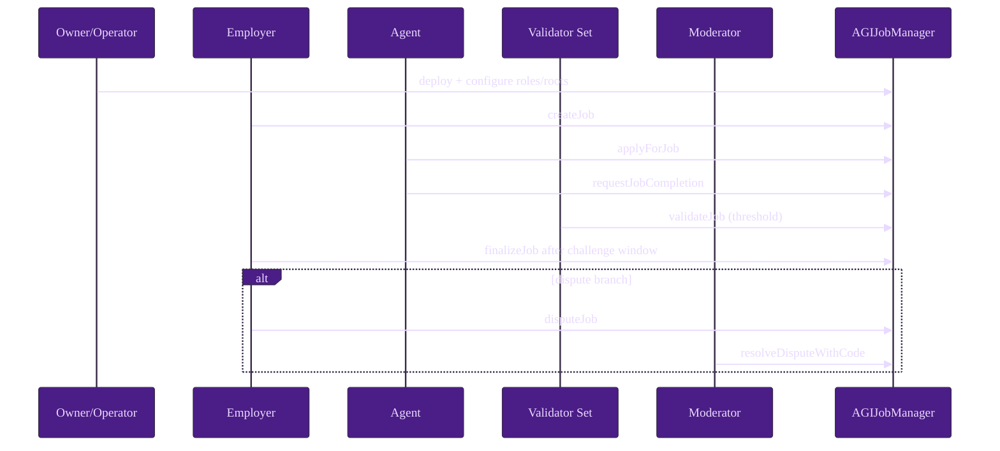
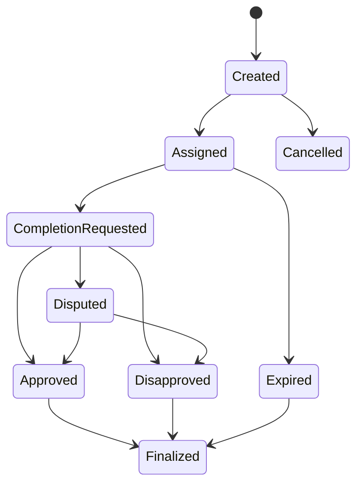

# Quintessential Use Case

This canonical walkthrough covers local deterministic execution and a production-safe operator checklist.

## A) Local walkthrough

### Prerequisites

```bash
npm ci
npm run build
npm test
```

### Step table

| Step | Actor | Function/Command | Preconditions | Expected on-chain outcome | Events emitted |
| --- | --- | --- | --- | --- | --- |
| 1 | Operator | `truffle migrate --network development` | Local chain running | Contract deployed and initialized | deployment logs |
| 2 | Owner | `addModerator`, `addAdditionalAgent`, `addAdditionalValidator`, `updateMerkleRoots` | Owner signer | Moderator + eligibility controls configured | `MerkleRootsUpdated` and role update events |
| 3 | Employer | `createJob(jobSpecURI,payout,duration,details)` | Employer funded/approved AGI | Escrow locked, job created | `JobCreated` |
| 4 | Agent | `applyForJob(jobId,subdomain,proof)` | Eligibility satisfied | Agent assigned and bond locked | `JobApplied` |
| 5 | Agent | `requestJobCompletion(jobId,jobCompletionURI)` | Assigned and active | Completion metadata recorded | `JobCompletionRequested` |
| 6a | Validators | `validateJob` | In review window | Approval counts progress toward threshold | `JobValidated` |
| 6b | Validators | `disapproveJob` | In review window | Disapproval counts progress toward threshold | `JobDisapproved` |
| 7 | Employer/anyone | `finalizeJob(jobId)` | Threshold met + challenge period elapsed | Payout/refund, bonds settled, NFT mint on agent-win | `JobCompleted` or outcome events + `NFTIssued` |
| 8 | Moderator | `resolveDisputeWithCode(jobId,code,reason)` | Active dispute | Terminal dispute outcome applied (`code=0` no-op optional) | `DisputeResolvedWithCode` |
| 9 | Anyone | `expireJob(jobId)` | Deadline passed without required completion path | Employer recovery path executed | `JobExpired` |
| 10 | Operator | Read getters + monitor events | Job settled | Accounting sanity (`withdrawableAGI`, locked totals) | Monitoring pipeline updates |

### Happy path sequence



### Lifecycle state map



### Expected state checkpoints

- After create: `getJobCore` shows employer, payout, duration, no assigned agent.
- After apply: assigned agent set, agent bond accounted.
- After completion request: completion URI present and completion timestamp set.
- After voting: validation counters/flags reflect threshold trajectory.
- After finalize/dispute resolution: job is terminal; escrow and bonds unlocked accordingly.

## B) Testnet/Mainnet operator checklist

1. Prepare owner and moderator signers with change-control approvals.
2. Validate deployment config in `migrations/deploy-config.js` and `.env.example`-documented env vars.
3. Dry-run deploy on testnet; archive tx hashes.
4. Configure moderators/allowlists/roots; verify via read calls and emitted events.
5. Publish operational policy for jobSpecURI and completion URI hygiene.
6. Enable monitoring for core events and revert telemetry.
7. Run a canary job end-to-end before full rollout.
8. Keep incident controls (`pause`, `settlementPaused`, blacklist) operationally rehearsed.
9. Confirm no secrets in repo; maintain offline key handling.
