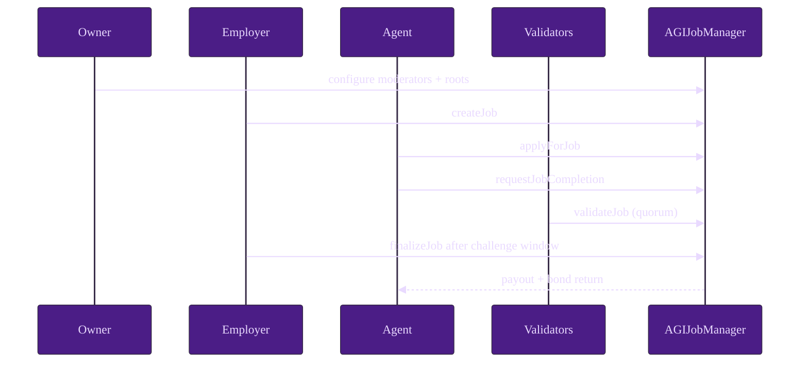
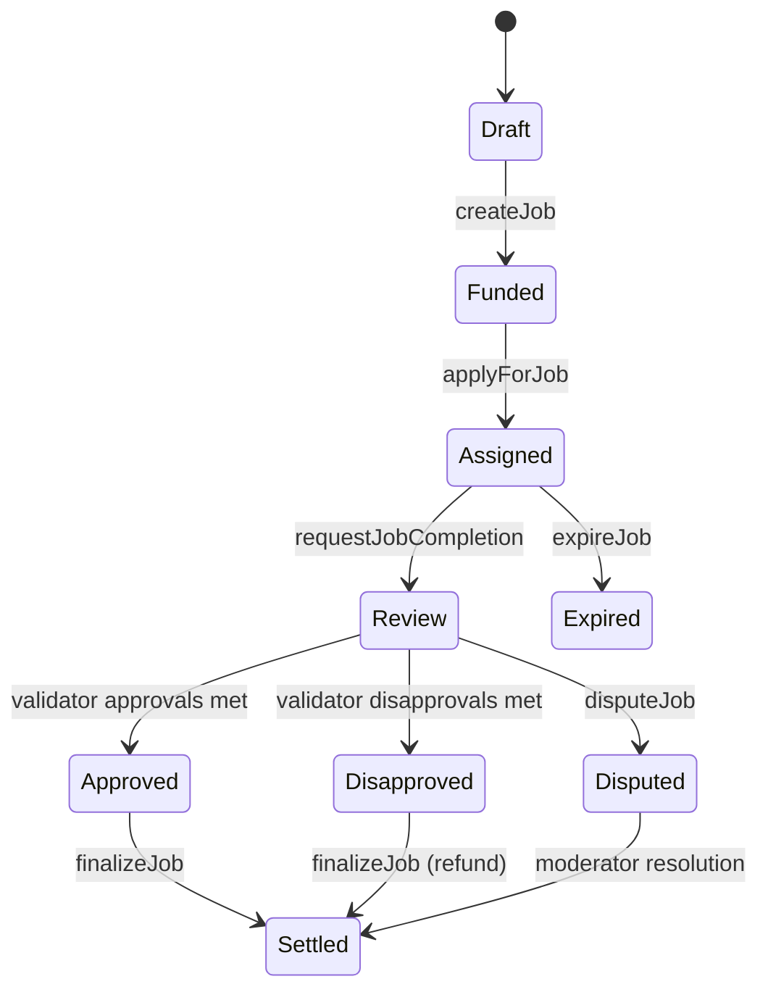

# Quintessential Use Case

A deterministic operator-to-settlement scenario covering happy path, disputes, and expiry.

## Step table

| Step | Actor | Function/Command | Preconditions | Expected on-chain outcome | Events emitted |
| --- | --- | --- | --- | --- | --- |
| 1 | Operator | `truffle migrate --network test` | Config present | Contract deployed and wired | deployment tx logs |
| 2 | Owner | `addModerator`, allowlist setters, `updateMerkleRoots` | ownership | governance and eligibility configured | config update events |
| 3 | Employer | `createJob(jobSpecURI, payout, duration, details)` | approved token balance | funded job created | `JobCreated` |
| 4 | Agent | `applyForJob(jobId, subdomain, proof)` | eligibility + bond | job assigned | `JobApplied` |
| 5 | Agent | `requestJobCompletion(jobId, jobCompletionURI)` | assigned and active | review phase starts | `JobCompletionRequested` |
| 6a | Validators | `validateJob` | eligibility + bond | approval count increases | `JobValidated` |
| 6b | Validators | `disapproveJob` | eligibility + bond | disapproval count increases | `JobDisapproved` |
| 7 | Employer | `finalizeJob(jobId)` | challenge/review conditions met | payout or refund path settles | `JobCompleted` or refund-side events |
| 8 | Moderator | `resolveDisputeWithCode(jobId, code, reason)` | active dispute | forced settlement by policy code | `DisputeResolvedWithCode` |
| 9 | Anyone | `expireJob(jobId)` | duration elapsed with no completion | expiry settlement | `JobExpired` |
| 10 | Operator | monitor events/getters | indexer active | solvency and lifecycle sanity | event stream + getter reads |

## Happy path sequence

## Lifecycle state diagram

## Expected state checkpoints

1. After deployment: owner, token, roots, and pause flags match intended baseline.
2. After configuration: moderator and allowlist/merkle settings readable and event-confirmed.
3. After job creation: escrow and active-job accounting incremented.
4. After apply: assigned agent and agent bond lock visible.
5. After completion request: review windows and timestamps populated.
6. After voting: vote tallies and bond locks reconciled.
7. After finalize/dispute/expire: job terminal, locked balances decremented, withdrawable totals sane.

## Testnet/Mainnet checklist (safe)

- Use hardware-backed or multisig owner custody.
- Validate deploy and post-deploy scripts in staging before production.
- Record all governance and parameter transactions.
- Keep incident runbook and moderation rota active before enabling traffic.
- Never publish secrets; use environment variables and `.env.example` patterns only.
