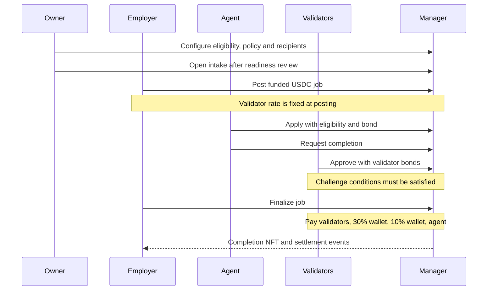
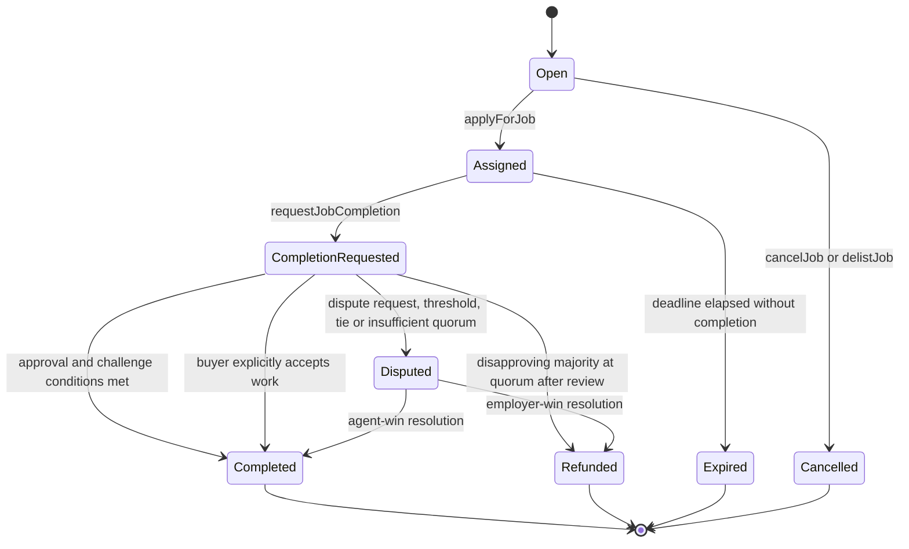

# Quintessential Use Case — v1.0.3

Follow one USDC-funded job from posting through settlement, then rehearse refunds and disputes separately. All amounts passed to the contract are integers in six-decimal USDC units: **100 USDC = 100000000**. ETH pays transaction gas; it is not a job-payment token.

Successful jobs pay validators first, then 30% and 10% of the original job cost to the two configured wallets, then the agent remainder. The validator percentage is fixed when the employer **posts** the job. With the default 8% budget, the baseline split is 8 / 30 / 10 / 52; rounding, unused rewards, bonds and slashing follow the [payout rules](USDC_PAYOUT_SPLIT.md).

## A) Local dev chain walkthrough

### Prerequisites

Use Node 22.23.2 and the committed lockfiles. From the repository root:

```bash
npm ci
npm --prefix hardhat ci
npm run build
node scripts/local-job-demo.cjs
```

### Launch and deploy

The command starts an isolated Hardhat chain in memory, deploys mock six-decimal USDC, a mock NFT credential, the eight libraries and the manager, then closes the chain when the demonstration finishes. It always selects the local network and uses disposable accounts. It sends no public-network transactions and needs no RPC URL or private key.

The demonstration verifies that construction starts paused, configures one eligible agent and validator, funds and approves their USDC, and opens local intake. It posts a 100 USDC job, assigns the agent, records completion and validator approval, advances the simulated clock, and finalizes. Its deliberately shortened review windows are test values, not production policy.

The output must show **8 / 30 / 10 / 52 USDC** for validator, first wallet, second wallet and agent. Balance comparisons start before assignment and voting, so returned bonds do not inflate those rewards. The script also asserts that all five reserves, including pending payment claims, and the manager's USDC balance finish at zero. Any failed assertion exits unsuccessfully.

Read [the runnable example](../scripts/local-job-demo.cjs) for the exact calls and [the contract tests](../test/happyPath.test.js) for additional eligibility and NFT assertions. Use `npm test` for the complete regression suite, including refund, dispute and expiry alternatives. All these tests run real EVM bytecode locally.

An agent must satisfy **both** an authorization route (additional allowlist, valid Merkle proof or supported ENS ownership) and a positive enabled AGI-type ERC-721 holding. The credential's legacy `payoutPercentage` score enables eligibility; it does not replace the job's USDC payout split. The demonstration uses the additional allowlist route, so its subdomain is empty and proof is `[]`.

### Step table

| Step | Actor | Function/Command | Preconditions | Expected on-chain outcome | Events emitted | What to verify next |
| --- | --- | --- | --- | --- | --- | --- |
| 1 | Operator | `node scripts/local-job-demo.cjs` | Root and Hardhat dependencies installed; current compiled artifacts | Local fixture deployed paused, configured, then explicitly unpaused | Deployment and pause events | Mock USDC, local recipients, owner and constructor wiring |
| 2 | Owner | `pauseIntake`, `addAGIType`, role/allowlist setters, optional `updateMerkleRoots`, then `unpauseIntake` | Reviewed local accounts; enabled NFT held by agent; safe policy configuration | Eligibility and policy configured before posting | `AGITypeUpdated`, pause/parameter events; `MerkleRootsUpdated` if called | Read role/allowlist maps directly; these setters do not all emit role-specific events |
| 3 | Employer | `createJob(jobSpecURI,payout,duration,details)` | Intake and settlement enabled; sufficient USDC/allowance; valid URI and limits | Job created, escrow locked, validator rate and agent percentage fixed at posting | `JobCreated`, USDC `Transfer` | `getJobCore`, posted terms and `lockedEscrow` |
| 4 | Agent | `applyForJob(jobId,subdomain,proof)` | Authorized and NFT-eligible; not blacklisted; open capacity; sufficient bond balance/allowance | Agent assigned, deadline starts, agent bond fixed for that assignment | `JobApplied`, USDC `Transfer` when bond is nonzero | Assigned agent, `assignedAt`, unchanged posting-time payout percentage and reserves |
| 5 | Agent | `requestJobCompletion(jobId,jobCompletionURI)` | Assigned agent; valid URI; active job within its permitted completion window | Completion URI and request time recorded | `JobCompletionRequested` | `getJobValidation` and `getJobCompletionURI` |
| 6 | Validator | `validateJob` or `disapproveJob` | Validator-authorized, not blacklisted, has not voted; review window open; bond balance/allowance | Vote and bond recorded; thresholds may approve or trigger a dispute | `JobValidated` or `JobDisapproved`; possibly `JobDisputed` | Counters, dispute state, bond reserves and applicable timers |
| 7 | Anyone | `finalizeJob(jobId)` | Required review/challenge conditions met; no active dispute; settlement enabled | Agent settlement, employer refund or a dispute according to votes | Agent win: `JobPayoutDistributed`, `NFTIssued`, `JobCompleted`; transfers for payouts/refunds; possibly `JobDisputed` | Actual outcome, ordered transfers and all remaining liabilities |
| 8 | Employer/agent; then moderator | `disputeJob`, then `resolveDisputeWithCode` | Completion requested; dispute opened within review window; initiator bond approved; moderator authorized | Code 1 settles for agent; code 2 refunds employer; code 0 leaves dispute open | `JobDisputed`, `DisputeResolvedWithCode`, outcome-dependent transfers/events | Resolution code, terminal state or still-open dispute |
| 9 | Anyone | `expireJob(jobId)` | Assigned, not disputed/terminal, no completion request, assignment deadline exceeded | Employer recovery and terminal expiry | `JobExpired`, USDC `Transfer` | `expired` flag and released escrow/bonds |
| 10 | Employer or owner | `cancelJob` or owner `delistJob` | Unassigned job; authorized caller; settlement enabled | Escrow refunded and job record deleted | `JobCancelled`, USDC `Transfer` | Refund event/balance; getters for the deleted job revert |
| 11 | Operator | Current getters and event/transfer reconciliation | A job action has confirmed successfully | Remaining liabilities reconcile with token balance | Read-only monitoring | Balance is at least all four job escrow/bond reserves; `withdrawableUSDC()` is only surplus |

The dispute, expiry and cancellation rows are alternative scenarios. Rehearse each on a separate eligible job; they are not steps to run after a successful terminal settlement.

### Happy path sequence diagram


```mermaid
sequenceDiagram
  participant O as Owner
  participant E as Employer
  participant A as Agent
  participant V as Validators
  participant C as Manager
  O->>C: Configure eligibility, policy and recipients
  O->>C: Open intake after readiness review
  E->>C: Post funded USDC job
  Note over E,C: Validator rate is fixed at posting
  A->>C: Apply with eligibility and bond
  A->>C: Request completion
  V->>C: Approve with validator bonds
  Note over V,C: Challenge conditions must be satisfied
  E->>C: Finalize job
  Note over V,C: Pay validators, 30% wallet, 10% wallet, agent
  C-->>E: Completion NFT and settlement events
```

### Lifecycle state diagram


```mermaid
stateDiagram-v2
  [*] --> Open
  Open --> Assigned: applyForJob
  Open --> Cancelled: cancelJob or delistJob
  Assigned --> CompletionRequested: requestJobCompletion
  Assigned --> Expired: deadline elapsed without completion
  CompletionRequested --> Completed: approval and challenge conditions met
  CompletionRequested --> Completed: buyer explicitly accepts work
  CompletionRequested --> Refunded: disapproving majority at quorum after review
  CompletionRequested --> Disputed: dispute request, threshold, tie or insufficient quorum
  Disputed --> Completed: agent-win resolution
  Disputed --> Refunded: employer-win resolution
  Completed --> [*]
  Refunded --> [*]
  Expired --> [*]
  Cancelled --> [*]
```

The diagram summarizes contract conditions, not automatic background execution. An eligible caller must submit the relevant transaction. Expiry cannot replace completion review once completion has been requested. Code-0 dispute resolution leaves the job disputed; stale-dispute owner resolution becomes available only after its configured deadline.

### Expected state checkpoints

- **Post-deploy:** confirm `owner()`, `pendingOwner()`, `usdcToken()`, `wallet30()`, `wallet10()`, namespace roots and both pause flags. Public deployment remains paused; the disposable demonstration explicitly opens intake after configuring its fixture.
- **Post-config:** verify moderator/allowlist maps, Merkle roots, enabled NFT type and the agent's holding. Check the final owner's acceptance and policy before public activation.
- **Post-create:** `getJobCore(jobId)` contains employer, payout, duration, unassigned state and the posting-time `agentPayoutPct`; `lockedEscrow` increases by the exact funded amount.
- **Post-apply:** `assignedAgent` and `assignedAt` are set; the existing payout percentage is unchanged. Agent-bond reserves increase by the computed bond.
- **Post-completion request:** the URI is valid and recorded; `getJobValidation` supplies the completion flag/time and vote counters.
- **Post-voting:** vote counters and validator-bond reserves reconcile with confirmed votes. Check dispute state before trying to finalize.
- **Post-finalization/resolution:** verify the actual outcome from state and USDC transfers. `completed=true` can also represent an employer refund; an agent win additionally emits payout/NFT events. No 30%/10% shares are taken from employer-refund outcomes.
- **Post-cancellation:** the refund is confirmed and `JobCancelled` is recorded; the deleted job is no longer available through job getters.
- **Accounting:** compare total USDC balance with all five reserve counters, including pending payment claims. Fully distributed job costs do not create withdrawable protocol revenue.

## B) Testnet/mainnet operator checklist

1. **Release and scope:** verify v1.0.3 source/checksums and its qualification evidence. Publishing software does not deploy a live manager or verify an operator's production setup.
2. **Signing:** use the [Hardhat guide](../hardhat/README.md), a disposable deployer and a reviewed final owner/signing arrangement. Local tests and demonstrations use disposable accounts only.
3. **Configuration:** review `hardhat/deploy.config.cjs` and `hardhat/.env.example`. Supply native Circle USDC, both distinct settlement wallets, intended owner, ENS/namespace settings and Merkle roots; do not use `migrations/deploy-config.js` for public deployment.
4. **Plan and rehearse:** from `hardhat/`, run `DRY_RUN=1 npm run deploy:sepolia` with reviewed settings, then perform a separately authorized Sepolia deployment. Rehearse eligibility, posting, validator payouts, refunds, disputes and the actual ownership handover.
5. **Verify and accept:** preserve the deployment journal, verify all linked code and explorer sources, and have the proposed owner call `acceptOwnership()`. Keep public intake paused throughout configuration.
6. **Prepare participants:** ensure agents satisfy authorization and any NFT requirement recorded by their jobs; fund participants with native USDC and ETH for gas. Check required token allowances, bonds, thresholds and review windows.
7. **Readiness:** run the read-only checker against the reviewed deployment receipt as described in [deployment operations](DEPLOYMENT_OPERATIONS.md). Review its recorded block and hash, current identity settings, recipients, ownership, issuer status and reserve totals, plus operational checks outside its scope.
8. **Containment rehearsal:** rehearse intake pause, settlement pause, `pauseAll`, appropriate blacklist use and stale-dispute recovery. Never use an irreversible identity lock as an emergency response.
9. **Activation and canary:** only the accepted owner opens intake after the reviewed launch gates. Execute a deliberately limited first job; reconcile validator rewards, gross-cost wallet shares, agent remainder and separate bonds before increasing exposure.
10. **Monitoring:** alert on pauses, disputes, withdrawals, recipient/identity changes and stalled jobs. Continuously reconcile token balance and all reserved liabilities. Review [incident response](OPERATIONS/INCIDENT_RESPONSE.md) before operating with significant funds.
