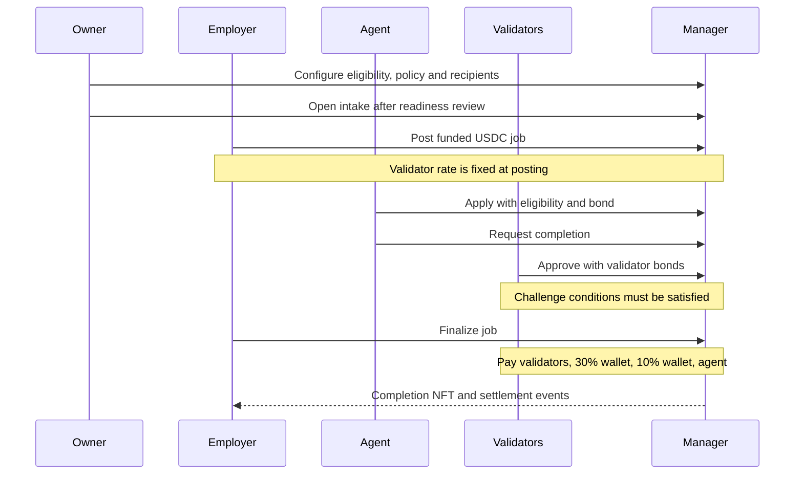

# Quintessential Use Case — v0.9.0

Follow one USDC-funded job from posting through settlement, then rehearse refunds and disputes separately. All amounts passed to the contract are integers in six-decimal USDC units: **100 USDC = 100000000**. ETH pays transaction gas; it is not a job-payment token.

Successful jobs pay validators first, then 30% and 10% of the original job cost to the two configured wallets, then the agent remainder. The validator percentage is fixed when the employer **posts** the job. With the default 8% budget, the baseline split is 8 / 30 / 10 / 52; rounding, unused rewards, bonds and slashing follow the [payout rules](USDC_PAYOUT_SPLIT.md).

## A) Local dev chain walkthrough

### Prerequisites

Use Node 22.23.2 and a disposable local environment. Root Truffle/Ganache dependencies are local test tooling; do not supply production keys. From the repository root:

```bash
npm ci
npm run build
npm test
```

### Launch and deploy

Run Ganache in one terminal:

```bash
npx ganache --wallet.totalAccounts 10 --wallet.defaultBalance 1000 --chain.chainId 1337
```

In a second terminal, from the repository root:

```bash
npx truffle migrate --network development --reset
npx truffle console --network development
```

This migration deploys a **mock** six-decimal USDC and mock ENS components, assigns local accounts 8 and 9 as the settlement wallets, and explicitly unpauses the disposable manager. Public deployment uses Hardhat and keeps the constructor's intake pause in place.

In the fresh Truffle console, set up a local employer, eligible agent and validator. The short review settings below are demo values, not recommended production policy. Re-pause intake while configuring:

```javascript
const addresses = await web3.eth.getAccounts();
const [owner, employer, agent, validator, moderator] = addresses;
const manager = await artifacts.require('AGIJobManager').deployed();
const usdc = await artifacts.require('MockERC20').deployed();
await manager.pauseIntake({ from: owner });
const credential = await artifacts.require('MockERC721').new({ from: owner });
await credential.mint(agent, { from: owner });
await manager.addAGIType(credential.address, 1, { from: owner });
await manager.addAdditionalAgent(agent, { from: owner });
await manager.addAdditionalValidator(validator, { from: owner });
await manager.addModerator(moderator, { from: owner });
await manager.setRequiredValidatorApprovals(1, { from: owner });
await manager.setChallengePeriodAfterApproval(1, { from: owner });
await manager.setCompletionReviewPeriod(300, { from: owner });
for (const account of [employer, agent, validator]) {
  await usdc.mint(account, '100000000', { from: owner });
  await usdc.approve(manager.address, '100000000', { from: account });
}
await manager.unpauseIntake({ from: owner });
```

An agent must satisfy **both** an authorization route (additional allowlist, valid Merkle proof or supported ENS ownership) and a positive enabled AGI-type ERC-721 holding. The credential's legacy `payoutPercentage` score enables eligibility; it does not replace the job's USDC payout split. The fixture uses the additional allowlist route, so its subdomain is empty and proof is `[]`.

Post and complete the local example:

```javascript
const posted = await manager.createJob('ipfs://job-spec', '100000000', 3600, 'Local rehearsal', { from: employer });
const jobId = posted.logs.find(log => log.event === 'JobCreated').args.jobId;
await manager.applyForJob(jobId, '', [], { from: agent });
await manager.requestJobCompletion(jobId, 'ipfs://job-result', { from: agent });
await manager.validateJob(jobId, '', [], { from: validator });
```

Wait at least two seconds for this fixture's one-second challenge period, then call `await manager.finalizeJob(jobId, { from: employer })`. With no competing vote or dispute, this completes the job. Compare recipient balances with their balances **before assignment/voting** so returned bonds are not mistaken for extra rewards. Do not reuse the shortened thresholds/windows as production defaults.

### Step table

| Step | Actor | Function/Command | Preconditions | Expected on-chain outcome | Events emitted | What to verify next |
| --- | --- | --- | --- | --- | --- | --- |
| 1 | Operator | `npx truffle migrate --network development --reset` | Disposable Ganache chain 1337; ten local accounts | Local fixture deployed and explicitly unpaused by migration | Deployment and pause events | Mock USDC, local recipients, owner and constructor wiring |
| 2 | Owner | `pauseIntake`, `addAGIType`, role/allowlist setters, optional `updateMerkleRoots`, then `unpauseIntake` | Reviewed local accounts; enabled NFT held by agent; safe policy configuration | Eligibility and policy configured before posting | `AGITypeUpdated`, pause/parameter events; `MerkleRootsUpdated` if called | Read role/allowlist maps directly; these setters do not all emit role-specific events |
| 3 | Employer | `createJob(jobSpecURI,payout,duration,details)` | Intake and settlement enabled; sufficient USDC/allowance; valid URI and limits | Job created, escrow locked, validator rate and agent percentage fixed at posting | `JobCreated`, USDC `Transfer` | `getJobCore`, posted terms and `lockedEscrow` |
| 4 | Agent | `applyForJob(jobId,subdomain,proof)` | Authorized and NFT-eligible; not blacklisted; open capacity; sufficient bond balance/allowance | Agent assigned, deadline starts, agent bond fixed for that assignment | `JobApplied`, USDC `Transfer` when bond is nonzero | Assigned agent, `assignedAt`, unchanged posting-time payout percentage and reserves |
| 5 | Agent | `requestJobCompletion(jobId,jobCompletionURI)` | Assigned agent; valid URI; active job within its permitted completion window | Completion URI and request time recorded | `JobCompletionRequested` | `getJobValidation` and `getJobCompletionURI` |
| 6 | Validator | `validateJob` or `disapproveJob` | Validator-authorized, not blacklisted, has not voted; review window open; bond balance/allowance | Vote and bond recorded; thresholds may approve or trigger a dispute | `JobValidated` or `JobDisapproved`; possibly `JobDisputed` | Counters, dispute state, bond reserves and applicable timers |
| 7 | Anyone | `finalizeJob(jobId)` | Required review/challenge conditions met; no active dispute; settlement enabled | Agent settlement, employer refund or a dispute according to votes | Agent win: `JobPayoutDistributed`, `NFTIssued`, `JobCompleted`; transfers for payouts/refunds; possibly `JobDisputed` | Actual outcome, ordered transfers and all remaining liabilities |
| 8 | Employer/agent; then moderator | `disputeJob`, then `resolveDisputeWithCode` | Completion requested; dispute opened within review window; initiator bond approved; moderator authorized | Code 1 settles for agent; code 2 refunds employer; code 0 leaves dispute open | `JobDisputed`, `DisputeResolvedWithCode`, outcome-dependent transfers/events | Resolution code, terminal state or still-open dispute |
| 9 | Anyone | `expireJob(jobId)` | Assigned, not disputed/terminal, no completion request, assignment deadline exceeded | Employer recovery and terminal expiry | `JobExpired`, USDC `Transfer` | `expired` flag and released escrow/bonds |
| 10 | Employer or owner | `cancelJob` or owner `delistJob` | Unassigned job; authorized caller; settlement enabled | Escrow refunded and job record deleted | `JobCancelled`, USDC `Transfer` | Refund event/balance; getters for the deleted job revert |
| 11 | Operator | Current getters and event/transfer reconciliation | A job action has confirmed successfully | Remaining liabilities reconcile with token balance | Read-only monitoring | Balance is at least all four reserves; `withdrawableUSDC()` is only surplus |

The dispute, expiry and cancellation rows are alternative scenarios. Rehearse each on a separate eligible job; they are not steps to run after a successful terminal settlement.

### Happy path sequence diagram


```mermaid
sequenceDiagram
  participant O as Owner
  participant E as Employer
  participant A as Agent
  participant V as Validators
  participant C as Manager
  O->>C: Configure eligibility, policy and recipients
  O->>C: Open intake after readiness review
  E->>C: Post funded USDC job
  Note over E,C: Validator rate is fixed at posting
  A->>C: Apply with eligibility and bond
  A->>C: Request completion
  V->>C: Approve with validator bonds
  Note over V,C: Challenge conditions must be satisfied
  E->>C: Finalize job
  Note over V,C: Pay validators, 30% wallet, 10% wallet, agent
  C-->>E: Completion NFT and settlement events
```

### Lifecycle state diagram


```mermaid
stateDiagram-v2
  [*] --> Open
  Open --> Assigned: applyForJob
  Open --> Cancelled: cancelJob or delistJob
  Assigned --> CompletionRequested: requestJobCompletion
  Assigned --> Expired: deadline elapsed without completion
  CompletionRequested --> Completed: approval and challenge conditions met
  CompletionRequested --> Completed: no votes after review window
  CompletionRequested --> Refunded: disapproving majority at quorum after review
  CompletionRequested --> Disputed: dispute request, threshold, tie or insufficient quorum
  Disputed --> Completed: agent-win resolution
  Disputed --> Refunded: employer-win resolution
  Completed --> [*]
  Refunded --> [*]
  Expired --> [*]
  Cancelled --> [*]
```

The diagram summarizes contract conditions, not automatic background execution. An eligible caller must submit the relevant transaction. Expiry cannot replace completion review once completion has been requested. Code-0 dispute resolution leaves the job disputed; stale-dispute owner resolution becomes available only after its configured deadline.

### Expected state checkpoints

- **Post-deploy:** confirm `owner()`, `pendingOwner()`, `usdcToken()`, `wallet30()`, `wallet10()`, namespace roots and both pause flags. Public deployment remains paused; the disposable migration deliberately unpauses its fixture.
- **Post-config:** verify moderator/allowlist maps, Merkle roots, enabled NFT type and the agent's holding. Check the final owner's acceptance and policy before public activation.
- **Post-create:** `getJobCore(jobId)` contains employer, payout, duration, unassigned state and the posting-time `agentPayoutPct`; `lockedEscrow` increases by the exact funded amount.
- **Post-apply:** `assignedAgent` and `assignedAt` are set; the existing payout percentage is unchanged. Agent-bond reserves increase by the computed bond.
- **Post-completion request:** the URI is valid and recorded; `getJobValidation` supplies the completion flag/time and vote counters.
- **Post-voting:** vote counters and validator-bond reserves reconcile with confirmed votes. Check dispute state before trying to finalize.
- **Post-finalization/resolution:** verify the actual outcome from state and USDC transfers. `completed=true` can also represent an employer refund; an agent win additionally emits payout/NFT events. No 30%/10% shares are taken from employer-refund outcomes.
- **Post-cancellation:** the refund is confirmed and `JobCancelled` is recorded; the deleted job is no longer available through job getters.
- **Accounting:** compare total USDC balance with all four reserve counters across every remaining job. Fully distributed job costs do not create withdrawable protocol revenue.

## B) Testnet/mainnet operator checklist

1. **Release and scope:** verify v0.9.0 source/checksums and its qualification evidence. Publishing software does not deploy a live manager or verify an operator's production setup.
2. **Signing:** use the [Hardhat guide](../hardhat/README.md), a disposable deployer and a reviewed final owner/signing arrangement. Never supply public-network keys to Truffle/Ganache tools.
3. **Configuration:** review `hardhat/deploy.config.js` and `hardhat/.env.example`. Supply native Circle USDC, both distinct settlement wallets, intended owner, ENS/namespace settings and Merkle roots; do not use `migrations/deploy-config.js` for public deployment.
4. **Plan and rehearse:** from `hardhat/`, run `DRY_RUN=1 npm run deploy:sepolia` with reviewed settings, then perform a separately authorized Sepolia deployment. Rehearse eligibility, posting, validator payouts, refunds, disputes and the actual ownership handover.
5. **Verify and accept:** preserve the deployment journal, verify all linked code and explorer sources, and have the proposed owner call `acceptOwnership()`. Keep public intake paused throughout configuration.
6. **Prepare participants:** ensure agents satisfy both authorization and enabled NFT eligibility; fund participants with native USDC and ETH for gas. Check required token allowances, bonds, thresholds and review windows.
7. **Readiness:** run the read-only checker against the reviewed deployment receipt as described in [deployment operations](DEPLOYMENT_OPERATIONS.md). Review its recorded block and hash, current identity settings, recipients, ownership, issuer status and reserve totals, plus operational checks outside its scope.
8. **Containment rehearsal:** rehearse intake pause, settlement pause, `pauseAll`, appropriate blacklist use and stale-dispute recovery. Never use an irreversible identity lock as an emergency response.
9. **Activation and canary:** only the accepted owner opens intake after the reviewed launch gates. Execute a deliberately limited first job; reconcile validator rewards, gross-cost wallet shares, agent remainder and separate bonds before increasing exposure.
10. **Monitoring:** alert on pauses, disputes, withdrawals, recipient/identity changes and stalled jobs. Continuously reconcile token balance and all reserved liabilities. Review [incident response](OPERATIONS/INCIDENT_RESPONSE.md) before operating with significant funds.
