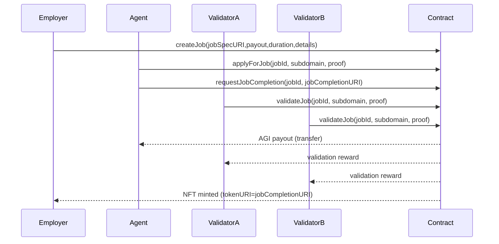
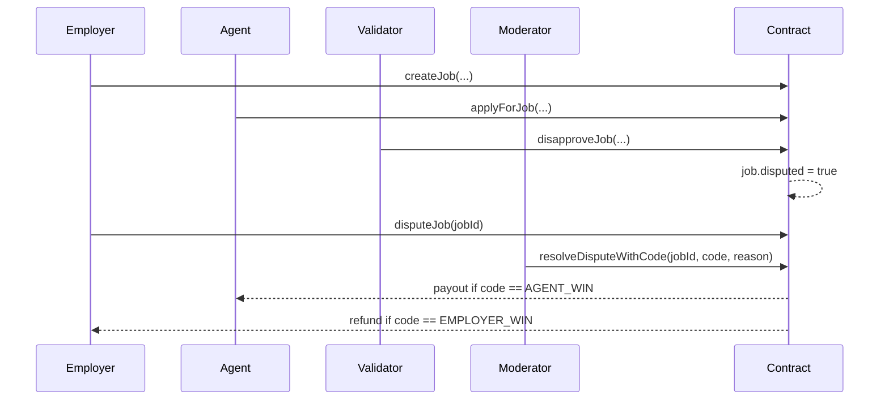

# AGIJobManager — User Guide (Start Here)

This guide is written for **all roles**, starting with non‑technical users. It explains how to safely use the AGIJobManager smart contract without needing to read Solidity. For deep technical details, see the role guides and reference docs.

> **Safety first**
> - Always verify contract addresses and token addresses from trusted sources before sending any funds.
> - Use **small test amounts** first.
> - Never grant unlimited ERC‑20 approvals unless you fully trust the contract and your wallet is secured.
> - Use a hardware wallet or multisig for owner/operator keys.

## What this contract does (plain English)
AGIJobManager lets an employer escrow an ERC‑20 payout, select an agent to do work, and request validation from validators. When validators approve, the agent is paid, validators are rewarded, and an NFT “receipt” is minted to the employer. A dispute path exists and is resolved by moderators.

## Roles & where to go next
- **Employer**: post jobs, escrow AGI, cancel, dispute, receive NFT → [`docs/roles/EMPLOYER.md`](roles/EMPLOYER.md)
- **Agent**: prove identity, apply, request completion, get paid, reputation → [`docs/roles/AGENT.md`](roles/AGENT.md)
- **Validator**: approve/disapprove, vote rules, payouts, reputation → [`docs/roles/VALIDATOR.md`](roles/VALIDATOR.md)
- **Moderator**: resolve disputes, resolution strings → [`docs/roles/MODERATOR.md`](roles/MODERATOR.md)
- **Owner/Operator**: pause, allowlists, blacklists, parameter tuning, withdrawals → [`docs/roles/OWNER_OPERATOR.md`](roles/OWNER_OPERATOR.md)
- **NFT buyers/sellers**: listNFT, purchaseNFT, delistNFT → [`docs/roles/NFT_MARKETPLACE.md`](roles/NFT_MARKETPLACE.md)

## Contract lifecycle (visual)
### Happy path (job → validation → payout + NFT)


### Dispute path (disapproval or manual dispute → moderator resolution)


## Quickstart — Local Dev Chain (Truffle + Ganache)
This path is best for experimentation and demos. It uses mock ENS/Resolver/NameWrapper contracts to satisfy identity checks.

### 1) Install dependencies
```bash
npm install
```

### 2) Open Truffle console
```bash
npx truffle console --network test
```

### 3) Deploy mocks + AGIJobManager
```javascript
const MockERC20 = artifacts.require("MockERC20");
const MockENS = artifacts.require("MockENS");
const MockResolver = artifacts.require("MockResolver");
const MockNameWrapper = artifacts.require("MockNameWrapper");
const AGIJobManager = artifacts.require("AGIJobManager");

const token = await MockERC20.new();
const ens = await MockENS.new();
const resolver = await MockResolver.new();
const nameWrapper = await MockNameWrapper.new();

const clubRoot = web3.utils.soliditySha3({ type: "string", value: "club-root" });
const agentRoot = web3.utils.soliditySha3({ type: "string", value: "agent-root" });
const alphaClubRoot = web3.utils.soliditySha3({ type: "string", value: "alpha.club-root" });
const alphaAgentRoot = web3.utils.soliditySha3({ type: "string", value: "alpha.agent-root" });
const zeroRoot = "0x" + "00".repeat(32);

const manager = await AGIJobManager.new(
  token.address,
  "ipfs://base",
  ens.address,
  nameWrapper.address,
  clubRoot,
  agentRoot,
  alphaClubRoot,
  alphaAgentRoot,
  zeroRoot,
  zeroRoot
);
```

### 4) Run a happy‑path job end‑to‑end
```javascript
const accounts = await web3.eth.getAccounts();
const [owner, employer, agent, validatorA, validatorB] = accounts;

// Mint tokens for employer
await token.mint(employer, web3.utils.toWei("100"));
await token.approve(manager.address, web3.utils.toWei("100"), { from: employer });

// Set NameWrapper ownership for agent/validators
const subnode = (root, label) => web3.utils.soliditySha3(
  { type: "bytes32", value: root },
  { type: "bytes32", value: web3.utils.keccak256(label) }
);
await nameWrapper.setOwner(subnode(agentRoot, "agent"), agent);
await nameWrapper.setOwner(subnode(clubRoot, "validator-a"), validatorA);
await nameWrapper.setOwner(subnode(clubRoot, "validator-b"), validatorB);

// Create & complete job
const jobTx = await manager.createJob("ipfs-job-spec", web3.utils.toWei("100"), 3600, "details", { from: employer });
const jobId = jobTx.logs[0].args.jobId.toNumber();

await manager.applyForJob(jobId, "agent", [], { from: agent });
await manager.requestJobCompletion(jobId, "ipfs-completion", { from: agent });

await manager.setRequiredValidatorApprovals(2, { from: owner });
await manager.validateJob(jobId, "validator-a", [], { from: validatorA });
await manager.validateJob(jobId, "validator-b", [], { from: validatorB });
```

✅ At this point, the agent is paid, validators are rewarded, and the employer owns an NFT receipt.

## Quickstart — Testnet/Mainnet using Etherscan (non‑technical)
This path uses the Etherscan **Write Contract** UI. You will need the contract address and ABI.

### Before you start
1. Confirm the AGI token address and AGIJobManager contract address from a trusted source.
2. Use a **small allowance** and **small payout** first.
3. Know which **identity gate** your role uses:
   - **ENS/NameWrapper ownership** (subdomain string), or
   - **Merkle allowlist** (you need a Merkle proof), or
   - **Additional allowlist** managed by the owner (additionalAgents/additionalValidators).

### Approving ERC‑20 allowance (safe method)
1. Go to the AGI token contract on Etherscan → **Write Contract**.
2. Connect your wallet.
3. Call `approve(spender, amount)` where:
   - `spender` = AGIJobManager contract address
   - `amount` = exact payout you want to escrow
4. **After the job completes**, revoke or reduce the allowance by calling `approve(spender, 0)`.

### Common calls (click‑by‑click)
> **Tip:** Use the “Copy” icon in Etherscan to copy exact addresses.
> **Screenshot placeholder:** (Add screenshot of Etherscan “Write Contract” tab with wallet connected.)

**Employer**
1. `createJob(jobSpecURI, payout, duration, details)`
   - `jobSpecURI`: ERC‑721 metadata URI (full `ipfs://...` or `https://...` recommended)
   - `payout`: integer in token wei (18 decimals)
   - `duration`: seconds
   - `details`: short plain text
2. Optional: `cancelJob(jobId)` if no agent is assigned and not completed.
3. Optional: `disputeJob(jobId)` if you disagree with completion.

**Agent**
1. `applyForJob(jobId, subdomain, proof)`
   - `subdomain`: your ENS/NameWrapper subdomain label (ex: `alice`)
   - `proof`: Merkle proof array if using allowlist, else `[]`
2. `requestJobCompletion(jobId, jobCompletionURI)` after work is done.

**Validator**
1. `validateJob(jobId, subdomain, proof)` to approve.
2. `disapproveJob(jobId, subdomain, proof)` to reject (may trigger dispute).

**Moderator**
1. `resolveDisputeWithCode(jobId, resolutionCode, reason)`
   - Use `1` for agent win, `2` for employer win, `0` to log a note and keep the dispute active.

**NFT Marketplace**
1. `listNFT(tokenId, price)`
2. `purchaseNFT(tokenId)` (buyer must approve token spending first)
3. `delistNFT(tokenId)`

## What happens on‑chain (events + balances)
Every step emits events and changes state/balances.

| Action | Events | Token movements | State changes |
| --- | --- | --- | --- |
| `createJob` | `JobCreated` | employer → contract escrow | new job stored |
| `applyForJob` | `JobApplied` | none | `assignedAgent`, `assignedAt` |
| `requestJobCompletion` | `JobCompletionRequested` | none | `completionRequested`, `jobCompletionURI` |
| `validateJob` | `JobValidated` | none (until threshold) | `validatorApprovals`, validator maps |
| `disapproveJob` | `JobDisapproved`, maybe `JobDisputed` | none | `validatorDisapprovals`, `disputed` |
| `resolveDisputeWithCode(AGENT_WIN)` | `DisputeResolvedWithCode`, `DisputeResolved`, `JobCompleted`, `NFTIssued` | contract → agent/validators | `completed`, reputation updates |
| `resolveDisputeWithCode(EMPLOYER_WIN)` | `DisputeResolvedWithCode`, `DisputeResolved` | contract → employer refund | `completed` |
| `listNFT` | `NFTListed` | none | listing active |
| `purchaseNFT` | `NFTPurchased` | buyer → seller | listing inactive, NFT transfer |
| `delistNFT` | `NFTDelisted` | none | listing inactive |

Key events include:
- `JobCreated`, `JobApplied`, `JobCompletionRequested`
- `JobValidated`, `JobDisapproved`, `JobDisputed`, `DisputeResolvedWithCode`, `DisputeResolved`
- `JobCompleted`, `NFTIssued`
- `NFTListed`, `NFTPurchased`, `NFTDelisted`

Token movements:
- **createJob**: employer → contract escrow
- **completion**: contract → agent + validators
- **employer win**: contract → employer refund
- **NFT sale**: buyer → seller

## Safety & failure modes
Common revert reasons include `NotAuthorized`, `InvalidState`, `JobNotFound`, and `TransferFailed`. For full diagnostics and fixes, see [`docs/TROUBLESHOOTING.md`](TROUBLESHOOTING.md).

## Developer deep‑dive
- Full contract surface area: [`docs/REFERENCE.md`](REFERENCE.md)
- Test instructions: [`docs/TESTING.md`](TESTING.md)
- Security practices: [`docs/SECURITY_BEST_PRACTICES.md`](SECURITY_BEST_PRACTICES.md)
