# Architecture & state machine

This document summarizes the on-chain modules inside the monolithic
`AGIJobManager` contract and the job lifecycle it enforces.

## Contract modules (single-contract composition)
- **Job escrow & state machine**: `createJob`, `applyForJob`, `requestJobCompletion`,
  `finalizeJob`, `expireJob`, `cancelJob`, `delistJob`, plus internal settlement.
- **Validation & dispute handling**: validator approvals/disapprovals,
  dispute opening, moderator resolution, and stale-dispute owner recovery.
- **ERC‑721 completion NFTs**: minted on job completion; URI points to completion
  metadata.
- **Reputation system**: on-chain reputation updates for agents and approving
  validators with diminishing returns and a hard cap.
- **Identity verification**: ENS/NameWrapper checks plus Merkle allowlists and
  explicit allow/deny overrides.

## Job lifecycle (plain English)
1. **Open**: employer creates a job and escrows the payout.
2. **InProgress**: an eligible agent applies and is assigned.
3. **CompletionRequested**: the agent submits completion metadata.
4. **Completed**: validators approve to threshold, or completion review period
   elapses and `finalizeJob` is called.
5. **Disputed**: validators disapprove to threshold or parties call `disputeJob`.
6. **Expired**: duration elapses without completion request and anyone calls
   `expireJob`.
7. **Cancelled/Delisted**: employer cancels an unassigned job or owner delists it.

## State transition diagram (Mermaid)

```mermaid
stateDiagram-v2
    [*] --> Open: createJob
    Open --> InProgress: applyForJob
    InProgress --> CompletionRequested: requestJobCompletion

    CompletionRequested --> Completed: validateJob (approvals)
    CompletionRequested --> Completed: finalizeJob (review timeout)

    CompletionRequested --> Disputed: disapproveJob (disapproval threshold)
    CompletionRequested --> Disputed: disputeJob (manual)

    Disputed --> Completed: resolveDisputeWithCode(AGENT_WIN)
    Disputed --> Completed: resolveDisputeWithCode(EMPLOYER_WIN)
    Disputed --> Completed: resolveStaleDispute (owner, timeout; pause optional)

    InProgress --> Expired: expireJob (duration elapsed)
    Open --> Cancelled: cancelJob (employer)
    Open --> Cancelled: delistJob (owner)
```

## Liveness and finality timeouts
- **Job duration** (`jobDurationLimit`, per-job `duration`):
  - If the duration elapses without a completion request, anyone can call
    `expireJob` to refund the employer.
- **Completion review period** (`completionReviewPeriod`):
  - After completion is requested, anyone can call `finalizeJob` once the review
    window has passed.
  - `finalizeJob` selects the outcome based on validator approvals vs
    disapprovals or defaults to an agent win when no validators acted.
- **Dispute review period** (`disputeReviewPeriod`):
  - If a dispute remains unresolved past the review window, the owner can call
    `resolveStaleDispute` after `disputeReviewPeriod` (pause optional; often used for incident response).

## Why this matters
The state machine guarantees that escrowed funds are released only through
defined settlement paths and that every completion payout has a recorded
completion metadata URI.
