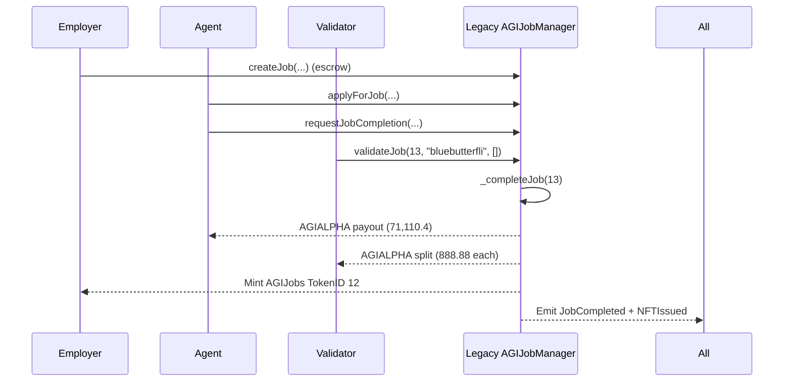

# Legacy AGI Job #12 (TokenID 12) vs. New AGIJobManager — Case Study

## At a glance

> **Legacy contract (mainnet, v0)**: [`0x0178B6baD606aaF908f72135B8eC32Fc1D5bA477`](https://etherscan.io/address/0x0178B6baD606aaF908f72135B8eC32Fc1D5bA477)  
> **Legacy completion tx**: [`0xbd3f652ba96154388186a47e4e6620f3e97d05c7384d5e6954460a39c666c6ac`](https://etherscan.io/tx/0xbd3f652ba96154388186a47e4e6620f3e97d05c7384d5e6954460a39c666c6ac)  
> **Legacy ERC‑721 minted**: AGIJobs TokenID **12**  
> **Legacy ERC‑20 used**: AGIALPHA `0x2E8F3ED88BcBB469bEc54a9A8D1a2f980E09070B`  
> **When**: Aug‑03‑2025 12:59:23 AM +UTC (per Etherscan)  
> **Function invoked**: `validateJob(uint256 _jobId,string subdomain,bytes32[] proof)`  
> &nbsp;&nbsp;• `_jobId = 13`  
> &nbsp;&nbsp;• `subdomain = "bluebutterfli"`  
> &nbsp;&nbsp;• `proof = []` (empty array)

**Participants**
- **Validator / tx sender**: `0x9DbBBC1E49dA102dC6c667a238E7EedEA9b0E290`
- **Agent paid (888.node.agi.eth)**: `0x5ff14ac26a21B3ceB4421F86fB5aaa4B9F084f2A`
- **Employer / NFT receiver (asi.eth)**: `0xd76AD27E9C819c345A14825797ca8AFc0C15A491`

**Outputs observed on the legacy tx**
- **ERC‑20 transfers (from legacy contract)**
  - `71,110.4` AGIALPHA → `0x5ff14ac26a21B3ceB4421F86fB5aaa4B9F084f2A` (agent)
  - `888.88` AGIALPHA → each validator address:
    - `0x21301d901db04724597d1b6012ac49878157580d`
    - `0xa9ed0539c2fbc5c6bc15a2e168bd9bcd07c01201`
    - `0xecb97519efd7d9d9d279e7c284b286bbe10afaa9`
    - `0x5e5f40346387874922e17b177f55a8880dd432cb`
    - `0x2fdc910574113dfe6a4db5971e166e286813c79f`
    - `0x88692de2a896c6534e544976defd41064904c730`
    - `0xa46cea0a1871b875ee8a1798848c0089a321e588`
    - `0x9DbBBC1E49dA102dC6c667a238E7EedEA9b0E290`
- **ERC‑721 mint**: TokenID `12` minted from `0x0000000000000000000000000000000000000000` to `0xd76AD27E9C819c345A14825797ca8AFc0C15A491`
- **`NFTIssued` event tokenURI**:  
  `https://ipfs.io/ipfs//bafkreibq3jcpanwlzubcvhdwstbfrwc43wrq2nqjh5kgrvflau3gxgoum4`
- **`JobCompleted` event**:  
  `jobId = 13`, `agent = 0x5ff14ac26a21B3ceB4421F86fB5aaa4B9F084f2A`, `reputationPoints = 0`

---

## A. Legacy flow walkthrough (v0 mainnet)

This transaction captures the **job completion path** for an existing job (`jobId = 13`). The steps below match the on-chain lifecycle that this single transaction represents.

1) **Job exists with escrowed funds**
   - The job (`jobId = 13`) must already exist with AGIALPHA escrowed in the legacy contract.  
   - *Not observable from this tx alone*: the original `createJob(...)` parameters and escrow deposit details.

2) **Agent was assigned previously**
   - The agent (`0x5ff14ac26a21B3ceB4421F86fB5aaa4B9F084f2A`) had already been assigned to the job.  
   - *Not observable from this tx alone*: which transaction performed the assignment or the exact assignment time.

3) **Completion request and validator approvals accumulated**
   - By the time this tx executes, the job had accumulated enough progress to be one approval away from completion.  
   - *Not observable from this tx alone*: the full approval set before this call.

4) **Validator calls `validateJob(...)`**
   - The validator (`0x9DbBBC1E49dA102dC6c667a238E7EedEA9b0E290`) calls `validateJob(13, "bluebutterfli", [])`.  
   - This increments `validatorApprovals` and **triggers `_completeJob(...)`**.

5) **`_completeJob(...)` executes**
   - **Calculates reputation** (shown as `0` in the `JobCompleted` event).  
   - **Pays agent** (`71,110.4` AGIALPHA).  
   - **Pays validators** by splitting `totalValidatorPayout / validators.length` (each `888.88` AGIALPHA).  
   - **Mints ERC‑721** to the employer (TokenID `12`).  
   - **Emits events**: `NFTIssued`, `JobCompleted`, ERC‑20 `Transfer` events, and ERC‑721 `Transfer`.

> ✅ **Key takeaway**: The legacy transaction combines the *final validation* with *completion*, *payouts*, and *NFT mint* in one call.

---

## B. New contract flow (this repo’s `AGIJobManager.sol`)

**New contract file**: [`contracts/AGIJobManager.sol`](../../contracts/AGIJobManager.sol) (also on GitHub: https://github.com/MontrealAI/AGIJobManager/blob/main/contracts/AGIJobManager.sol)

The **new contract** preserves the **same user‑visible lifecycle** and public function names for this case study, while tightening safety checks and dispute handling. The same actors and steps apply:

1) **Employer creates the job (same lifecycle)**
   - `createJob(...)` escrows AGIALPHA in the contract.  
   - The job is created with a new `jobId` from `nextJobId`.【F:contracts/AGIJobManager.sol†L221-L238】

2) **Agent applies and is assigned (same lifecycle)**
   - `applyForJob(...)` assigns the agent if none is assigned and authorization passes.  
   - The job cannot be pre‑claimed before it exists due to `_job(...)` existence guard.【F:contracts/AGIJobManager.sol†L195-L206】【F:contracts/AGIJobManager.sol†L240-L248】

3) **Agent requests completion (same lifecycle)**
   - `requestJobCompletion(...)` records completion request and updated IPFS hash.【F:contracts/AGIJobManager.sol†L250-L257】

4) **Validator calls `validateJob(...)`**
   - Same external call as legacy: increments approvals and can trigger `_completeJob(...)`.  
   - **New rule**: validator cannot both approve and disapprove (double‑vote protection).【F:contracts/AGIJobManager.sol†L259-L267】

5) **`_completeJob(...)` executes with new guards**
   - Prevents **double‑complete**: reverts if job already completed or missing assigned agent.【F:contracts/AGIJobManager.sol†L407-L413】
   - Clears `disputed` and completes in one path.【F:contracts/AGIJobManager.sol†L414-L416】
   - **Safe transfers** (`_t`/`_tFrom`) revert on ERC‑20 failure rather than silently succeeding.【F:contracts/AGIJobManager.sol†L204-L212】【F:contracts/AGIJobManager.sol†L421-L438】
   - **Validator payout** checks `vCount > 0` to prevent division‑by‑zero if no validators are recorded.【F:contracts/AGIJobManager.sol†L427-L438】
   - **NFT minted** to employer with tokenURI as `baseIpfsUrl + "/" + ipfsHash`.【F:contracts/AGIJobManager.sol†L440-L446】

> ✅ **What stays the same**: the **public functions**, **events**, **role actors**, and **overall lifecycle** remain recognizable and compatible with the legacy flow.

---

## C. Side‑by‑side: legacy vs new (risk & fix table)

| Topic | Legacy behavior / risk | New behavior / fix | Why it matters |
|---|---|---|---|
| Job takeover via pre‑claiming future IDs | A malicious agent could try to apply to job IDs that don’t exist yet, effectively pre‑claiming. | `_job(...)` requires `employer != address(0)` before job access, preventing pre‑claim on missing jobs.【F:contracts/AGIJobManager.sol†L195-L206】 | Stops “front‑running” future jobs and protects employers’ listings. |
| Double‑complete / double payout risk | Completion paths could be re‑entered or called twice if the state isn’t locked. | `_completeJob(...)` reverts when `job.completed` is already true, making it idempotent‑safe.【F:contracts/AGIJobManager.sol†L407-L413】 | Prevents duplicate payouts and duplicate NFT mints. |
| Division‑by‑zero in validator payout | If `validators.length` is 0, splitting can revert or misbehave. | `vCount > 0` check guards division before paying validators.【F:contracts/AGIJobManager.sol†L427-L438】 | Prevents accidental failure or undefined behavior when no validators exist. |
| Double‑vote / approve+disapprove by same validator | A validator could vote twice or in both directions. | `validateJob` and `disapproveJob` forbid double‑voting across approvals and disapprovals.【F:contracts/AGIJobManager.sol†L259-L267】【F:contracts/AGIJobManager.sol†L270-L279】 | Keeps approvals honest and prevents vote manipulation. |
| Unchecked ERC‑20 transfers (silent failures) | Token transfers could fail silently if `transfer` returns false. | `_t` / `_tFrom` revert on failed transfers (`TransferFailed`).【F:contracts/AGIJobManager.sol†L204-L212】 | Ensures payouts and refunds actually happen or the tx reverts. |
| Dispute “employer win” closure & post‑resolution completion | If employer wins a dispute, legacy behavior can allow later completion and double payout. | `resolveDispute` sets `completed = true` on “employer win,” closing the job.【F:contracts/AGIJobManager.sol†L297-L309】 | Prevents later completion from paying out after a resolved employer‑win dispute. |

---

## D. Where the new contract is strictly better (code‑anchored)

✅ **Existence guard** — `_job(...)` checks that a job exists (`employer != address(0)`) before any workflow step, preventing pre‑claim/takeover on future job IDs.【F:contracts/AGIJobManager.sol†L195-L206】

✅ **Double‑complete prevention** — `_completeJob(...)` reverts if `job.completed` is already true, blocking re‑entry or double payout attempts.【F:contracts/AGIJobManager.sol†L407-L413】

✅ **Validator payout safety** — `vCount > 0` guard prevents division‑by‑zero when splitting validator rewards.【F:contracts/AGIJobManager.sol†L427-L438】

✅ **Vote rules tightened** — a validator cannot approve and disapprove the same job; each direction is one‑time only.【F:contracts/AGIJobManager.sol†L259-L267】【F:contracts/AGIJobManager.sol†L270-L279】

✅ **ERC‑20 transfer checks** — `_t(...)` and `_tFrom(...)` revert if token transfers fail, avoiding silent payout failures.【F:contracts/AGIJobManager.sol†L204-L212】

✅ **Dispute‑resolution closure** — on “employer win,” `resolveDispute(...)` refunds and marks the job completed so no future completion is possible while still emitting `DisputeResolved` for any string resolution value.【F:contracts/AGIJobManager.sol†L297-L309】

---

## E. Legacy vs new: Mermaid sequence diagrams

### Legacy (v0 mainnet)



### New contract (this repo)


---

## F. Payouts summary (legacy case)

**Why each party is paid**
- **Agent**: receives the primary payout for completing the job (71,110.4 AGIALPHA).
- **Validators**: receive equal split of the validator reward pool (888.88 AGIALPHA each).
- **Employer**: receives the AGIJobs ERC‑721 token representing the completed job deliverable (TokenID 12).

---

## G. Practical reproduction guidance (local Truffle tests)

> ⚠️ This is a *local replay* of the lifecycle, not a perfect mainnet replay. ENS ownership checks won’t resolve on a local chain unless you add mocks. The contract exposes `additionalAgents` / `additionalValidators` mappings that test harnesses can set (e.g., via a derived test contract or direct storage helpers) to bypass ENS/Merkle gating in local tests.【F:contracts/AGIJobManager.sol†L156-L160】

**Pseudo‑script (local test flow)**
```solidity
// 1) Employer creates job
createJob(ipfsHash, payout, duration, details)

// 2) Owner/Moderator marks local test addresses as allowed
additionalAgents[agent] = true
additionalValidators[validator] = true

// 3) Agent applies and requests completion
applyForJob(jobId, "bluebutterfli", [])
requestJobCompletion(jobId, finalIpfsHash)

// 4) Validator validates and completes
validateJob(jobId, "bluebutterfli", [])

// 5) New‑contract reverts on legacy exploits
validateJob(jobId, "bluebutterfli", []) // ❌ double‑vote revert
_completeJob(jobId) // ❌ double‑complete revert
```

---

## References
- **Legacy contract (Etherscan)**: https://etherscan.io/address/0x0178B6baD606aaF908f72135B8eC32Fc1D5bA477
- **Legacy completion tx (Etherscan)**: https://etherscan.io/tx/0xbd3f652ba96154388186a47e4e6620f3e97d05c7384d5e6954460a39c666c6ac
- **New contract source**: [`contracts/AGIJobManager.sol`](../../contracts/AGIJobManager.sol) (GitHub: https://github.com/MontrealAI/AGIJobManager/blob/main/contracts/AGIJobManager.sol)
