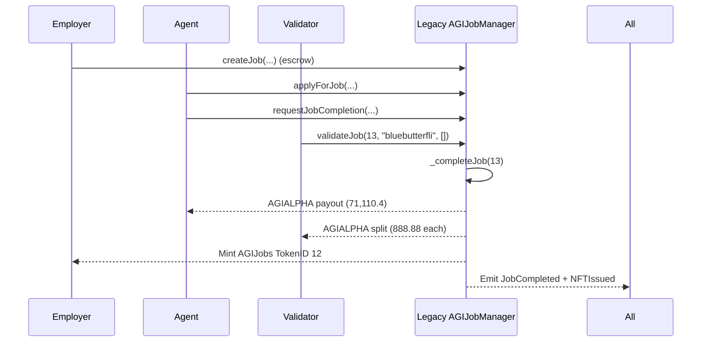

# Legacy AGI Job #12 (TokenID 12) vs. New AGIJobManager — Institution-Grade Case Study

This case study maps a **real mainnet legacy job completion** to the **new `AGIJobManager.sol`** in this repo, using the same identities, and highlights where the new contract is **strictly safer**. It is written for auditors, operators, and institutional users who want verifiable on‑chain artifacts and a deterministic local replay.

---

## At‑a‑Glance (Etherscan‑anchored)

> **Legacy contract (mainnet, v0)**: [`0x0178B6baD606aaF908f72135B8eC32Fc1D5bA477`](https://etherscan.io/address/0x0178B6baD606aaF908f72135B8eC32Fc1D5bA477)  
> **Legacy completion tx**: [`0xbd3f652ba96154388186a47e4e6620f3e97d05c7384d5e6954460a39c666c6ac`](https://etherscan.io/tx/0xbd3f652ba96154388186a47e4e6620f3e97d05c7384d5e6954460a39c666c6ac)  
> **Block time**: Aug‑03‑2025 05:09:59 AM UTC (per Etherscan tx page)  
> **Function invoked**: `validateJob(uint256 _jobId,string subdomain,bytes32[] proof)`  
> &nbsp;&nbsp;• `_jobId = 13`  
> &nbsp;&nbsp;• `subdomain = "bluebutterfli"`  
> &nbsp;&nbsp;• `proof = []` (empty)

**Identifiers**
- **Legacy jobId (from tx input)**: `13`
- **Minted AGIJobs NFT (from logs)**: TokenID **12**
- **tokenURI (from `NFTIssued`)**:  
  `https://ipfs.io/ipfs//bafkreibq3jcpanwlzubcvhdwstbfrwc43wrq2nqjh5kgrvflau3gxgoum4`

**ERC‑20 token used**
- **AGIALPHA** (AGI ALPHA AGENT): `0x2e8fb54c3ec41f55f06c1f082c081a609eaa4ebe` (see tx token transfers on Etherscan)

**Participants (as labeled on Etherscan)**
- **Validator / tx sender**: `0x9DbBBC1E49dA102dC6c667a238E7EedEA9b0E290`
- **Agent paid (888.node.agi.eth)**: `0x5ff14ac26a21B3ceB4421F86fB5aaa4B9F084f2A`
- **Employer / NFT receiver (asi.eth)**: `0xd76AD27E9C819c345A14825797ca8AFc0C15A491`

**ERC‑20 payouts observed in tx logs** (from legacy contract)
- **Agent payout**: `71,110.4` AGIALPHA → `0x5ff14ac26a21B3ceB4421F86fB5aaa4B9F084f2A`
- **Validator payouts**: `888.88` AGIALPHA → each validator:
  - `0x21301d901db04724597d1b6012ac49878157580d`
  - `0xa9ed0539c2fbc5c6bc15a2e168bd9bcd07c01201`
  - `0xecb97519efd7d9d9d279e7c284b286bbe10afaa9`
  - `0x5e5f40346387874922e17b177f55a8880dd432cb`
  - `0x2fdc910574113dfe6a4db5971e166e286813c79f`
  - `0x88692de2a896c6534e544976defd41064904c730`
  - `0xa46cea0a1871b875ee8a1798848c0089a321e588`
  - `0x9DbBBC1E49dA102dC6c667a238E7EedEA9b0E290`

**Events observed** (Etherscan → Event Logs)
- `JobValidated` (final approval) → triggers completion path
- `JobCompleted` → `jobId = 13`, `agent = 0x5ff14...`, `reputationPoints = 0`
- `NFTIssued` → `tokenId = 12`, `employer = 0xd76A...`, `tokenURI = <above>`
- ERC‑20 `Transfer` events (AGIALPHA) for the agent + validators
- ERC‑721 `Transfer` (mint) from `0x0` to employer

> ✅ **Primary artifact for verification**: the Etherscan tx page (see [`#eventlog`](https://etherscan.io/tx/0xbd3f652ba96154388186a47e4e6620f3e97d05c7384d5e6954460a39c666c6ac#eventlog) and [`#tokentxns`](https://etherscan.io/tx/0xbd3f652ba96154388186a47e4e6620f3e97d05c7384d5e6954460a39c666c6ac#tokentxns)) serves as the source of truth for values listed above.

---

## A. Legacy lifecycle (what actually happened on mainnet)

This single transaction represents the **final validator approval**, which in legacy **also completes the job** and performs **all payouts + NFT mint** in the same call.

1) **A job already exists (escrowed) — not visible in this tx**
   - The job with `jobId = 13` must have been created earlier with a funded escrow.  
   - This transaction alone does **not** expose the original `createJob(...)` parameters or escrow deposit.

2) **An agent was assigned earlier — not visible in this tx**
   - The agent address (`0x5ff14...`) was already assigned to the job prior to this validation call.

3) **Completion was already requested and prior approvals accumulated — not visible in this tx**
   - The job was one approval away from completion at the time of this validator call.

4) **Validator calls `validateJob(13, "bluebutterfli", [])`**
   - The tx sender (`0x9DbBBC...`) validates and increments approvals.

5) **Legacy `_completeJob(...)` executes immediately**
   - **Pays the agent**: `71,110.4` AGIALPHA.  
   - **Pays validators**: `888.88` AGIALPHA each.  
   - **Mints AGIJobs ERC‑721**: TokenID `12` to employer.  
   - **Emits events**: `JobCompleted`, `NFTIssued`, ERC‑20 `Transfer`, ERC‑721 `Transfer`.

> ✅ **Legacy summary**: One validator call triggers completion, payouts, and NFT minting in a single on‑chain step.

---

## B. New contract lifecycle (same identities & lifecycle, safer rules)

**Target contract**: `contracts/AGIJobManager.sol` (this repo)

The **user‑visible lifecycle is preserved** — same roles, same function names — but critical safety gates are added.

1) **Employer creates job** — `createJob(...)`
   - Escrows AGI token into the contract.

2) **Agent applies** — `applyForJob(jobId, "888.node.agi.eth", proof)`
   - **New guard**: the job must already exist (`_job`), preventing pre‑claim takeover.

3) **Agent requests completion** — `requestJobCompletion(jobId, ipfsHash)`
   - IPFS hash updated for minting on completion.

4) **Validators approve** — `validateJob(jobId, "bluebutterfli", proof)`
   - **New rule**: a validator cannot approve after disapproving (or vice versa). Double‑votes are blocked.

5) **Completion executes** — `_completeJob(jobId)`
   - **New guards**: no double completion, no payout with missing agent, no div‑by‑zero if validators list is empty.
   - **Safe transfers**: `_t` / `_tFrom` revert on failed ERC‑20 transfers.
   - **NFT mint**: tokenURI = `baseIpfsUrl + "/" + ipfsHash`.

> ✅ **Behavior preserved**: same external call names, same overall lifecycle, same event names, same payout shape.  
> ✅ **Safety improved**: strict existence checks, vote protections, and transfer reverts.

---

## C. Side‑by‑side comparison (legacy vs. new)

| Risk / Topic | Legacy behavior / risk | New behavior / fix | Practical impact |
|---|---|---|---|
| **Job takeover via non‑existent jobId** | A malicious party can attempt to apply to job IDs that don’t exist yet. | `_job(...)` requires `employer != address(0)` before state access. | Prevents pre‑claiming or “phantom job” takeovers. |
| **Double‑complete / double payout** | Completion path can be invoked more than once in edge cases. | `_completeJob(...)` reverts if job already completed. | Eliminates duplicate payouts and NFT mints. |
| **Division‑by‑zero on validator payouts** | If validators list is empty, legacy split can revert or misbehave. | `vCount > 0` guard protects split. | Avoids runtime failures and ensures safe dispute‑completion paths. |
| **Double‑vote / approve+disapprove** | A validator can vote twice or in conflicting directions. | `validateJob` + `disapproveJob` block double voting across both directions. | Prevents vote manipulation and inconsistent counts. |
| **Unchecked ERC‑20 transfers** | ERC‑20 transfers can silently fail. | `_t` / `_tFrom` revert on transfer failure. | Guarantees payouts/refunds are atomic or revert. |
| **Dispute “employer win” closure** | Legacy can leave the job open after refund, allowing later completion. | `resolveDispute` marks job completed on employer win. | Prevents double payout after dispute resolution. |

---

## D. Code‑anchored improvements (new contract)

Each improvement below maps to a specific behavior in `AGIJobManager.sol`, without altering the legacy public interface:

- **Job existence guard** — `_job(...)` reverts if the job does not exist. Prevents phantom job claims.
- **Double‑complete prevention** — `_completeJob(...)` reverts if `completed == true`.
- **No div‑by‑zero** — validator payout split only executes when `vCount > 0`.
- **Vote rules** — `validateJob` and `disapproveJob` block double voting and cross‑voting.
- **Safe ERC‑20 transfer checks** — `_t` and `_tFrom` enforce transfer success.
- **Dispute closure** — `resolveDispute(...)` marks job completed on employer win, preventing later completion.

**Intentionally preserved from legacy**
- Same **public function names** and **event names** for observability.
- Same **payout structure** (agent + validators) driven by AGI types and validation reward percentage.
- Same **accept‑any‑resolution string** behavior (only canonical strings trigger on‑chain actions).

---

## E. Visuals (Mermaid)

### Legacy v0 flow (mainnet)



### New flow (this repo)


---

## F. Payouts (legacy case)

**Payout breakdown (from tx logs):**
- **Agent**: `71,110.4` AGIALPHA → `0x5ff14...` (888.node.agi.eth)
- **Validators**: `888.88` AGIALPHA each → eight validator addresses listed above
- **Employer**: receives AGIJobs NFT TokenID `12`

---

## G. Local “perfect replay” (Truffle, ENS‑mocked)

The local replay **mirrors the lifecycle** (create → apply → request → validate → complete) and enforces the same **safety rules** as the new contract. Because mainnet ENS state is not available on Ganache, **ENS/Resolver/NameWrapper are mocked** deterministically.

### How ENS mocking works (as implemented in tests)

Subnode computation in Solidity (same formula used in the contract):

```solidity
subnode = keccak256(abi.encodePacked(rootNode, keccak256(bytes(subdomain))))
```

In the test:
- **`clubRootNode`** → used for validator subdomains.
- **`agentRootNode`** → used for agent subdomains.
- Mocks return the expected ownership and resolver mapping:
  - `ENS.resolver(subnode)` → mock resolver address
  - `Resolver.addr(subnode)` → claimant address
  - `NameWrapper.ownerOf(uint256(subnode))` → claimant address

### Test replay file
- **Test file**: `test/caseStudies.job12.replay.test.js`
- **Mocks used**: `MockENS`, `MockResolver`, `MockNameWrapper`, `MockERC20`, `MockERC721`

**Lifecycle asserted in the test**
1) Employer approves AGI token allowance
2) `createJob`
3) Agent `applyForJob` using ENS‑mocked subdomain
4) Agent `requestJobCompletion`
5) 3 validators `validateJob` using ENS‑mocked subdomains
6) Assertions:
   - `JobCompleted` + `NFTIssued`
   - NFT minted to employer
   - tokenURI = `baseIpfsUrl + "/" + ipfsHash`
   - AGI token balances updated as expected

**Better‑only assertions in the replay test**
- Apply for a **non‑existent jobId** → revert (takeover fix)
- **Double‑validate** by same validator → revert
- **Approve then disapprove** by same validator → revert
- **Re‑complete** a completed job → revert
- **Dispute agent‑win with zero validators** → no div‑by‑zero (completion succeeds)

### Running locally

```bash
npm install
truffle compile
truffle test
```

> ⚠️ **Replay fidelity note**: the test reproduces **identities, ENS structure, event sequence, and lifecycle**.  
> Token amounts and tokenId are locally derived (Ganache state), not forced to match the real mainnet amounts/tokenId.  
> The test **maps local accounts to the mainnet identities** for deterministic execution; a mainnet fork would be required to use the exact on-chain private keys.

---

## Summary

- The legacy mainnet transaction demonstrates a **single‑call completion** with payouts and NFT mint.  
- The new contract **keeps the same lifecycle** but enforces **stronger correctness guarantees**.  
- The repository now includes a **deterministic, ENS‑mocked local replay** that mirrors the legacy flow and asserts the new safety properties.
