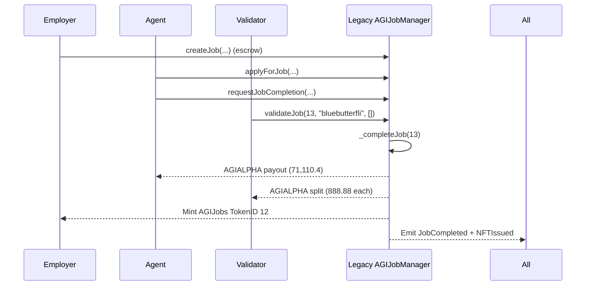
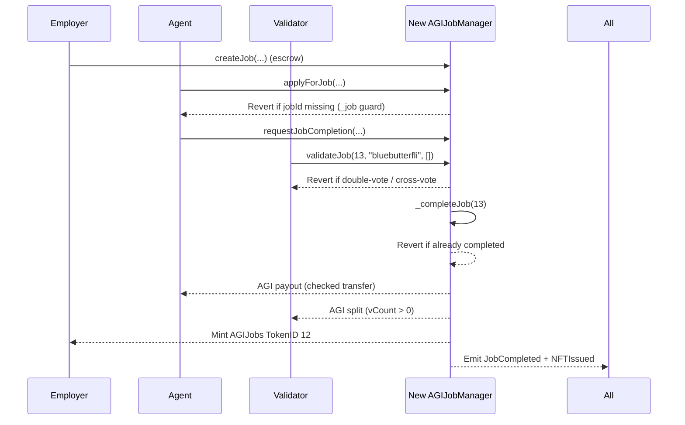

# Legacy AGI Job #12 (TokenID 12) vs. New AGIJobManager — Institution‑Grade Case Study

This case study maps a **real mainnet legacy job completion** to the **new `AGIJobManager.sol`** in this repo, using the same identities, subdomains, and lifecycle steps. It highlights where the new contract is **strictly safer**, with verifiable, Etherscan‑anchored artifacts and a deterministic local replay.

---

## A. At‑a‑Glance (Etherscan‑anchored)

> **Primary source of truth**: Etherscan transaction page and event logs for the legacy completion tx.  
> **Tx**: [`0xbd3f652ba96154388186a47e4e6620f3e97d05c7384d5e6954460a39c666c6ac`](https://etherscan.io/tx/0xbd3f652ba96154388186a47e4e6620f3e97d05c7384d5e6954460a39c666c6ac)

### Core artifacts

| Field | Value (as shown on Etherscan) |
|---|---|
| **Legacy contract (mainnet, v0)** | `0x0178B6baD606aaF908f72135B8eC32Fc1D5bA477` |
| **Completion tx hash** | `0xbd3f652ba96154388186a47e4e6620f3e97d05c7384d5e6954460a39c666c6ac` |
| **Block time (UTC)** | Aug‑03‑2025 05:09:59 AM UTC |
| **Function invoked** | `validateJob(uint256 _jobId,string subdomain,bytes32[] proof)` |
| **MethodID** | `0x4a63f630` |
| **Arguments** | `_jobId = 13`, `subdomain = "bluebutterfli"`, `proof = []` |
| **Legacy jobId** | `13` (from event logs) |
| **Minted AGIJobs tokenId** | `12` (ERC‑721 `Transfer` + `NFTIssued`) |
| **tokenURI (from `NFTIssued`)** | `https://ipfs.io/ipfs//bafkreibq3jcpanwlzubcvhdwstbfrwc43wrq2nqjh5kgrvflau3gxgoum4` |

### Participants (identities on Etherscan)

| Role | Address | Label |
|---|---|---|
| **Validator / tx sender** | `0x9DbBBCc3c603903702BC323C4A4A8a597280a89B` | — |
| **Agent paid** | `0x5ff14ac26a21B3ceB4421F86fB5aaa4B9F084f2A` | `888.node.agi.eth` |
| **Employer / NFT receiver** | `0xd76AD27a1Bcf8652e7e46BE603FA742FD1c10A99` | `asi.eth` |

### ERC‑20 payouts observed (legacy contract → recipients)

Token: **AGI ALPHA AGENT (AGIALPHA)**  
Contract: `0x2e8fb54c3ec41f55f06c1f082c081a609eaa4ebe` (6 decimals, per token contract header on Etherscan)

| Recipient | Raw value (event log) | Human‑readable (6 decimals) |
|---|---:|---:|
| **Agent** `0x5ff14ac26a21B3ceB4421F86fB5aaa4B9F084f2A` | `71,110,400,000` | `71,110.4` AGIALPHA |
| **Validator 1** `0x21301d901DB04724597D1B6012aC49878157580d` | `888,880,000` | `888.88` AGIALPHA |
| **Validator 2** `0xa9eD0539c2fbc5C6BC15a2E168bd9BCd07c01201` | `888,880,000` | `888.88` AGIALPHA |
| **Validator 3** `0xeCb97519EFd7d9D9d279e7C284B286BBE10AFaa9` | `888,880,000` | `888.88` AGIALPHA |
| **Validator 4** `0x5e5F40346387874922E17b177f55a8880dd432cB` | `888,880,000` | `888.88` AGIALPHA |
| **Validator 5** `0x2fDC910574113DFE6A4DB5971E166E286813c79F` | `888,880,000` | `888.88` AGIALPHA |
| **Validator 6** `0x88692DE2a896C6534E544976DEFd41064904C730` | `888,880,000` | `888.88` AGIALPHA |
| **Validator 7** `0xA46Cea0A1871b875eE8A1798848C0089a321e588` | `888,880,000` | `888.88` AGIALPHA |
| **Validator 8 (tx sender)** `0x9DbBBCc3c603903702BC323C4A4A8a597280a89B` | `888,880,000` | `888.88` AGIALPHA |

**Events observed (Etherscan → Event Logs)** — see [`#eventlog`](https://etherscan.io/tx/0xbd3f652ba96154388186a47e4e6620f3e97d05c7384d5e6954460a39c666c6ac#eventlog) and [`#tokentxns`](https://etherscan.io/tx/0xbd3f652ba96154388186a47e4e6620f3e97d05c7384d5e6954460a39c666c6ac#tokentxns)

- `JobValidated(jobId=13, validator=0x9DbBBCc3...)`
- `JobCompleted(jobId=13, agent=0x5ff14..., reputationPoints=0)`
- `NFTIssued(tokenId=12, employer=0xd76AD27a1..., tokenURI=<above>)`
- ERC‑20 `Transfer` events for agent + validators
- ERC‑721 `Transfer` event minting tokenId 12 from `0x0` to employer

---

## B. Legacy lifecycle (what actually happened on mainnet)

This single transaction is the **final validator approval**. In legacy v0, the final validation **also completes the job**, executes **all payouts**, and **mints the NFT** in the same call.

1) **A job already existed and was escrowed** — not visible in this tx alone
   - The job with `jobId = 13` must have been created earlier with escrowed AGIALPHA.
   - The `createJob(...)` parameters are not present in this tx.

2) **An agent was already assigned** — not visible in this tx alone
   - The agent address (`0x5ff14...`) is revealed in `JobCompleted`, but the `applyForJob(...)` tx is not shown here.

3) **Completion was already requested and approvals accumulated** — not visible in this tx alone
   - The job was one approval away from completion at the time of this validator call.

4) **Validator calls `validateJob(13, "bluebutterfli", [])`**
   - The tx sender is `0x9DbBBCc3...` and the decoded input shows `jobId=13`, `subdomain="bluebutterfli"`, `proof=[]`.
   - `JobValidated` is emitted with the same validator address.

5) **Legacy completion executes immediately in‑tx**
   - `JobCompleted(jobId=13, agent=0x5ff14..., reputationPoints=0)`
   - ERC‑20 payouts: agent + eight validators (see At‑a‑Glance table)
   - `NFTIssued(tokenId=12, employer=0xd76AD27a1..., tokenURI=...)`
   - ERC‑721 `Transfer` mint from `0x0` to employer

> ✅ **Legacy summary**: a single validator approval completes the job and executes payouts + NFT minting in one on‑chain transaction.

---

## C. New contract lifecycle (same identities & lifecycle, safer rules)

**Target contract**: `contracts/AGIJobManager.sol` (this repo)

The **user‑visible lifecycle is preserved** — same role flow, same function names — but the new contract introduces critical safety gates. Below is the **same job flow**, using the same participant identities and subdomains from the legacy tx.

1) **Employer creates job** — `createJob(...)`  
   Escrows AGI token in the contract.

2) **Agent applies** — `applyForJob(jobId, "888.node.agi.eth", proof)`  
   **New guard**: `_job(...)` requires job existence, preventing pre‑claim/phantom job takeover.

3) **Agent requests completion** — `requestJobCompletion(jobId, jobCompletionURI)`  
   Completion metadata URI is stored and used for minting.

4) **Validators approve** — `validateJob(jobId, "bluebutterfli", proof)`  
   **New rule**: validators cannot approve after disapproving (or vice‑versa). Double votes are blocked.

5) **Completion executes** — `_completeJob(jobId)`  
   **New guards**: no double completion, no payout if agent missing, no div‑by‑zero when validator list is empty.  
   **Safe transfers**: `_t` / `_tFrom` enforce ERC‑20 success.  
   **NFT mint**: `tokenURI` resolves the completion metadata URI (full URI or `baseIpfsUrl + "/" + cid`).

> ✅ **Behavior preserved**: same external call names, same event names, same payout structure.  
> ✅ **Safety improved**: existence checks, vote protections, and transfer‑failure reverts.

---

## D. Side‑by‑side comparison (legacy vs. new)

| Risk / Topic | Legacy behavior / risk | New behavior / fix | Practical impact |
|---|---|---|---|
| **Job takeover via non‑existent jobId** | Phantom job IDs could be targeted before creation. | `_job(...)` guards on `employer != address(0)` before state access. | Prevents pre‑claim and phantom‑job takeover attempts. |
| **Double‑complete / double payout** | Edge cases can trigger completion twice. | `_completeJob(...)` reverts if already completed. | Eliminates duplicate payouts and NFT mints. |
| **Division‑by‑zero when validators list is empty** | Validator split can revert if `validators.length == 0`. | `vCount > 0` guard before splitting payouts. | Prevents runtime failures during dispute completions. |
| **Double‑vote / approve+disapprove by same validator** | Validators can vote twice or contradict themselves. | `validateJob` + `disapproveJob` block double and cross‑voting. | Prevents vote manipulation and inconsistent tallies. |
| **Unchecked ERC‑20 transfers** | Transfers can silently fail. | `_t` / `_tFrom` revert on failure. | Payouts are atomic or revert. |
| **Dispute “employer win” closure** | Legacy can refund employer yet still allow later completion. | `resolveDisputeWithCode(EMPLOYER_WIN)` closes job on employer win (legacy `resolveDispute` still maps the canonical string). | Prevents double payout after dispute resolution. |

---

## E. Code‑anchored improvements (new contract)

Each improvement below maps directly to behavior in `AGIJobManager.sol` (no contract edits required):

- **Job existence guard** — `_job(...)` reverts if the job does not exist.
- **Double‑complete prevention** — `_completeJob(...)` reverts if `completed == true`.
- **No div‑by‑zero** — validator payout split only runs when `vCount > 0`.
- **Vote rules** — `validateJob` and `disapproveJob` block double voting and cross‑voting.
- **Safe ERC‑20 transfers** — `_t` and `_tFrom` enforce transfer success.
- **Dispute closure** — `resolveDisputeWithCode(EMPLOYER_WIN)` marks job completed on employer win.

**Intentionally preserved from legacy**
- **Public interface**: legacy function names remain for compatibility; `resolveDisputeWithCode` adds typed dispute resolution.
- **Event names**: `JobValidated`, `JobCompleted`, `NFTIssued`, etc. are preserved for observability.
- **Economic shape**: same agent‑plus‑validator split driven by the AGI type configuration.
- **Resolution strings**: legacy string interface remains but is deprecated; canonical strings map to typed actions.

---

## F. Illustrations (Mermaid)

### Legacy v0 flow (mainnet)



### New flow (this repo)



### Payouts (legacy case)

**Payout breakdown (from tx logs):**
- **Agent**: `71,110.4` AGIALPHA → `0x5ff14...` (888.node.agi.eth)
- **Validators**: `888.88` AGIALPHA each → eight validator addresses listed above
- **Employer**: receives AGIJobs NFT TokenID `12`

---

## G. Local “perfect replay” (Truffle, ENS‑mocked)

The local replay **mirrors the lifecycle** (create → apply → request → validate → complete) and enforces the same **safety rules** as the new contract. Because mainnet ENS state is not available on Ganache, **ENS / Resolver / NameWrapper are mocked** deterministically.

### How ENS mocking works (as implemented in tests)

Subnode computation in Solidity (same formula used in the contract):

```solidity
subnode = keccak256(abi.encodePacked(rootNode, keccak256(bytes(subdomain))))
```

In the test:
- **`clubRootNode`** → validator subdomains
- **`agentRootNode`** → agent subdomains
- These are set as `keccak256("club-root")` and `keccak256("agent-root")`.
- Mocks return the expected ownership and resolver mapping:
  - `ENS.resolver(subnode)` → mock resolver address
  - `Resolver.addr(subnode)` → claimant address
  - `NameWrapper.ownerOf(uint256(subnode))` → claimant address

### Test replay file
- **Test file**: `test/caseStudies.job12.replay.test.js`
- **Mocks used**: `MockENS`, `MockResolver`, `MockNameWrapper`, `MockERC20`, `MockERC721`

**Lifecycle asserted in the test**
1) Employer approves AGI token allowance
2) `createJob`
3) Agent `applyForJob` using ENS‑mocked subdomain (`888.node.agi.eth`)
4) Agent `requestJobCompletion`
5) 3 validators `validateJob` using ENS‑mocked subdomains (including `bluebutterfli`)
6) Assertions:
   - `JobCompleted` + `NFTIssued`
   - NFT minted to employer
   - `tokenURI = baseIpfsUrl + "/" + ipfsHash`
   - AGI token balances updated as expected

**Better‑only assertions in the replay test**
- Apply for a **non‑existent jobId** → revert (takeover fix)
- **Double‑validate** by same validator → revert
- **Approve then disapprove** by same validator → revert
- **Disapprove then approve** by same validator → revert
- **Completed job cannot be validated again** → revert
- **Dispute agent‑win with zero validators** → no div‑by‑zero (completion succeeds)

### Running locally

```bash
npm install
truffle compile
truffle test
```

> ⚠️ **Replay fidelity note**: the test reproduces **identities, ENS structure, event sequence, and lifecycle**.  
> Token amounts and tokenId are locally derived (Ganache state), not forced to match the real mainnet amounts/tokenId.  
> Local accounts are **mapped** to the mainnet identities for determinism; a mainnet fork would be required to use the exact on‑chain private keys.

---

## Summary

- The legacy mainnet transaction demonstrates a **single‑call completion** with payouts and NFT minting.  
- The new contract **preserves the same lifecycle** but enforces **stronger correctness and safety guarantees**.  
- The repo includes a **deterministic, ENS‑mocked local replay** that mirrors the legacy flow and asserts the new safety properties.
