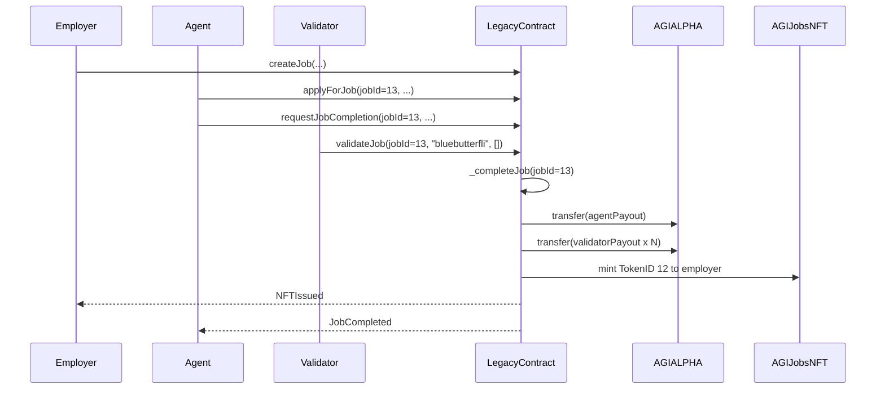
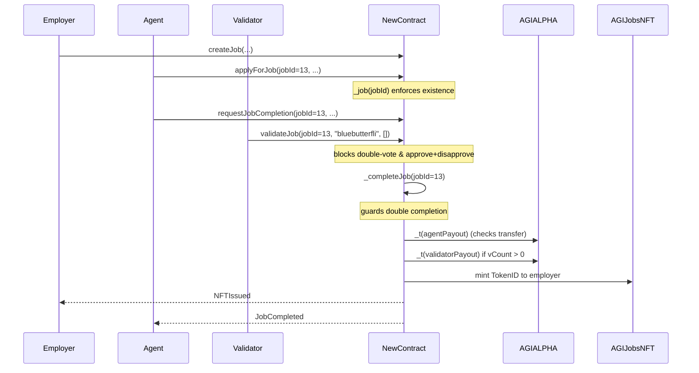

# Legacy AGI Job 12 vs New AGIJobManager — case study (mainnet)

> **At a glance**
> - **Legacy contract (mainnet):** [`0x0178B6baD606aaF908f72135B8eC32Fc1D5bA477`](https://etherscan.io/address/0x0178B6baD606aaF908f72135B8eC32Fc1D5bA477)
> - **Legacy case transaction (job completion path):** [`0xbd3f652ba96154388186a47e4e6620f3e97d05c7384d5e6954460a39c666c6ac`](https://etherscan.io/tx/0xbd3f652ba96154388186a47e4e6620f3e97d05c7384d5e6954460a39c666c6ac)
> - **Legacy ERC-721 minted:** “AGIJobs” TokenID `12`
> - **Legacy ERC-20 token used:** AGIALPHA `0x2E8F3ED88BcBB469bEc54a9A8D1a2f980E09070B`
> - **When:** Aug-03-2025 12:59:23 AM +UTC (per Etherscan)
> - **Function called in tx:** `validateJob(uint256 _jobId,string subdomain,bytes32[] proof)`
>   - `_jobId` = `13`
>   - `subdomain` = `"bluebutterfli"`
>   - `proof` = `[]` (empty array)
> - **New contract (this repo):** [`contracts/AGIJobManager.sol`](../../contracts/AGIJobManager.sol)

## Participants (legacy tx)

- **Validator / tx sender:** `0x9DbBBC1E49dA102dC6c667a238E7EedEA9b0E290`
- **Agent paid (888.node.agi.eth):** `0x5ff14ac26a21B3ceB4421F86fB5aaa4B9F084f2A`
- **Employer / NFT receiver (asi.eth):** `0xd76AD27E9C819c345A14825797ca8AFc0C15A491`

## Outputs observed on the legacy transaction

✅ **ERC-20 transfers (from legacy contract) included:**
- `71,110.4` AGIALPHA → `0x5ff14ac26a21B3ceB4421F86fB5aaa4B9F084f2A` (888.node.agi.eth)
- `888.88` AGIALPHA → **each validator**:
  - `0x21301d901Db04724597D1b6012aC49878157580d`
  - `0xa9eD0539c2fBc5c6bC15a2e168Bd9bcd07C01201`
  - `0xECB97519EFd7d9D9D279E7C284b286BBe10AfAa9`
  - `0x5E5f40346387874922E17B177f55A8880Dd432CB`
  - `0x2fDC910574113DFE6A4dB5971E166E286813C79F`
  - `0x88692De2A896C6534E544976DEFd41064904c730`
  - `0xA46cEa0a1871B875eE8A1798848c0089A321E588`
  - `0x9dBbBcc3c603903702bC323c4a4A8A597280a89B`

✅ **ERC-721 mint:**
- `TokenID 12` minted from `0x0000000000000000000000000000000000000000` to `0xd76AD27E9C819c345A14825797ca8AFc0C15A491` (asi.eth)

✅ **NFTIssued event tokenURI:**
- `https://ipfs.io/ipfs//bafkreibq3jcpanwlzubcvhdwstbfrwc43wrq2nqjh5kgrvflau3gxgoum4`

✅ **JobCompleted event details (legacy tx):**
- `jobId = 13`
- `agent = 0x5ff14ac26a21B3ceB4421F86fB5aaa4B9F084f2A`
- `reputationPoints = 0`

---

## Legacy flow walkthrough (v0 mainnet)

The transaction above **only shows the completion path**. Earlier setup steps (job creation, assignment, and completion request) are **not observable from this tx alone**.

1) **Job existed already (`jobId = 13`) with escrowed AGIALPHA.**
   - ⚠️ *Not observable from this tx alone.* The contract emits `JobCreated` in a prior transaction.
2) **Agent had been assigned previously.**
   - ⚠️ *Not observable from this tx alone.* The contract emits `JobApplied` earlier.
3) **Completion request and validations accumulated.**
   - ⚠️ *Not observable from this tx alone.* The contract emits `JobCompletionRequested` and prior validations elsewhere.
4) **In the referenced tx, a validator calls `validateJob(...)`.**
   - This increments approvals and, once the threshold is met, **triggers `_completeJob`** on the legacy contract.
5) **`_completeJob` (legacy) performs payouts, mints the NFT, and emits events.**
   - Calculates reputation.
   - Pays the agent.
   - Pays validators by splitting `totalValidatorPayout / validators.length`.
   - Mints ERC‑721 to the employer.
   - Emits `JobCompleted` and `NFTIssued`.

### Legacy payout snapshot (from the tx)

- **Agent:** `71,110.4` AGIALPHA to `0x5ff14ac26a21B3ceB4421F86fB5aaa4B9F084f2A`
- **Validators:** `888.88` AGIALPHA to each of 8 validator addresses listed above
- **Employer:** receives **ERC‑721 TokenID 12** with tokenURI shown above

---

## New contract flow (this repo’s `AGIJobManager.sol`)

The **same logical lifecycle** applies in the new contract:

1) **Job creation** (same `createJob` flow).
2) **Agent assignment** via `applyForJob`.
3) **Completion request** via `requestJobCompletion`.
4) **Validator approval** via `validateJob`.
5) **Completion** via `_completeJob` when approval threshold is reached.

✅ **What stays identical (public surface & lifecycle)**
- Same public function names for the core lifecycle (`createJob`, `applyForJob`, `requestJobCompletion`, `validateJob`).
- Same `JobCompleted`, `NFTIssued`, and `DisputeResolved` event flow at completion time.
- Same conceptual escrow → validation → payout → NFT mint sequence.

✅ **What is strictly improved in the new contract**
- Job existence is guarded via `_job(...)` before any state changes.
- Completion is guarded against double‑execution.
- Validator payouts are skipped safely if `validators.length == 0` to avoid division‑by‑zero.
- Validators cannot approve and disapprove the same job, or vote twice.
- All ERC‑20 transfers are checked for return values.
- Dispute resolution **closes** the job on employer‑win to prevent later completion.

---

## Side‑by‑side: legacy vs new behavior

| Topic | Legacy behavior / risk | New behavior / fix | Why it matters |
| --- | --- | --- | --- |
| Job takeover via pre‑claiming future IDs | `applyForJob` can target a job that does not exist yet, allowing pre‑assignment. | `_job(jobId)` enforces existence; non‑existent job IDs revert. | Prevents a malicious agent from squatting on future jobs. |
| Double‑complete / double payout risk | `_completeJob` does not guard against being called twice. | `_completeJob` verifies the job is not already completed. | Stops duplicate payouts and double NFT issuance. |
| Division‑by‑zero in validator payout | Payout divides by `validators.length` without guarding zero. | `vCount > 0` check skips validator payout when there are none. | Avoids runtime errors and stuck jobs. |
| Double‑vote / approve+disapprove by same validator | Validator can approve and later disapprove the same job. | `validateJob` and `disapproveJob` reject any prior vote in either direction. | Prevents vote manipulation or griefing. |
| Unchecked ERC‑20 transfers (silent failures) | Some paths call `transfer` without checking return values. | `_t(...)` and `_tFrom(...)` require transfer success for all flows. | Prevents silent payout failures and inconsistent state. |
| Dispute “employer win” closure and post‑resolution completion risk | “Employer win” sends funds but does **not** mark job completed. | “Employer win” pays employer **and** closes the job. | Prevents later completion from paying out twice. |

---

## Where the new contract is strictly better (code‑anchored)

- **Job existence guard:** `_job(jobId)` enforces `job.employer != address(0)`, preventing pre‑claims on non‑existent IDs.
- **Completion guarded:** `_completeJob(...)` checks `job.completed` and `job.assignedAgent` before paying out, then resets `job.disputed`.
- **Validator payout safety:** `vCount > 0` avoids division‑by‑zero when there are no validators.
- **Vote rules:** `validateJob` and `disapproveJob` block double‑votes and approve+disapprove combos.
- **Safer token transfers:** `_t(...)` / `_tFrom(...)` revert on failed ERC‑20 transfers.
- **Dispute resolution closure:** `resolveDispute(..., "employer win")` closes the job to prevent later completion while still emitting `DisputeResolved` for arbitrary strings.

---

## Mermaid sequence diagram — legacy flow



## Mermaid sequence diagram — new flow (same lifecycle + guardrails)



---

## Practical reproduction guidance (local Truffle tests)

> ✅ **Goal:** Replay the same lifecycle locally and verify that the new contract blocks the legacy‑era pitfalls.
> ⚠️ **Note:** ENS resolution cannot be reproduced locally without mocks; use `additionalAgents` and `additionalValidators` to bypass ENS/Merkle gating in tests.

**Pseudo‑script (high level):**

```text
owner.deploy(AGIJobManager)
owner.addAdditionalAgent(agent)
owner.addAdditionalValidator(validator)

employer.createJob(ipfsHash, payout, duration, details)
agent.applyForJob(jobId=13, subdomain="bluebutterfli", proof=[])
agent.requestJobCompletion(jobId=13, ipfsHash)
validator.validateJob(jobId=13, subdomain="bluebutterfli", proof=[])

# Legacy exploit attempts that now revert
agent.applyForJob(jobId=9999, ...)          # _job guard prevents pre-claim
validator.validateJob(jobId=13, ...)        # first vote ok
validator.disapproveJob(jobId=13, ...)      # now reverts (double-vote)
validator.validateJob(jobId=13, ...)        # now reverts (double-vote)
```

---

## References

- **Legacy contract on Etherscan:** https://etherscan.io/address/0x0178B6baD606aaF908f72135B8eC32Fc1D5bA477
- **Legacy transaction (Job 12 completion):** https://etherscan.io/tx/0xbd3f652ba96154388186a47e4e6620f3e97d05c7384d5e6954460a39c666c6ac
- **New contract source:** [`contracts/AGIJobManager.sol`](../../contracts/AGIJobManager.sol)
