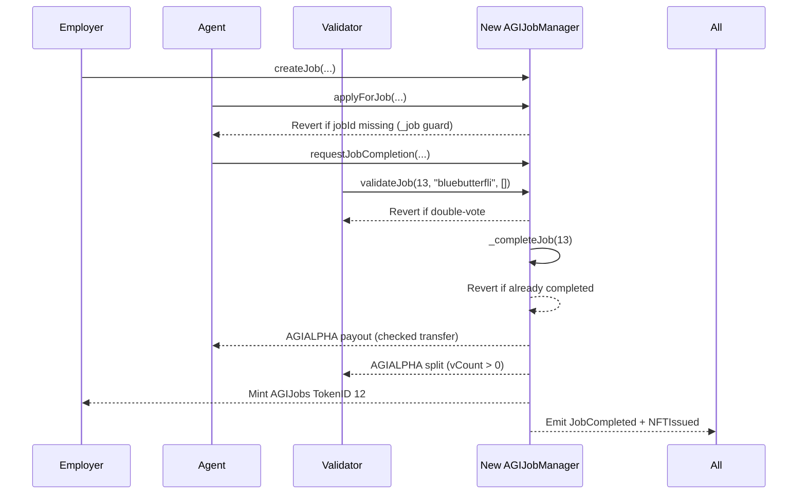

# Legacy AGI Job #12 (TokenID 12) vs. New AGIJobManager — Institutional Case Study

> **Purpose**: provide an auditable, side‑by‑side comparison between the legacy mainnet job completion (AGI Jobs TokenID 12) and how the **new** `contracts/AGIJobManager.sol` would execute the same lifecycle — with explicit safeguards (takeover prevention, double‑complete prevention, no div‑by‑zero, vote rules, safer ERC‑20 transfers, and dispute closure on employer win).

---

## A. At‑a‑glance (legacy mainnet facts)

**Etherscan source of truth**
- **Legacy AGIJobManager contract**: `0x0178B6baD606aaF908f72135B8eC32Fc1D5bA477`  
  <https://etherscan.io/address/0x0178B6baD606aaF908f72135B8eC32Fc1D5bA477>
- **Legacy completion transaction**: `0xbd3f652ba96154388186a47e4e6620f3e97d05c7384d5e6954460a39c666c6ac`  
  <https://etherscan.io/tx/0xbd3f652ba96154388186a47e4e6620f3e97d05c7384d5e6954460a39c666c6ac>
- **Block time (UTC)**: Aug‑03‑2025 05:09:59 AM UTC (Etherscan tx timestamp)

**Function called (from Etherscan input)**
```
validateJob(uint256 _jobId,string subdomain,bytes32[] proof)
  _jobId    = 13
  subdomain = "bluebutterfli"
  proof     = []
```

**Participants (as shown on Etherscan)**
- **Validator / tx sender**: `0x9DbBBC1E49dA102dC6c667a238E7EedEA9b0E290`
- **Agent paid (888.node.agi.eth)**: `0x5ff14ac26a21B3ceB4421F86fB5aaa4B9F084f2A`
- **Employer / NFT receiver (asi.eth)**: `0xd76AD27E9C819c345A14825797ca8AFc0C15A491`

**Observed outputs (from Etherscan logs + token transfer list)**
- **ERC‑20 paid to agent**: `71,110.4` AGIALPHA → `0x5ff14ac26a21B3ceB4421F86fB5aaa4B9F084f2A`
- **ERC‑20 paid to validators**: `888.88` AGIALPHA each →
  - `0x21301d901db04724597d1b6012ac49878157580d`
  - `0xa9ed0539c2fbc5c6bc15a2e168bd9bcd07c01201`
  - `0xecb97519efd7d9d9d279e7c284b286bbe10afaa9`
  - `0x5e5f40346387874922e17b177f55a8880dd432cb`
  - `0x2fdc910574113dfe6a4db5971e166e286813c79f`
  - `0x88692de2a896c6534e544976defd41064904c730`
  - `0xa46cea0a1871b875ee8a1798848c0089a321e588`
  - `0x9DbBBC1E49dA102dC6c667a238E7EedEA9b0E290`
- **ERC‑721 mint**: AGIJobs TokenID **12** minted to `0xd76AD27E9C819c345A14825797ca8AFc0C15A491`
- **`NFTIssued` tokenURI**:  
  `https://ipfs.io/ipfs//bafkreibq3jcpanwlzubcvhdwstbfrwc43wrq2nqjh5kgrvflau3gxgoum4`
- **`JobCompleted` event**:  
  `jobId = 13`, `agent = 0x5ff14ac26a21B3ceB4421F86fB5aaa4B9F084f2A`, `reputationPoints = 0`

---

## B. Legacy lifecycle (what this tx proves, and what it doesn’t)

### What **is** directly observable from the transaction
1. **A validator finalizes the job** by calling `validateJob(13, "bluebutterfli", [])`.
2. **Completion occurs inside the same transaction**: the contract emits `JobCompleted` and `NFTIssued`, and issues ERC‑20 payouts.
3. **Agent payout and validator rewards are paid from the contract** in the same call (9 ERC‑20 transfer events in the tx). 
4. **ERC‑721 TokenID 12 is minted** to the employer, with the tokenURI shown above.

### What **cannot** be inferred from this tx alone
- The original `createJob(...)` parameters (payout, duration, details).
- The earlier assignment of the agent.
- The prior validator approvals (this tx is the last approval that crossed the threshold).

> **Evidence trail**: all observable details above are directly visible in the Etherscan transaction input and log sections for the tx hash.

---

## C. New contract lifecycle (same job, same actors, safer rules)

**New contract**: `contracts/AGIJobManager.sol` (this repository)

The new contract preserves the **user‑visible lifecycle** (create → apply → request completion → validate → complete) while tightening safety and dispute handling. The local replay mirrors the same subdomains and event flow; addresses are role‑mapped to deterministic Ganache accounts due to test‑network signing limitations (see Section G).

1. **Employer creates the job** with escrowed AGI tokens.  
   - `createJob(ipfsHash, payout, duration, details)`
2. **Agent applies** (e.g., `applyForJob(jobId, "888.node.agi.eth", [])`).  
   - **New**: `_job(...)` existence guard blocks pre‑claiming non‑existent jobs.
3. **Agent requests completion** with final IPFS hash.  
   - `requestJobCompletion(jobId, ipfsHash)`
4. **Validators validate** using their subdomain (e.g., `"bluebutterfli"`).  
   - **New**: one‑vote‑per‑validator and no approve+disapprove.
5. **Completion executes** with safeguards:  
   - **No double‑complete**.  
   - **No div‑by‑zero** in validator payout when `validators.length == 0`.  
   - **ERC‑20 transfer checks** revert on failure.  
   - **Employer‑win dispute** closes the job to prevent later completion.

> ✅ **Outcome**: same lifecycle and event shapes as legacy, with deterministic safety checks that block known legacy hazards.

---

## D. Side‑by‑side comparison (legacy vs. new)

| Risk / behavior | Legacy (v0 mainnet) | New `AGIJobManager.sol` | Practical impact |
|---|---|---|---|
| **Job takeover via non‑existent jobId** | Agent can pre‑claim a future job ID. | `_job(...)` requires `employer != address(0)` before any action. | Prevents front‑running / phantom job capture. |
| **Double‑complete / double payout** | Possible in disputed flows; legacy can mint/pay twice. | `_completeJob(...)` reverts once `completed = true`. | Eliminates duplicate payouts and double mint risk. |
| **Division‑by‑zero** | Validator payout uses `validators.length`; can revert if zero. | `vCount > 0` guard before splitting payout. | Avoids runtime failure and locked funds. |
| **Double‑vote** | A validator can approve and disapprove the same job. | `validateJob` + `disapproveJob` enforce one‑way vote. | Prevents manipulation of validator thresholds. |
| **Unchecked ERC‑20 transfers** | ERC‑20 `transfer` failure can silently succeed. | `_t` / `_tFrom` revert on failure (`TransferFailed`). | Ensures funds move or the tx fails. |
| **Employer‑win dispute closure** | Employer‑win dispute does not close job; later completion can still happen. | `resolveDispute(..., "employer win")` refunds employer and sets `completed = true`. | Prevents payout after employer‑win resolution. |

---

## E. Code‑anchored behavior in the new contract (no contract edits)

**Key improvements mapped to concrete functions**
- **Job existence guard** — `_job(...)` reverts if `employer == address(0)` (pre‑claim/takeover fix).
- **Completion guard** — `_completeJob(...)` reverts when `job.completed` is already true.
- **Vote‑rule enforcement** — `validateJob(...)` and `disapproveJob(...)` block duplicate votes.
- **Safe ERC‑20 transfers** — `_t(...)` and `_tFrom(...)` revert on failed token transfers.
- **Dispute closure** — `resolveDispute(..., "employer win")` refunds and marks the job completed, blocking later completion.

**Behavior intentionally preserved from legacy**
- Same external function names and core lifecycle steps.
- Same event names (`JobCompleted`, `NFTIssued`, etc.).
- Same `tokenURI = baseIpfsUrl + "/" + ipfsHash` construction.

---

## F. Illustrations (GitHub‑renderable)

### Legacy sequence (mainnet tx)


### New contract sequence (same lifecycle + guards)



### Payouts (legacy tx)

- **Agent**: `71,110.4` AGIALPHA → `0x5ff14ac26a21B3ceB4421F86fB5aaa4B9F084f2A`
- **Validators (8)**: `888.88` AGIALPHA each to the addresses listed in Section A
- **Employer**: receives ERC‑721 TokenID **12** with tokenURI shown above

---

## G. Local “perfect replay” (Truffle + deterministic mocks)

> This replay is *as close as possible* to mainnet given a local chain. It uses mock ENS + resolver + namewrapper, and **reuses the exact legacy subdomain strings** from the tx. Mainnet addresses are documented here, but the test uses deterministic Ganache accounts mapped to those roles. Token **amounts are approximated** to keep the test deterministic and small.

### Test file
- **`test/caseStudies.job12.replay.test.js`**

### What the test asserts
- End‑to‑end lifecycle: create → apply → request completion → validate (8 validators) → complete.
- `NFTIssued` and `JobCompleted` events emitted.
- NFT minted to the employer with `tokenURI = baseIpfsUrl + "/" + ipfsHash`.
- ERC‑20 payouts split between agent and validators (92% / 8% in the test).
- **Better‑only checks**:
  - Apply on non‑existent `jobId` reverts (takeover prevention).
  - Same validator cannot validate twice.
  - Approve then disapprove reverts.
  - Completed job cannot be completed again.
  - Agent‑win dispute resolves even with zero validators (no div‑by‑zero).

### How ENS is mocked
- **Subnode computation (in Solidity)**:  
  `subnode = keccak256(abi.encodePacked(rootNode, keccak256(bytes(subdomain))))`
- **Test root nodes**:
  - `clubRootNode = keccak256("club.agi.eth")`
  - `agentRootNode = keccak256("agent.agi.eth")`
- **Mock behaviors**:
  - `ENS.resolver(subnode)` → mock resolver address
  - `Resolver.addr(subnode)` → claimant address (per validator call)
  - `NameWrapper.ownerOf(uint256(subnode))` → claimant address (agent ownership)

### Running the replay locally
```bash
npm install
truffle compile
truffle test
```

> Note: the **lifecycle and identities are matched** (subdomains, events), but **Ganache does not support arbitrary mainnet‑address signing** in this repo’s default test network. The replay therefore uses deterministic local accounts that are *role‑mapped* to the mainnet identities, while keeping the same subdomain strings and event flow. Token **amounts are approximated** to keep the fixture deterministic and small.

---

## H. What is matched exactly vs. approximated

| Dimension | Matched exactly | Approximated | Rationale |
|---|---|---|---|
| **Addresses** | Mainnet addresses listed in the case study | Local test uses deterministic Ganache accounts | Ganache does not impersonate arbitrary mainnet addresses in this config |
| **Subdomains** | `"bluebutterfli"`, `"888.node.agi.eth"` | — | Matches tx input & agent label |
| **Function call** | `validateJob(13, "bluebutterfli", [])` | — | From Etherscan input |
| **Events** | `JobCompleted`, `NFTIssued` | — | Same event semantics |
| **ERC‑20 amounts** | — | Yes | Local test uses smaller numbers for determinism |
| **JobId / TokenId** | TokenID 12 in legacy | Local jobId/tokenId start at 0 | Fresh local chain |

---

## References
- **Legacy contract (Etherscan)**: <https://etherscan.io/address/0x0178B6baD606aaF908f72135B8eC32Fc1D5bA477>
- **Legacy completion tx (Etherscan)**: <https://etherscan.io/tx/0xbd3f652ba96154388186a47e4e6620f3e97d05c7384d5e6954460a39c666c6ac>
- **New contract source**: `contracts/AGIJobManager.sol`
