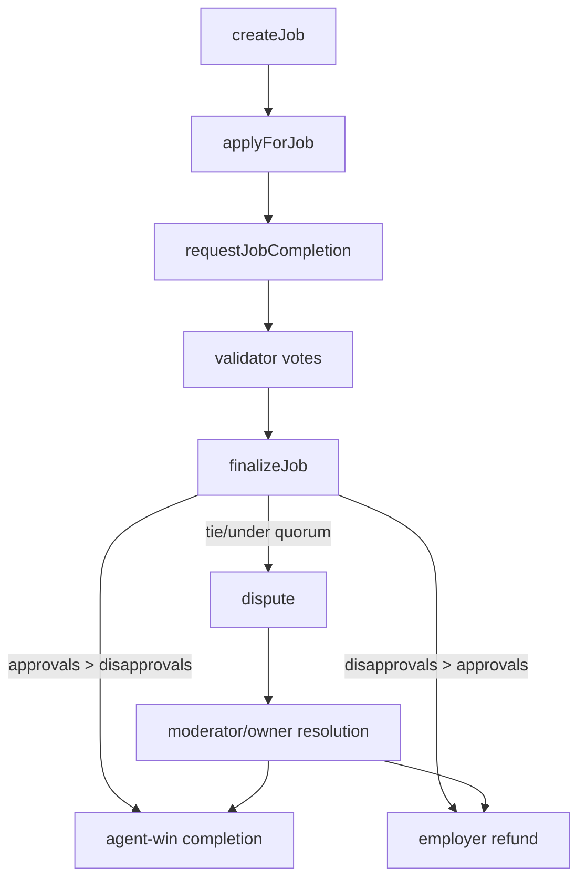
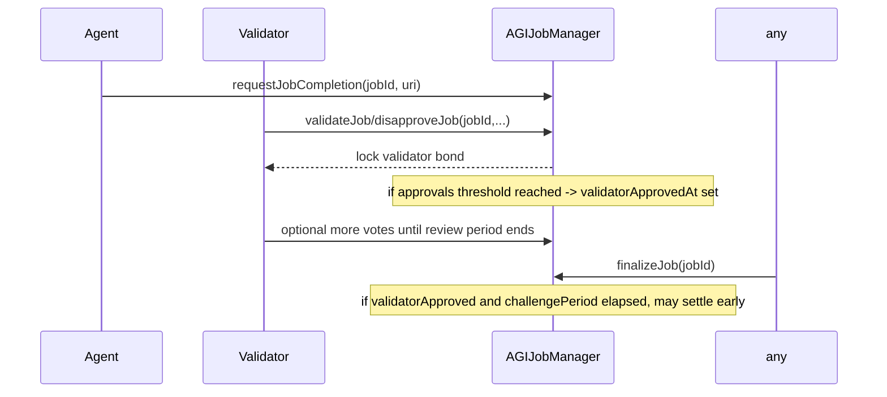
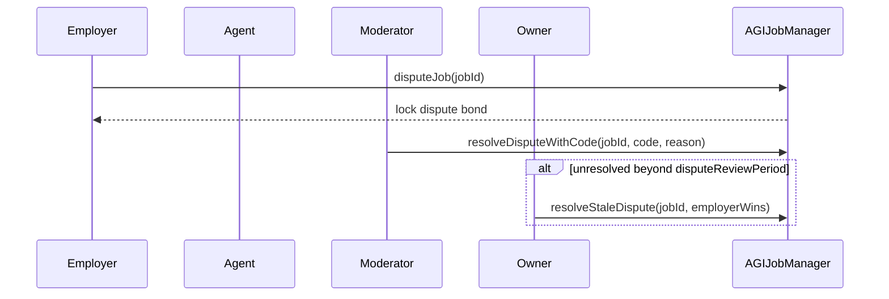

# AGIJobManager Contract Reference

## Purpose
`AGIJobManager` is the escrow and settlement engine. It manages job lifecycle, role-gated participation, validator voting, dispute resolution, bond accounting, and completion NFT minting.

## Audience
Protocol engineers, auditors, integrators, and operations teams.

## Preconditions / Assumptions
- AGI token follows ERC20 transfer semantics compatible with `TransferUtils` exact-transfer checks.
- Moderator and owner keys are operationally controlled (prefer multisig).
- URI content availability is off-chain responsibility.

## Roles and Permissions
| Role | Core permissions |
|---|---|
| Owner | Pause/unpause, settlement pause, config updates, role lists, dispute backstop (`resolveStaleDispute`), treasury withdrawal while paused |
| Moderator | Resolve disputes (`resolveDispute`, `resolveDisputeWithCode`) |
| Employer | Create/cancel jobs, dispute jobs, receive completion NFT |
| Agent | Apply, post agent bond, request completion |
| Validator | Vote with bond (`validateJob` / `disapproveJob`) |

## Key State Variables
- Economic controls: `validationRewardPercentage`, bond parameters, thresholds/quorum, review periods.
- Escrow accounting: `lockedEscrow`, `lockedAgentBonds`, `lockedValidatorBonds`, `lockedDisputeBonds`.
- Identity gating: ENS roots, Merkle roots, allowlists/blacklists.
- ENS integration toggles: `ensJobPages`, `useEnsJobTokenURI`, identity lock state.

## Job Lifecycle

## Validator + Challenge Window Sequence

## Dispute Sequence

## Function Reference by Workflow
### Creation / Assignment
- `createJob(string,uint256,uint256,string)`
- `applyForJob(uint256,string,bytes32[])`

### Completion / Voting / Settlement
- `requestJobCompletion(uint256,string)`
- `validateJob(uint256,string,bytes32[])`
- `disapproveJob(uint256,string,bytes32[])`
- `finalizeJob(uint256)`
- `expireJob(uint256)`

### Disputes
- `disputeJob(uint256)`
- `resolveDispute(uint256,string)` (deprecated string matcher)
- `resolveDisputeWithCode(uint256,uint8,string)`
- `resolveStaleDispute(uint256,bool)`

### Administrative
- Pausing: `pause`, `unpause`, `setSettlementPaused`
- Identity wiring: `updateAGITokenAddress`, `updateEnsRegistry`, `updateNameWrapper`, `setEnsJobPages`, `updateRootNodes`, `lockIdentityConfiguration`
- Governance config: thresholds, periods, bond params, slash bps, reward percentage, merkle roots
- Lists: moderators, additional agents/validators, blacklists

### Read APIs
- `getJobCore`, `getJobValidation`, `getJobSpecURI`, `getJobCompletionURI`
- `withdrawableAGI`, `tokenURI`, `canAccessPremiumFeature`, `getHighestPayoutPercentage`

## Events (Operationally Important)
- Lifecycle: `JobCreated`, `JobApplied`, `JobCompletionRequested`, `JobCompleted`, `JobExpired`, `JobCancelled`
- Governance/security: `SettlementPauseSet`, `IdentityConfigurationLocked`, `AGIWithdrawn`, `ConfigUpdated`
- Disputes: `JobDisputed`, `DisputeResolvedWithCode`
- Metadata plane: `EnsHookAttempted`, `NFTIssued`

## Invariants / Assumptions
- Escrow solvency checked by `withdrawableAGI()`; owner withdrawals are limited to non-locked balances and require both `paused` and `!settlementPaused`.
- Settlement requires completion request and unsettled job state.
- Validator settlement loop bounded by `MAX_VALIDATORS_PER_JOB`.
- Agent/validator bond math is capped at payout.

## Gotchas / Failure Modes
- `setAdditionalAgentPayoutPercentage` always reverts (`DeprecatedParameter`).
- No-vote finalization after review period settles to agent with `repEligible=false`.
- Under-quorum or tie transitions to dispute.
- ENS hook failure does not revert escrow flow; monitor `EnsHookAttempted`.
- `lockIdentityConfiguration()` is irreversible and blocks token/ENS/root rewiring.

## References
- [`../../contracts/AGIJobManager.sol`](../../contracts/AGIJobManager.sol)
- [`../../test/escrowAccounting.test.js`](../../test/escrowAccounting.test.js)
- [`../../test/disputeHardening.test.js`](../../test/disputeHardening.test.js)
