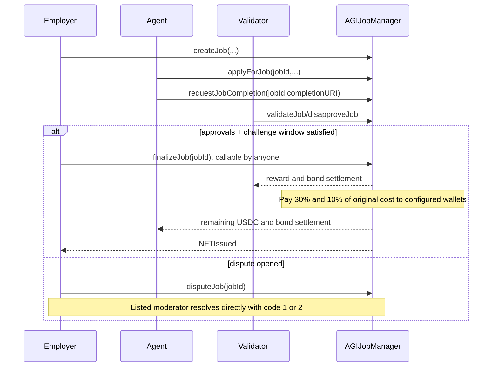

# AGIJobManager Contract Reference — v0.9.6

## Purpose
Document operational and audit-critical behavior of `AGIJobManager`.

## Audience
Smart contract engineers, auditors, operators.

## Preconditions / assumptions
- Contract is non-upgradeable.
- Public-chain deployments use immutable native USDC with six decimals; issuer pause/blocklist authority remains a transfer dependency. ETH pays gas.
- Owner/moderator authority is part of the intended business-operated trust model.

## Roles and permissions
| Role | Key capabilities |
|---|---|
| Owner | Pause/unpause, settlement pause, config setters, allowlists/blacklists, moderators, withdraw surplus while paused, lock identity config. |
| Moderator | Resolve disputes (`resolveDisputeWithCode`). |
| Employer | Create/cancel/dispute jobs, receive refund or completion NFT. |
| Agent | Apply, request completion, receive payout on successful settlement. |
| Validator | Approve/disapprove completion with bonded vote. |

## Successful-job economics

Validators are paid first from the budget fixed at posting (8% default, owner-selectable 1–60% for new jobs). Next, `wallet30` and `wallet10` receive fixed 30% and 10% of the original job cost; the agent receives all remaining USDC. A default 100 USDC job yields 8/30/10/52, excluding separate bonds. No-vote completion charges no validator budget. Rounding and unallocated rewards go to the agent on success, or the employer on refund. Cancelled, expired and employer-win jobs pay no wallet shares.

Recipient addresses can rotate only while intake is paused and all four reserves are zero. Percentages and token stay fixed. Fresh deployments start paused; ownership changes require acceptance. See [configuration](../CONFIGURATION.md) and [owner controls](../OWNER_CONTROLS.md).

## Key state and accounting
| Category | Variables |
|---|---|
| Escrow solvency | `lockedEscrow`, `lockedAgentBonds`, `lockedValidatorBonds`, `lockedDisputeBonds`, `withdrawableUSDC()` |
| Validator controls | `requiredValidatorApprovals`, `requiredValidatorDisapprovals`, `voteQuorum`, `validationRewardPercentage`, validator bond/slash params, `challengePeriodAfterApproval` |
| Agent controls | `agentBond`, `agentBondBps`, `agentBondMax`, `maxJobPayout`, `jobDurationLimit` |
| Timers | `completionReviewPeriod`, `disputeReviewPeriod` |
| Identity gating | `validatorMerkleRoot`, `agentMerkleRoot`, ENS roots, additional allowlists, blacklists |
| ENS/NFT behavior | `ensJobPages`, `setUseEnsJobTokenURI`, `tokenURI()` |

## Event families (monitoring-critical)
- **Lifecycle:** `JobCreated`, `JobApplied`, `JobCompletionRequested`, `JobValidated`, `JobDisapproved`, `JobCompleted`, `JobCancelled`, `JobExpired`, `JobDisputed`.
- **Dispute/settlement:** `DisputeResolvedWithCode`, `JobPayoutDistributed`, `USDCWithdrawn`.
- **Config/admin:** `SettlementPauseSet`, threshold and bond parameter update events, identity wiring updates, `IdentityConfigurationLocked`.
- **ENS integration:** `EnsHookAttempted`, `EnsJobPagesUpdated`.

## Workflow reference

### 1) Job creation and assignment
- `createJob(string _jobSpecURI, uint256 _payout, uint256 _duration, string _details)`
- `applyForJob(uint256 _jobId, string subdomain, bytes32[] proof)`

The first successful eligible application assigns the job immediately. Checks include cost/duration bounds, identity authorization plus a separate eligible NFT credential, blacklist enforcement, active-job limits, and USDC bond funding. NFT scores do not increase payouts.

### 2) Completion and voting
- `requestJobCompletion(uint256 _jobId, string _jobCompletionURI)`
- `validateJob(uint256 _jobId, string subdomain, bytes32[] proof)`
- `disapproveJob(uint256 _jobId, string subdomain, bytes32[] proof)`

### 3) Finalization and settlement
- `finalizeJob(uint256 _jobId)` handles approval-threshold/challenge-window and review-period settlement.
- `expireJob(uint256 _jobId)` handles timeout path.
- `cancelJob(uint256 _jobId)` handles pre-assignment cancellation.

### 4) Dispute resolution
- `disputeJob(uint256 _jobId)` opens a bonded dispute after completion submission, within review, before settlement, for the employer or assigned agent.
- `resolveDisputeWithCode(uint256 _jobId, uint8 resolutionCode, string reason)` moderator path: `0` note only, `1` agent win, `2` employer win. There is no current string-resolution API.
- `resolveStaleDispute(uint256 _jobId, bool employerWins)` owner fallback after timeout.

### 5) Treasury and pause controls
- `pause()` / `unpause()`
- `setSettlementPaused(bool)`
- `withdrawUSDC(uint256 amount)` only when paused and settlement not paused.

## Job lifecycle sequence

```mermaid
sequenceDiagram
  participant Employer
  participant Agent
  participant Validator
  participant C as AGIJobManager

  Employer->>C: createJob(...)
  Agent->>C: applyForJob(jobId,...)
  Agent->>C: requestJobCompletion(jobId,completionURI)
  Validator->>C: validateJob/disapproveJob
  alt approvals + challenge window satisfied
    Employer->>C: finalizeJob(jobId), callable by anyone
    C-->>Validator: reward and bond settlement
    Note over C: Pay 30% and 10% of original cost to configured wallets
    C-->>Agent: remaining USDC and bond settlement
    C-->>Employer: NFTIssued
  else dispute opened
    Employer->>C: disputeJob(jobId)
    Note over Employer,C: Listed moderator resolves directly with code 1 or 2
  end
```

## Invariants / assumptions
- Escrow and bonds remain solvent against token balance (`withdrawableUSDC()` checks).
- Settlement paths should release locked accounting exactly once.
- External ENS hook calls must not break settlement progress.
- Loops over validators and AGI types are bounded by constants.

## Gotchas / failure modes
- Approval votes do not automatically pay. Finalization requires the applicable windows to strictly elapse; once approval is latched its challenge must elapse even if the review window ends first.
- `lockIdentityConfiguration()` is irreversible and only affects identity wiring setters.
- Intake pause blocks creation/application. Settlement pause also blocks completion, voting, disputes, settlement and withdrawals. Use both states in operational checks.
- Token URI source may switch to ENS URI mode when enabled and ENSJobPages is configured.

## References
- [`../../contracts/AGIJobManager.sol`](../../contracts/AGIJobManager.sol)
- [`../../contracts/utils/BondMath.sol`](../../contracts/utils/BondMath.sol)
- [`../../contracts/utils/TransferUtils.sol`](../../contracts/utils/TransferUtils.sol)
- [`../../contracts/utils/ReputationMath.sol`](../../contracts/utils/ReputationMath.sol)
- [`../../contracts/utils/UriUtils.sol`](../../contracts/utils/UriUtils.sol)
