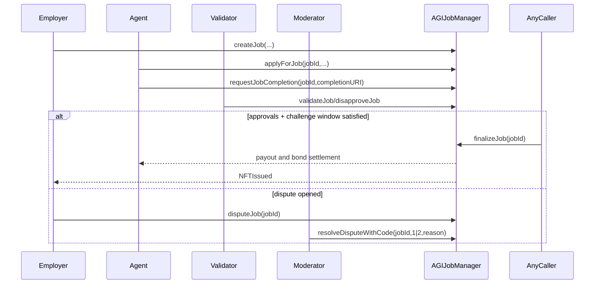

# AGIJobManager Contract Reference

## Purpose
Document operational and audit-critical behavior of `AGIJobManager`.

## Audience
Smart contract engineers, auditors, operators.

## Preconditions / assumptions
- Contract is non-upgradeable.
- AGI ERC20 token is trusted to be transfer-compatible with `TransferUtils` checks.
- Owner/moderator authority is part of the intended business-operated trust model.

## Roles and permissions
| Role | Key capabilities |
|---|---|
| Owner | Pause/unpause, settlement pause, config setters, allowlists/blacklists, moderators, withdraw surplus while paused, lock identity config. |
| Moderator | Resolve disputes (`resolveDispute`, `resolveDisputeWithCode`). |
| Employer | Create/cancel/dispute jobs, receive refund or completion NFT. |
| Agent | Apply, request completion, receive payout on successful settlement. |
| Validator | Approve/disapprove completion with bonded vote. |

## Key state and accounting
| Category | Variables |
|---|---|
| Escrow solvency | `lockedEscrow`, `lockedAgentBonds`, `lockedValidatorBonds`, `lockedDisputeBonds`, `withdrawableAGI()` |
| Validator controls | `requiredValidatorApprovals`, `requiredValidatorDisapprovals`, `voteQuorum`, `validationRewardPercentage`, validator bond/slash params, `challengePeriodAfterApproval` |
| Agent controls | `agentBond`, `agentBondBps`, `agentBondMax`, `maxJobPayout`, `jobDurationLimit` |
| Timers | `completionReviewPeriod`, `disputeReviewPeriod` |
| Identity gating | `validatorMerkleRoot`, `agentMerkleRoot`, ENS roots, additional allowlists, blacklists |
| ENS/NFT behavior | `ensJobPages`, `setUseEnsJobTokenURI`, `tokenURI()` |

## Event families (monitoring-critical)
- **Lifecycle:** `JobCreated`, `JobApplied`, `JobCompletionRequested`, `JobValidated`, `JobDisapproved`, `JobCompleted`, `JobCancelled`, `JobExpired`, `JobDisputed`.
- **Dispute/settlement:** `DisputeResolved`, `DisputeResolvedWithCode`, `PlatformRevenueAccrued`.
- **Config/admin:** `SettlementPauseSet`, threshold and bond parameter update events, identity wiring updates, `IdentityConfigurationLocked`.
- **ENS integration:** `EnsHookAttempted`, `EnsJobPagesUpdated`, `UseEnsJobTokenURIUpdated`.

## Workflow reference

### 1) Job creation and assignment
- `createJob(string _jobSpecURI, uint256 _payout, uint256 _duration, string _details)`
- `applyForJob(uint256 _jobId, string subdomain, bytes32[] proof)`

Checks include payout bounds, duration bounds, allowlist/ENS eligibility, blacklist enforcement, and active-job limits per agent.

### 2) Completion and voting
- `requestJobCompletion(uint256 _jobId, string _jobCompletionURI)`
- `validateJob(uint256 _jobId, string subdomain, bytes32[] proof)`
- `disapproveJob(uint256 _jobId, string subdomain, bytes32[] proof)`

### 3) Finalization and settlement
- `finalizeJob(uint256 _jobId)` handles approval-threshold/challenge-window and review-period settlement.
- `expireJob(uint256 _jobId)` handles timeout path.
- `cancelJob(uint256 _jobId)` handles pre-assignment cancellation.

### 4) Dispute resolution
- `disputeJob(uint256 _jobId)` opens dispute with dispute bond.
- `resolveDispute(uint256 _jobId, string resolution)` / `resolveDisputeWithCode(uint256 _jobId, uint8 resolutionCode, string reason)` moderator path.
- `resolveStaleDispute(uint256 _jobId, bool employerWins)` owner fallback after timeout.

### 5) Treasury and pause controls
- `pause()` / `unpause()`
- `setSettlementPaused(bool)`
- `withdrawAGI(uint256 amount)` only when paused and settlement not paused.

## Job lifecycle sequence

## Invariants / assumptions
- Escrow and bonds remain solvent against token balance (`withdrawableAGI()` checks).
- Settlement paths should release locked accounting exactly once.
- External ENS hook calls must not break settlement progress.
- Loops over validators and AGI types are bounded by constants.

## Gotchas / failure modes
- `setAdditionalAgentPayoutPercentage` is deprecated and intentionally reverts (`DeprecatedParameter`).
- `lockIdentityConfiguration()` is irreversible and only affects identity wiring setters.
- `pause` and `settlementPaused` are orthogonal; operational playbooks must account for both.
- Token URI source may switch to ENS URI mode when enabled and ENSJobPages is configured.

## References
- [`../../contracts/AGIJobManager.sol`](../../contracts/AGIJobManager.sol)
- [`../../contracts/utils/BondMath.sol`](../../contracts/utils/BondMath.sol)
- [`../../contracts/utils/TransferUtils.sol`](../../contracts/utils/TransferUtils.sol)
- [`../../contracts/utils/ReputationMath.sol`](../../contracts/utils/ReputationMath.sol)
- [`../../contracts/utils/UriUtils.sol`](../../contracts/utils/UriUtils.sol)
