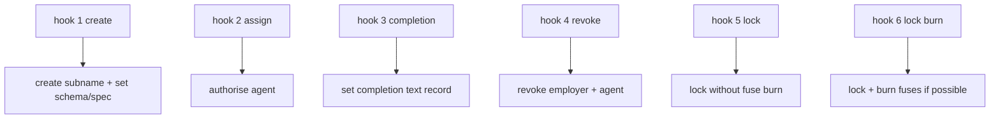
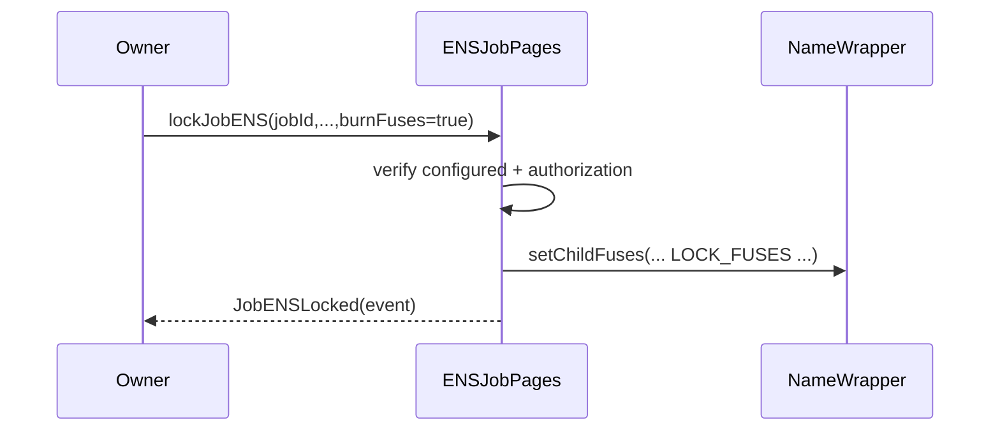

# ENSJobPages Contract Reference

## Purpose
Provide per-job ENS pages (`job-<id>.<root>`) and optional `ens://` tokenURI source for completion NFTs.

## Audience
Operators integrating ENS metadata and auditors reviewing metadata-plane risk.

## Preconditions / Assumptions
- Contract has rights on configured ENS root (wrapped or unwrapped path).
- `jobManager` is set to deployed AGIJobManager address.
- Resolver supports required methods.

## Hook Lifecycle

## ENS Fuse/Lock Flow

## Roles
| Role | Permissions |
|---|---|
| Owner | All direct mutation/config calls |
| Job manager | `handleHook` only |

## Key Functions
- Config: `setENSRegistry`, `setNameWrapper`, `setPublicResolver`, `setJobsRoot`, `setJobManager`, `setUseEnsJobTokenURI`
- Naming helpers: `jobEnsLabel`, `jobEnsName`, `jobEnsURI`, `jobEnsNode`
- Hook endpoint: `handleHook(uint8,uint256)`
- Manual owner helpers: `createJobPage`, `onAgentAssigned`, `onCompletionRequested`, `revokePermissions`, `lockJobENS`

## Best-Effort Behavior
- Text updates and authorizations use best-effort calls; failures do not revert.
- This design keeps escrow settlement independent from ENS outages/misconfiguration.

## Failure Modes / Gotchas
- If root ownership/approvals are missing, wrapped root operations will fail.
- Empty root name or zero root node is rejected.
- `useEnsJobTokenURI` in this contract is independent from manager’s `useEnsJobTokenURI`; both must be set coherently if ENS tokenURI mode is desired.

## References
- [`../../contracts/ens/ENSJobPages.sol`](../../contracts/ens/ENSJobPages.sol)
- [`../../contracts/ens/IENSJobPages.sol`](../../contracts/ens/IENSJobPages.sol)
- [`../../test/ensJobPagesHooks.test.js`](../../test/ensJobPagesHooks.test.js)
