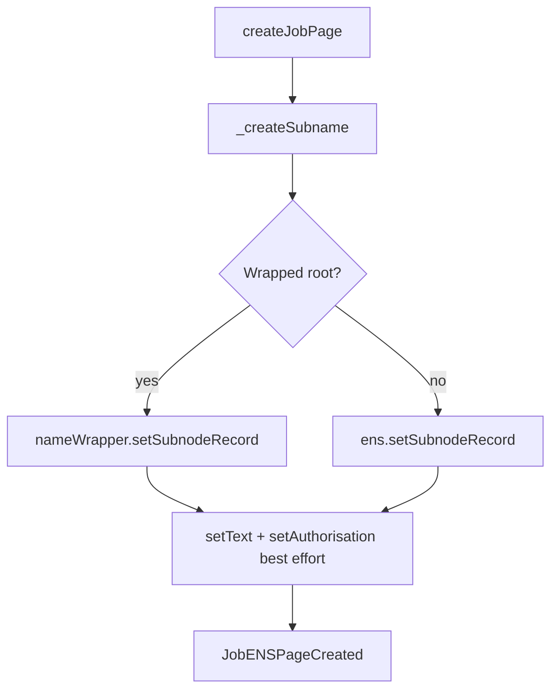
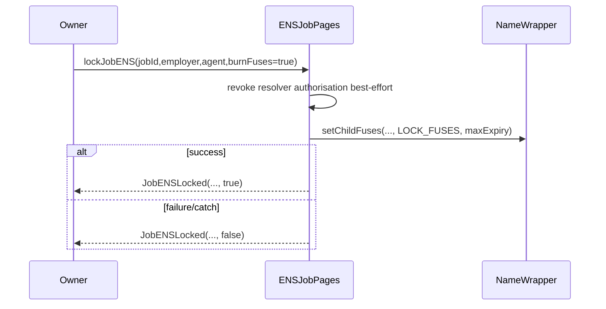

# ENSJobPages Contract Reference

## Purpose
Describe the optional ENS metadata publication helper used by AGIJobManager.

## Audience
Operators configuring ENS and auditors validating external-call behavior.

## Preconditions / assumptions
- A valid ENS registry, resolver, and optional NameWrapper are configured.
- Contract owner controls page lifecycle methods.

## Main responsibilities
- Build deterministic per-job labels (`job-<id>`) and nodes under `jobsRootNode`.
- Create subname records and publish text records (`schema`, job spec, completion URI).
- Delegate/revoke resolver authorisation for employer/agent (best-effort).
- Optionally lock ENS mutability and burn NameWrapper fuses.

## Roles and permissions
| Role | Permissions |
|---|---|
| Owner | Configuration setters, manual page operations, hook handling entrypoints. |
| `jobManager` address | `handleHook(uint8,uint256)` calls when configured by owner. |

## Hook map (as consumed by AGIJobManager)
| Hook | Meaning |
|---|---|
| `1` | Create page for job + authorise employer + set spec text. |
| `2` | Agent assigned: authorise agent. |
| `3` | Completion requested: set completion text. |
| `4` | Revoke employer/agent permissions. |
| `5` | Lock permissions (no fuse burn). |
| `6` | Lock permissions + attempt NameWrapper fuse burn. |

## ENS lifecycle

## Fuse lock flow

## Gotchas / failure modes
- Resolver operations are intentionally best-effort (`try/catch`) to avoid blocking core escrow flows.
- If root ownership/approval is misconfigured, wrapped-root writes revert with `ENSNotAuthorized`.
- Empty `jobsRootName` or zeroed essential addresses trigger `ENSNotConfigured`.

## References
- [`../../contracts/ens/ENSJobPages.sol`](../../contracts/ens/ENSJobPages.sol)
- [`../../contracts/ens/IENSJobPages.sol`](../../contracts/ens/IENSJobPages.sol)
- [`../../contracts/AGIJobManager.sol`](../../contracts/AGIJobManager.sol)
