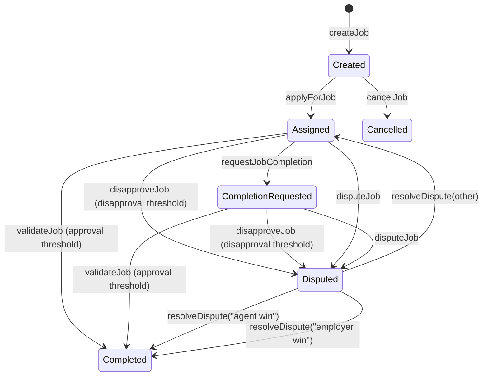

# Happy path walkthrough (non‑technical)

This walkthrough mirrors the **AGIJobManager Web UI** and uses the same field names. It is written so non‑technical users can complete a full job lifecycle without reading Solidity.

## Before you start

- **Confirm the chain/network** you are on (mainnet vs testnet).
- **Get the contract address** from a trusted source (deployment output, official docs, or a signed announcement).
- **Confirm the token address** by reading it from the contract (the UI shows this under **Contract snapshot → AGI Token**).
- **Approve token spending** before you:
  - create a job (employer), or
  - purchase a job NFT (buyer).

⚠️ **Warning**: On mainnet, transactions are irreversible and cost real funds. Double‑check the network and contract address before you click **Confirm**.

## Job state overview (simplified)



## 1) Connect wallet → choose network → set contract address

1. Open the UI: `docs/ui/agijobmanager.html` (GitHub Pages or local server).
2. Click **Connect Wallet**.
3. Check **Chain** and the **Network** pill. If you are not on the intended network, use **Switch**.
4. In **Contract address**, paste the deployment address and click **Save address**.
5. Click **Refresh snapshot** and confirm:
   - **AGI Token** address
   - **Token Symbol** / **Token Decimals**
   - **Owner** / **Paused**

**You should see**
- A green or yellow network pill (not “Not connected”).
- **Contract snapshot** fields populated (not “—”).

## 2) Verify token balance and allowance (employer or buyer)

1. In **Your role flags**, click **Refresh role flags**.
2. Check **AGI Token balance** and **AGI allowance**.
3. If allowance is too low, use **Approve AGI token** under **Employer actions**.

**You should see**
- **AGI Token balance** shows your token amount.
- **AGI allowance** shows approved amount for the contract.

## 3) Employer flow (create → validate → dispute if needed)

**Create job**
1. In **Employer actions**, fill:
   - **IPFS hash** (job description)
   - **Payout (token units)**
   - **Duration (seconds)**
   - **Details** (optional)
2. Click **Create job** and confirm the transaction.

**Wait for application and validation**
- An agent applies via **Apply for job**.
- Validators approve via **Validate job**.
- When approvals reach the threshold, the job completes and the NFT is minted.

**Dispute (if needed)**
- Use **Dispute job (employer)** with the **Job ID**.
- A moderator resolves using **Resolve dispute**.

**You should see**
- The job appears in **Jobs table** with status `Assigned` after an agent applies.
- After enough approvals, status becomes `Completed` and the **NFTs table** updates.

## 4) Agent flow (eligibility → apply → deliver → request completion)

**Check eligibility (preflight)**
1. In **Identity checks (preflight only)**:
   - **Identity type**: `Agent (agentRootNode)`
   - **Label only** (example: `helper`, **NOT** `helper.agent.agi.eth`)
   - **Merkle proof (JSON bytes32 array)** if required
2. Click **Run identity check** or **Evaluate Agent Eligibility**.

**Apply**
1. In **Agent actions**, fill:
   - **Job ID**
   - **Agent label (subdomain only)** → **label only**, not the full ENS name
   - **Merkle proof** (JSON array of 32‑byte hex strings)
2. Click **Apply**.

**Request completion**
1. Upload your completion output to IPFS.
2. In **Request completion**, fill:
   - **Job ID**
   - **Completion IPFS hash**
3. Click **Request completion**.

**You should see**
- **Agent eligibility** shows a green “Eligible” pill after preflight.
- The job status changes to `Completion requested` after you submit the completion hash.

## 5) Validator flow (eligibility → validate or disapprove)

**Check eligibility (preflight)**
1. In **Identity checks (preflight only)**:
   - **Identity type**: `Validator / Club (clubRootNode)`
   - **Label only** (example: `validator`, **NOT** `validator.club.agi.eth`)
   - **Merkle proof (JSON bytes32 array)** if required
2. Click **Run identity check** or **Evaluate Validator Eligibility**.

**Validate or disapprove**
1. In **Validator actions**, fill:
   - **Job ID**
   - **Validator label (subdomain only)** → **label only**, not the full ENS name
   - **Merkle proof** (JSON array of 32‑byte hex strings)
2. Click **Validate** *or* **Disapprove** (not both for the same job).

**You should see**
- The job’s **Approvals/Disapprovals** count increases in the **Jobs table**.

## 6) Moderator flow (resolve disputes)

1. In **Moderator actions**, fill:
   - **Job ID**
   - **Resolution string**
2. Use **Use “agent win”** or **Use “employer win”** for settlement.
3. Click **Resolve dispute**.

**Important**: Any other string only clears the dispute flag and does **not** settle funds.

## 7) Marketplace flow (list → delist → purchase)

**List an NFT**
1. In **List NFT**, enter **Token ID** and **Price (token units)**.
2. Click **List NFT**.

**Delist an NFT**
1. In **Delist NFT**, enter **Token ID**.
2. Click **Delist NFT**.

**Purchase an NFT**
1. In **Purchase NFT**, enter **Token ID**.
2. If **Approval status** shows “Approve required,” click **Approve token (listing price)**.
3. Click **Purchase NFT**.

## No UI? Use Etherscan or Truffle console

If you cannot use the web UI, you can still interact via:
- **Etherscan**: use the contract’s **Read** and **Write** tabs (wallet required for Write).
- **Truffle console**: read‑only calls are safe; transactions still cost gas.

### Truffle console examples (read‑only first)

Open a console:
```bash
truffle console --network mainnet
```

Read key contract values:
```javascript
const AGIJobManager = artifacts.require("AGIJobManager");
const jm = await AGIJobManager.deployed();
await jm.agiToken();
await jm.agentMerkleRoot();
await jm.validatorMerkleRoot();
```

> For write transactions, follow the same flows as the UI and confirm you are on the correct network.
