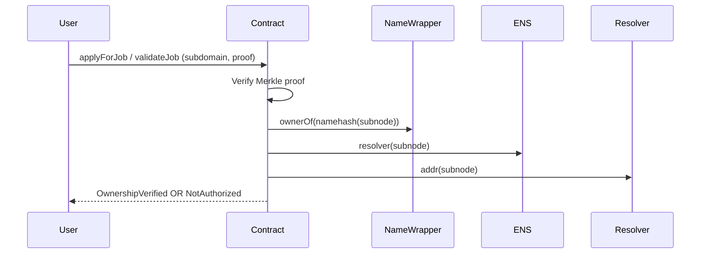
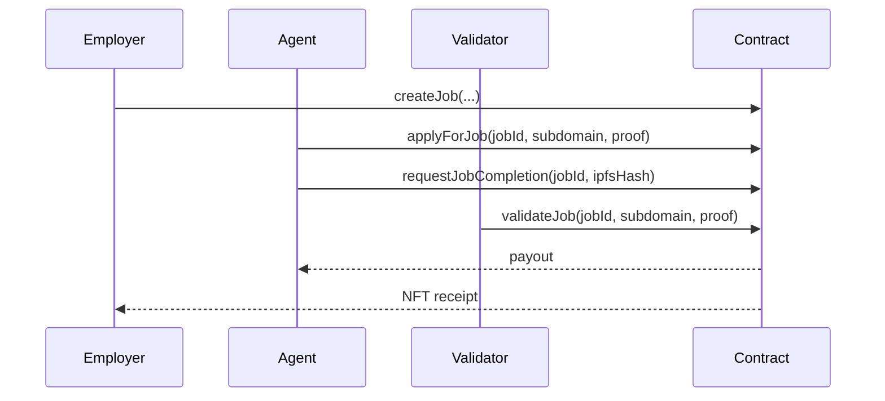
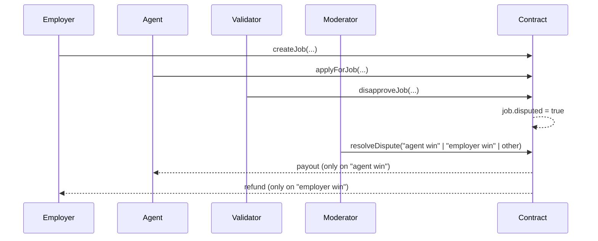

# AGI.Eth Namespace (env = alpha) — User Guide

This guide is **non‑technical** and written for institutions and end users who want to use the **AGI.Eth Namespace (alpha environment)** with the existing `AGIJobManager` smart contract. It explains naming, roles, the exact inputs the contract expects, and practical step‑by‑step flows for common roles.

> **Scope**: This guide explains how to use the **alpha** namespace (e.g., `helper.alpha.agent.agi.eth`) with **AGIJobManager** deployments that are configured with alpha root nodes at deploy time.

---

## 1) Quick orientation (plain English)

The AGI.Eth Namespace is a human‑readable identity system for agents, validators, and nodes. For the **alpha** environment, names include the `alpha` layer in the middle of the name. Example:

- **Agent**: `helper.alpha.agent.agi.eth`
- **Validator**: `alice.alpha.club.agi.eth`
- **Node (ecosystem convention)**: `gpu01.alpha.node.agi.eth`

When AGIJobManager checks your identity, it **does not** use the full ENS name. Instead, it expects **only the left‑most label** as input:

- `helper.alpha.agent.agi.eth` → `subdomain = "helper"`
- `alice.alpha.club.agi.eth` → `subdomain = "alice"`

The contract then combines your **subdomain label** with the **configured root node** (e.g., `alpha.agent.agi.eth` or `alpha.club.agi.eth`) to verify ownership.

---

## 2) Naming scheme (institutional standard)

The namespace grammar follows one rule:

```
<entity>.(<env>.)<role>.agi.eth
```

- **entity** = the unique name for the person/system (e.g., `alice`, `helper`, `gpu01`)
- **env** = optional environment layer (e.g., `alpha`, `x`, etc.)
- **role** = `agent`, `club` (validator), or `node`

### Role examples (alpha vs non‑alpha)

| Role | Non‑alpha | Alpha (env = alpha) | What the user passes to `subdomain` |
| --- | --- | --- | --- |
| Validator (club) | `alice.club.agi.eth` | `alice.alpha.club.agi.eth` | `"alice"` |
| Agent | `helper.agent.agi.eth` | `helper.alpha.agent.agi.eth` | `"helper"` |
| Node (convention) | `gpu01.node.agi.eth` | `gpu01.alpha.node.agi.eth` | `"gpu01"` |

> **Important:** The contract does **not** accept the full ENS name as `subdomain`. Use only the left‑most label.

### What changes between alpha and non‑alpha (same label, different root)

| Example | Non‑alpha name | Alpha name | What changes for the user |
| --- | --- | --- | --- |
| Validator | `alice.club.agi.eth` | `alice.alpha.club.agi.eth` | The **root node** changes (`club.agi.eth` vs `alpha.club.agi.eth`), but the **`subdomain` label stays** `"alice"`. |
| Agent | `helper.agent.agi.eth` | `helper.alpha.agent.agi.eth` | The **root node** changes (`agent.agi.eth` vs `alpha.agent.agi.eth`); you still pass `"helper"`. |

**Operational implication:** an alpha‑configured deployment only accepts **alpha** names because its root nodes are fixed at deploy time.

---

## 3) What AGIJobManager checks (in order)

When you call `applyForJob` (agent) or `validateJob` / `disapproveJob` (validator), the contract checks **one** of the following identity methods, in this order:

1. **Merkle allowlist**: your wallet address is in the allowlist proof.
2. **NameWrapper ownership**: you own the subdomain under the configured root node.
3. **ENS resolver address**: the resolver for the subdomain points to your wallet.

If **any** of the above succeeds, you pass. If **all** fail, the transaction reverts.

> **Owner‑managed bypass:** the contract owner can add you to `additionalAgents` or `additionalValidators`, which bypasses all identity checks.

> **Blacklist:** the owner can also blacklist agents or validators, which always blocks access.

---

## 4) Step‑by‑step “click‑by‑click” guides by role

These steps assume you are using a block explorer like Etherscan and have the contract address.

### A) Employer — create and fund a job

1. **Acquire tokens** (AGI or the configured ERC‑20).
2. **Approve allowance** for the AGIJobManager contract.
   - Go to the ERC‑20 contract → **Write Contract** → `approve(spender, amount)`
   - Use a **small, exact amount** (avoid unlimited approvals).
3. **Create a job**
   - Call `createJob(ipfsHash, payout, duration, details)`
   - `ipfsHash`: just the hash/CID (no `ipfs://` prefix)
   - `payout`: token amount in **wei** (18 decimals)
   - `duration`: seconds
4. **Track your jobId** from the `JobCreated` event.

**What happens on-chain**
- Tokens move into escrow when the job is created.
- An NFT is minted to you only after the job is completed and validated.

---

### B) Agent — apply and request completion

1. **Confirm your identity method** (one of):
   - You own `helper.alpha.agent.agi.eth` in NameWrapper, **or**
   - The ENS resolver for your subdomain points to your wallet, **or**
   - You are in the Merkle allowlist, **or**
   - The owner added you to `additionalAgents`.
2. **Apply for the job**
   - Call `applyForJob(jobId, subdomain, proof)`
   - `subdomain`: the left‑most label only (e.g., `"helper"`)
   - `proof`: Merkle proof array if allowlisted; otherwise `[]` (empty array)
3. **Request completion**
   - Call `requestJobCompletion(jobId, ipfsHash)`
   - Use a final IPFS hash that represents your deliverable.

**What happens on‑chain**
- `JobApplied` assigns you to the job.
- `JobCompletionRequested` updates the job’s IPFS hash.
- You are paid when validators approve (or when a moderator resolves dispute as “agent win”).

---

### C) Validator — approve or disapprove

1. **Confirm your identity method** (one of):
   - You own `alice.alpha.club.agi.eth` in NameWrapper, **or**
   - The ENS resolver for your subdomain points to your wallet, **or**
   - You are in the Merkle allowlist, **or**
   - The owner added you to `additionalValidators`.
2. **Approve the job**
   - Call `validateJob(jobId, subdomain, proof)`
3. **Disapprove if needed**
   - Call `disapproveJob(jobId, subdomain, proof)`

**Vote rules (strict)**
- A validator **cannot vote twice**.
- A validator **cannot both approve and disapprove** the same job.

---

### D) Moderator — resolve disputes

1. Call `resolveDispute(jobId, resolution)`.
2. Use one of the **exact** canonical strings:
   - `"agent win"` → triggers completion and payment to agent
   - `"employer win"` → refunds escrow to employer and finalizes job
3. Any **other string** still emits `DisputeResolved` but **does not** move funds.

---

### E) Owner / Operator — safety‑critical controls

The owner can:
- Pause/unpause the contract.
- Add/remove `additionalAgents` / `additionalValidators`.
- Manage blacklists.
- Adjust economic parameters (payout caps, validator thresholds, reward percentages).
- Withdraw escrowed ERC‑20.

Use a hardware wallet or multisig for the owner key.

---

## 5) Safety checklist (non‑technical)

Before doing anything on-chain:

- ✅ Confirm the **contract address** from a trusted source.
- ✅ Confirm the **token address** (ERC‑20 used for payout).
- ✅ Verify your ENS ownership in the ENS app.
- ✅ Confirm your ENS **resolver address** points to the wallet you will use.
- ✅ Use **small test amounts** first.
- ✅ Approve **only the amount you need**.
- ✅ Revoke approvals after completion (set allowance to 0).
- ✅ Ensure you’re on the right network (mainnet vs testnet vs local).

---

## 6) Practical troubleshooting

If a call fails with `NotAuthorized`, check:

- Are you passing only the left‑most label in `subdomain`?
- Does the contract deployment use **alpha** root nodes?
- Do you own the **alpha** ENS name or set the resolver correctly?
- Are you on the allowlist, or has the owner added you to `additionalAgents/Validators`?

---

## 7) Visual flows (Mermaid)

### Identity verification flow


### Happy‑path job lifecycle


### Dispute lifecycle


---

## 8) Next steps

- **Quickstart checklist**: [`AGI_ETH_NAMESPACE_ALPHA_QUICKSTART.md`](AGI_ETH_NAMESPACE_ALPHA_QUICKSTART.md)
- **Technical appendix**: [`ENS_IDENTITY_GATING.md`](ENS_IDENTITY_GATING.md)
- **FAQ / troubleshooting**: [`FAQ.md`](FAQ.md)
- **Testing coverage (local mocks)**: [`TESTING.md`](TESTING.md)
