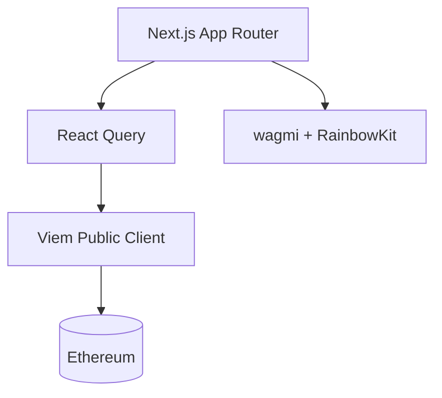
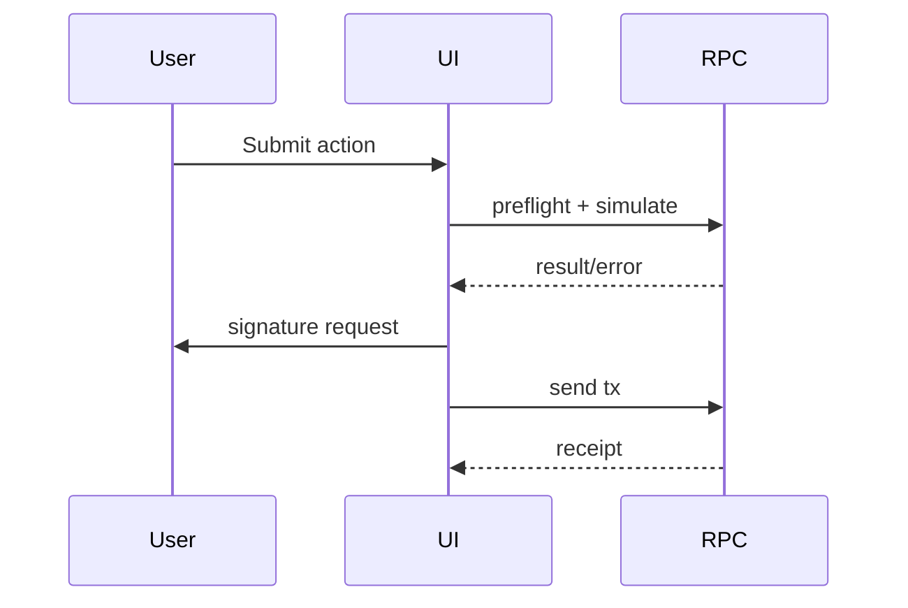

# UI Architecture

```mermaid
flowchart TD
  UI[Next.js App Router] --> Q[React Query]
  Q --> RPC[Viem Public Client]
  UI --> W[wagmi + RainbowKit]
  RPC --> Chain[(Ethereum)]
```

```mermaid
sequenceDiagram
participant U as User
participant UI as UI
participant RPC as RPC
U->>UI: Submit action
UI->>RPC: preflight + simulate
RPC-->>UI: result/error
UI->>U: signature request
UI->>RPC: send tx
RPC-->>UI: receipt
```
