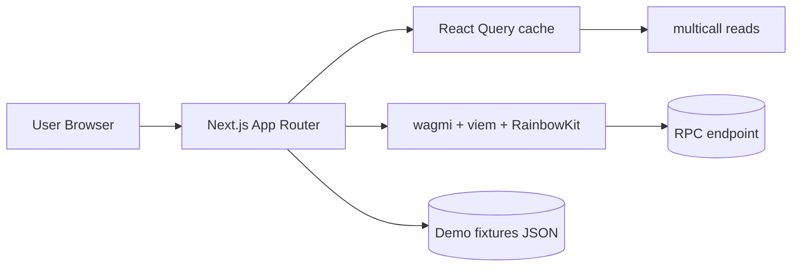
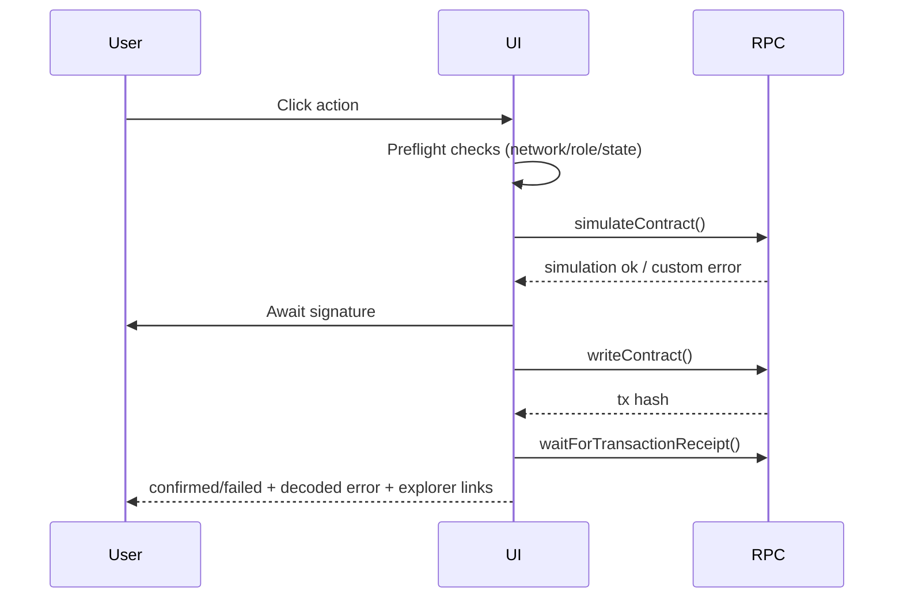

# UI Architecture

## Route map
```mermaid
flowchart TD
  A[/] --> B[/jobs]
  B --> C[/jobs/{jobId}]
  A --> D[/admin]
  A --> E[/design]
  A --> F[/demo]
```

## High-level architecture


## Transaction pipeline

