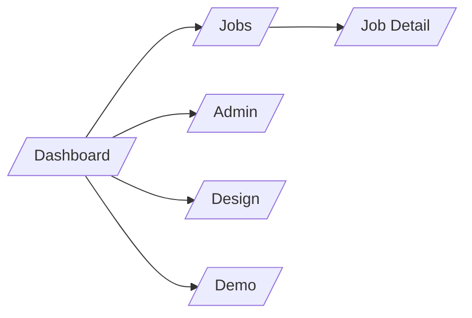
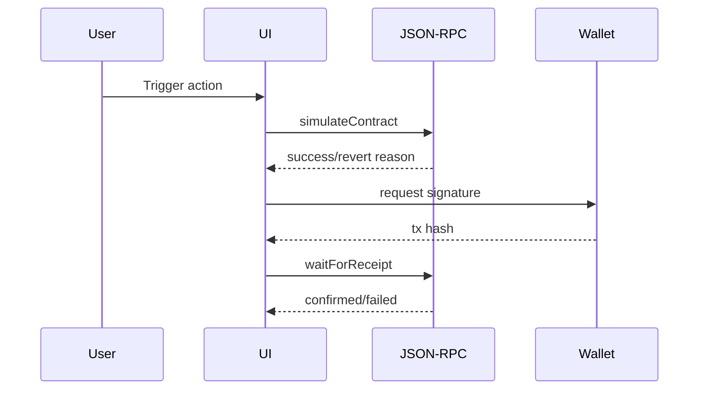

# UI Architecture

```mermaid
flowchart LR
  A[/Dashboard/] --> B[/Jobs/]
  B --> C[/Job Detail/]
  A --> D[/Admin/]
  A --> E[/Design/]
  A --> F[/Demo/]
```

```mermaid
sequenceDiagram
  participant U as User
  participant UI as UI
  participant RPC as JSON-RPC
  participant W as Wallet
  U->>UI: Trigger action
  UI->>RPC: simulateContract
  RPC-->>UI: success/revert reason
  UI->>W: request signature
  W-->>UI: tx hash
  UI->>RPC: waitForReceipt
  RPC-->>UI: confirmed/failed
```
