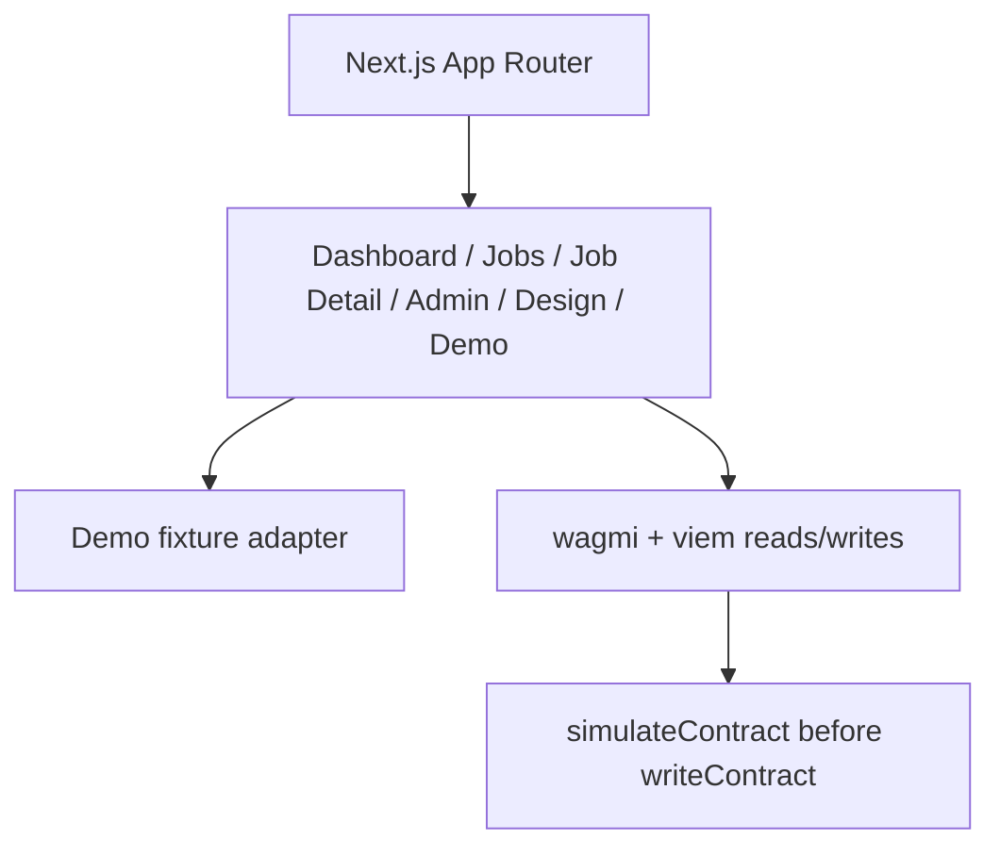
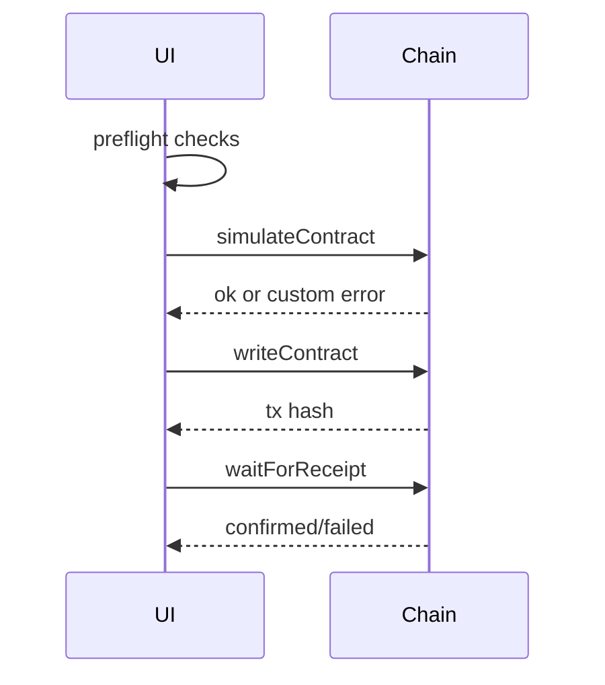

# Architecture

```mermaid
flowchart TD
  A[Next.js App Router] --> B[Dashboard / Jobs / Job Detail / Admin / Design / Demo]
  B --> C[Demo fixture adapter]
  B --> D[wagmi + viem reads/writes]
  D --> E[simulateContract before writeContract]
```

```mermaid
sequenceDiagram
  participant UI
  participant Chain
  UI->>UI: preflight checks
  UI->>Chain: simulateContract
  Chain-->>UI: ok or custom error
  UI->>Chain: writeContract
  Chain-->>UI: tx hash
  UI->>Chain: waitForReceipt
  Chain-->>UI: confirmed/failed
```
