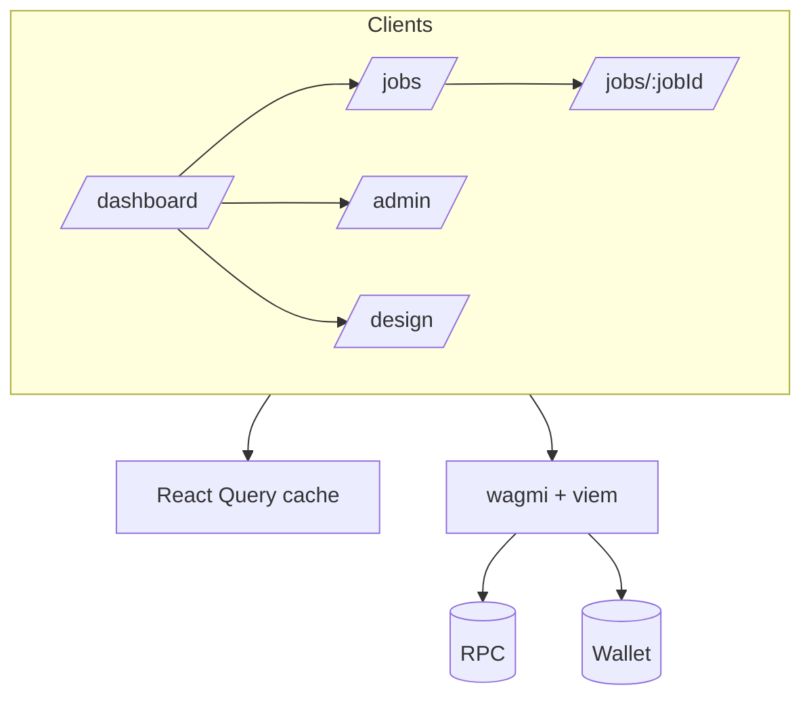
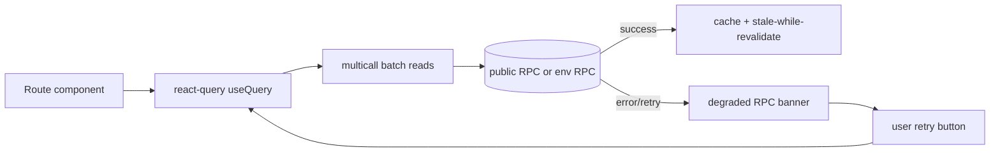
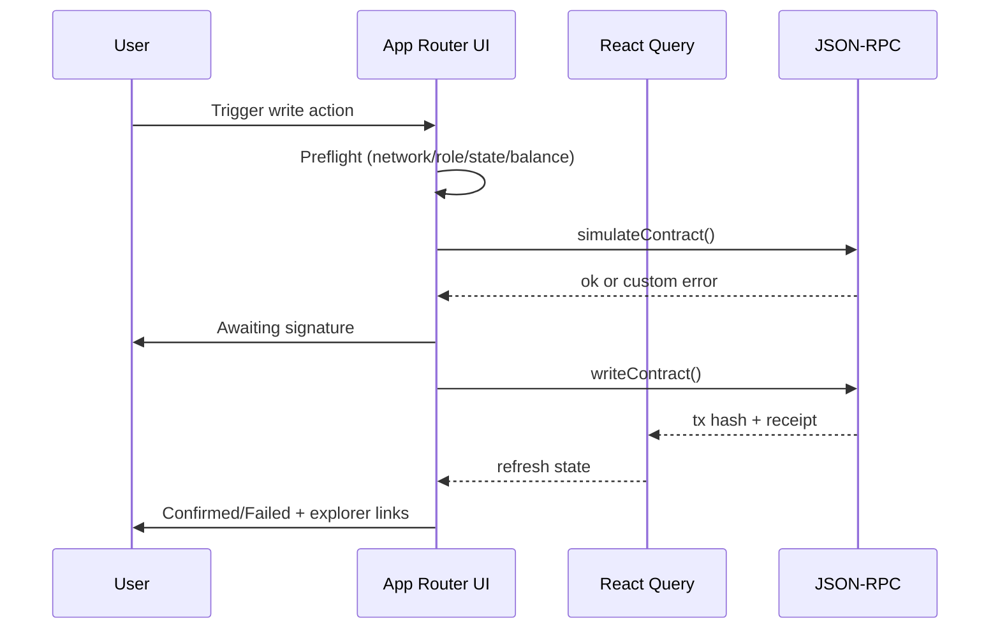

# UI Architecture

| Failure mode | Detection point | UI behavior |
|---|---|---|
| RPC unavailable | query error / timeout | Degraded RPC banner, retain last data, show Retry |
| Chain mismatch | wallet chain id check | network mismatch banner + write disabled |
| Simulation revert | `simulateContract` throws | decode custom error + remediation guidance |
| Transaction dropped | receipt timeout | stepper marks failed with explorer link + retry |
