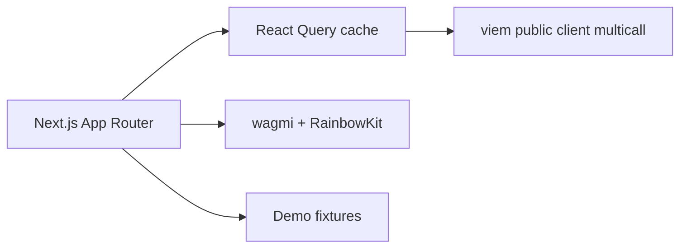
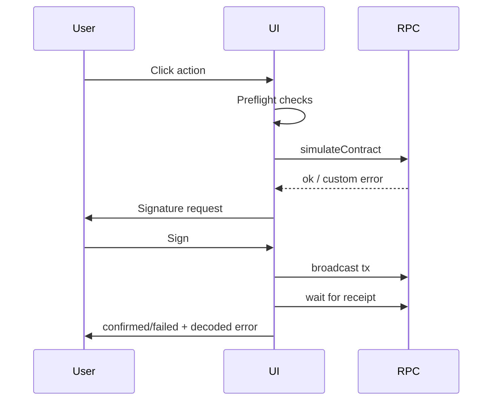

# UI Architecture

```mermaid
flowchart TD
  A[/] --> B[/jobs]
  B --> C[/jobs/:jobId]
  A --> D[/admin]
```

```mermaid
flowchart LR
  UI[Next.js App Router] --> Q[React Query cache]
  Q --> RPC[viem public client multicall]
  UI --> WALLET[wagmi + RainbowKit]
  UI --> DEMO[Demo fixtures]
```

```mermaid
sequenceDiagram
  participant U as User
  participant UI as UI
  participant RPC as RPC
  U->>UI: Click action
  UI->>UI: Preflight checks
  UI->>RPC: simulateContract
  RPC-->>UI: ok / custom error
  UI->>U: Signature request
  U->>UI: Sign
  UI->>RPC: broadcast tx
  UI->>RPC: wait for receipt
  UI->>U: confirmed/failed + decoded error
```
