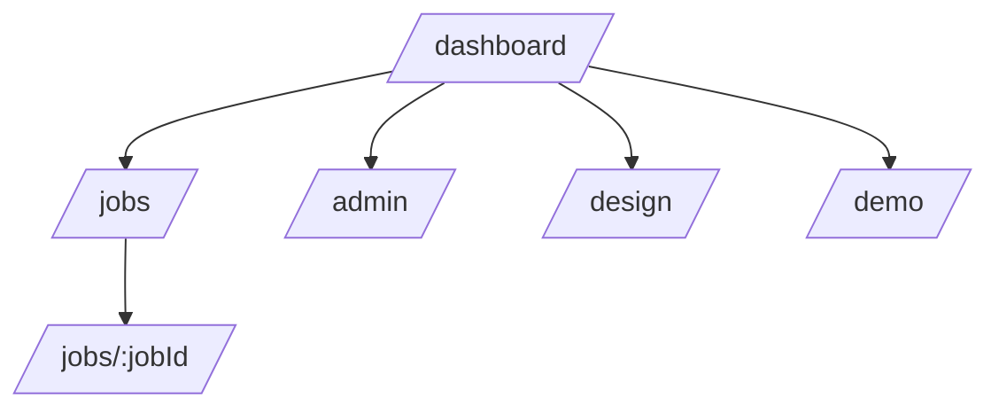
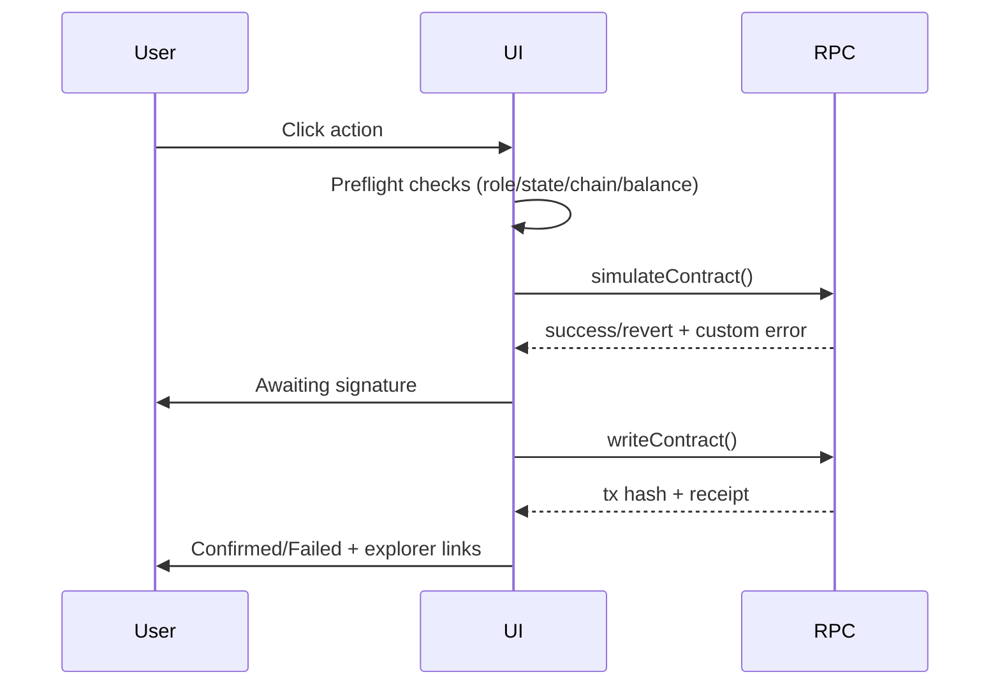

# UI Architecture

```mermaid
flowchart TD
  A[/dashboard/] --> B[/jobs/]
  B --> C[/jobs/:jobId/]
  A --> D[/admin/]
  A --> E[/design/]
  A --> F[/demo/]
```

```mermaid
sequenceDiagram
  participant U as User
  participant UI as UI
  participant RPC as RPC
  U->>UI: Click action
  UI->>UI: Preflight checks (role/state/chain/balance)
  UI->>RPC: simulateContract()
  RPC-->>UI: success/revert + custom error
  UI->>U: Awaiting signature
  UI->>RPC: writeContract()
  RPC-->>UI: tx hash + receipt
  UI->>U: Confirmed/Failed + explorer links
```
