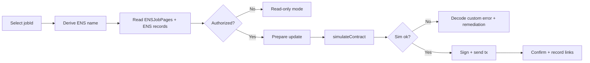

# Identity Layer Console (ENSJobPages)

The Sovereign Ops Console includes a dedicated `#/identity` route for ENS Job Pages operations on Ethereum mainnet.

## Intent

AGIJobManager is designed for autonomous agent workflows with human owner/operator oversight. The identity layer adds deterministic per-job naming and records for machine and human discoverability.

## Mainnet registry

- ENSJobPages: deployment and manager wiring required; no official v1.0.0 address is configured.
- Connected AGIJobManager: a newly deployed and verified v1.0.0 USDC manager (required; no default).
- Active registry: [`config/usdc-deployment.json`](../../config/usdc-deployment.json), currently `deployment-required`.
- Fresh root namespace: `usdc-1-<full-lowercase-manager-address-without-0x>.alpha.jobs.agi.eth`, derived by current deployment tooling; see the [namespace policy](../ENS/DEPLOYMENT_NAMESPACES.md). No live USDC root is supplied.
- Fresh labels: `job-<jobId>`. For existing jobs, read the helper's effective name; never reconstruct saved labels from a current prefix.
- Preserve the legacy `alpha.jobs.agi.eth` namespace and its existing helper.

The historical ENSJobPages v0.2.0 address `0xc19A84D10ed28c2642EfDA532eC7f3dD88E5ed94` and baseline block `24531331` are legacy references, not a verified v1.0.0 deployment. Follow the [replacement and wiring guide](../DEPLOYMENT/ENS_JOB_PAGES_MAINNET_REPLACEMENT.md) before configuring an identity deployment.

## Operational workflow



## Safety controls

- Read-only-first path always available without wallet.
- Writes are simulation-first and blocked in demo mode.
- Untrusted URI/text records are copy-first with scheme allowlist (`https://`, `ipfs://`, `ens://`; optional `http://` depending on settings).
- Chain mismatch, degraded RPC, and permission denial are surfaced as explicit banners.

## Agent export shape

Identity route exports JSON snapshots for autonomous agents. This example uses a fictional manager address; actual exports must use the configured helper's effective name:

```json
{
  "chainId": 1,
  "jobId": 42,
  "name": "job-42.usdc-1-1111111111111111111111111111111111111111.alpha.jobs.agi.eth",
  "resolver": "0x...",
  "records": {
    "contenthash": "ipfs://...",
    "url": "https://..."
  },
  "simulateFirst": true,
  "warnings": []
}
```
