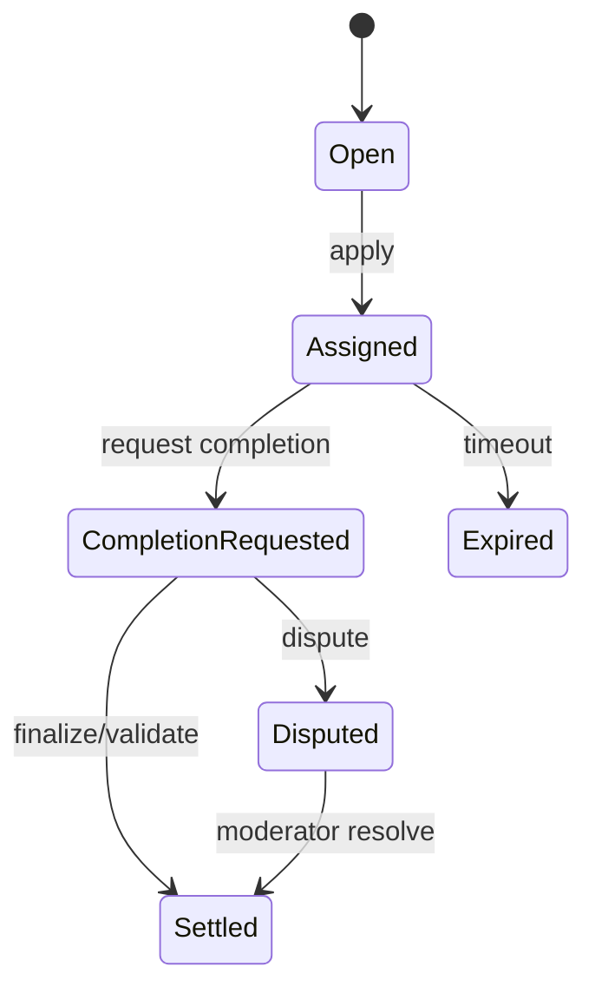

# Job Lifecycle

| Action | Employer | Agent | Validator | Moderator | Owner |
|---|---|---|---|---|---|
| cancelJob | ✅ | ❌ | ❌ | ❌ | ❌ |
| requestJobCompletion | ❌ | ✅ | ❌ | ❌ | ❌ |
| validateJob | ❌ | ❌ | ✅ | ❌ | ❌ |
| resolveDisputeWithCode | ❌ | ❌ | ❌ | ✅ | ❌ |
| lockJobENS | ❌ | ❌ | ❌ | ❌ | ✅ |
