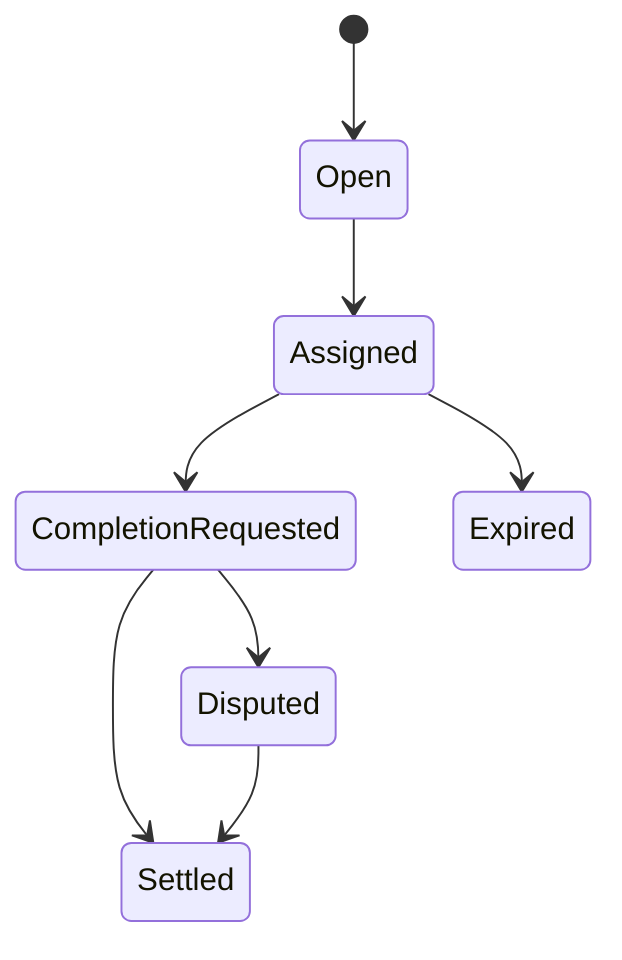

# Job Lifecycle

| Role | cancelJob | finalizeJob | disputeJob | validate/disapprove | resolveDisputeWithCode | pause |
|---|---|---|---|---|---|---|
| Employer | yes (pre-assignment) | yes (eligible windows) | yes | no | no | no |
| Agent | no | no | yes | no | no | no |
| Validator | no | no | no | yes | no | no |
| Moderator | no | no | no | no | yes | no |
| Owner | no | no | no | no | no | yes |
