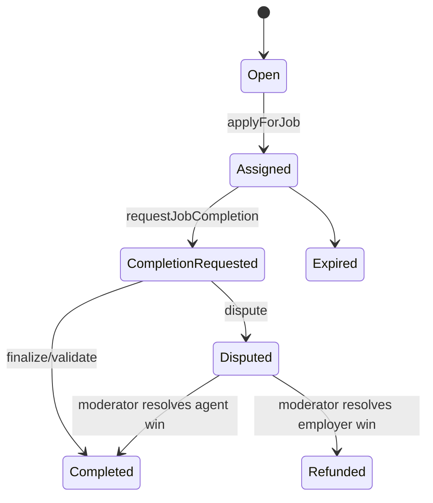

# Job Lifecycle

| Action | Employer | Agent | Validator | Moderator | Owner |
| --- | --- | --- | --- | --- | --- |
| cancelJob | Open/Assigned | - | - | - | - |
| applyForJob | - | Open | - | - | - |
| requestJobCompletion | - | Assigned | - | - | - |
| validateJob/disapproveJob | - | - | CompletionRequested | - | - |
| resolveDisputeWithCode | - | - | - | Disputed | - |
| lockJobENS | - | - | - | - | Disputed |
