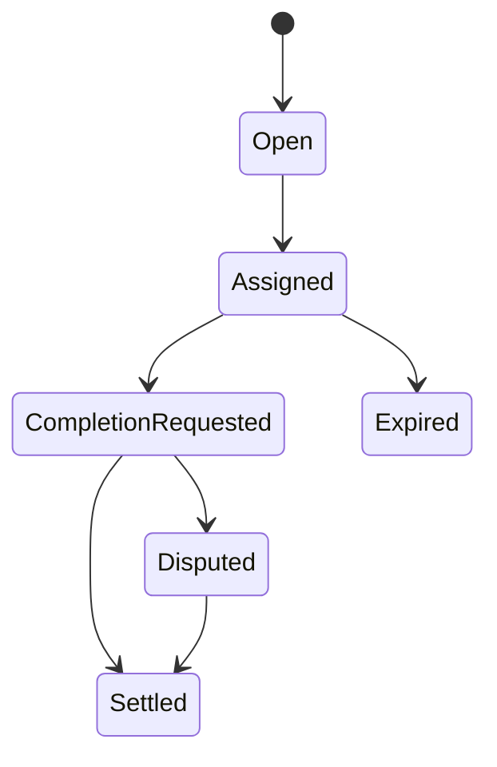

# Job Lifecycle

| Action | Employer | Agent | Validator | Moderator | Owner |
| --- | --- | --- | --- | --- | --- |
| cancelJob | ✅ pre-assignment | ❌ | ❌ | ❌ | ❌ |
| requestJobCompletion | ❌ | ✅ assigned | ❌ | ❌ | ❌ |
| validate/disapprove | ❌ | ❌ | ✅ role-gated | ❌ | ❌ |
| resolveDisputeWithCode | ❌ | ❌ | ❌ | ✅ disputed | ❌ |
| lockJobENS | ❌ | ❌ | ❌ | ❌ | ✅ |
