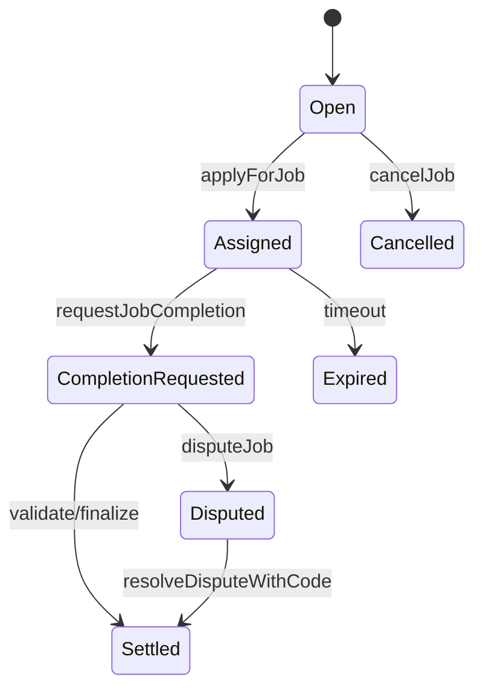

# Job Lifecycle

## Permissions matrix
| Action | Employer | Agent | Validator | Moderator | Owner | Conditions |
|---|---:|---:|---:|---:|---:|---|
| createJob | ✅ | ❌ | ❌ | ❌ | ❌ | wallet, allowance, not paused |
| applyForJob | ❌ | ✅ | ❌ | ❌ | ❌ | open job, role eligible |
| requestJobCompletion | ❌ | ✅ | ❌ | ❌ | ❌ | assigned to caller |
| validate/disapprove | ❌ | ❌ | ✅ | ❌ | ❌ | completion requested, within review |
| disputeJob | ✅ | ✅ | ❌ | ❌ | ❌ | in review window |
| resolveDisputeWithCode | ❌ | ❌ | ❌ | ✅ | ❌ | disputed state |
| pause/settlement controls | ❌ | ❌ | ❌ | ❌ | ✅ | owner only |

## Timing windows
| Derived window | Formula | UX behavior |
|---|---|---|
| Assignment expiry | `assignedAt + duration` | Shows next deadline and timeout warnings |
| Completion review end | `completionRequestedAt + completionReviewPeriod` | Enables dispute controls until end |
| Dispute review end | `disputedAt + disputeReviewPeriod` | Guides moderator resolution urgency |
