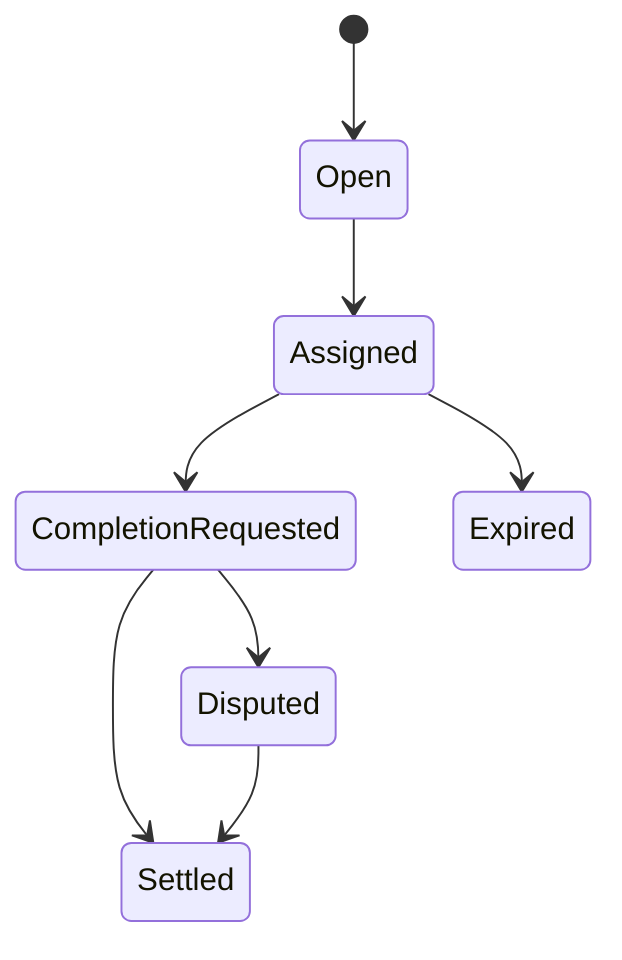

# Job Lifecycle

| Action | Employer | Agent | Validator | Moderator | Owner |
| --- | --- | --- | --- | --- | --- |
| applyForJob |  | ✅ |  |  |  |
| requestJobCompletion |  | ✅ |  |  |  |
| finalizeJob | ✅ |  |  |  |  |
| validate/disapprove |  |  | ✅ |  |  |
| resolveDisputeWithCode |  |  |  | ✅ |  |
| lockJobENS |  |  |  |  | ✅ |
