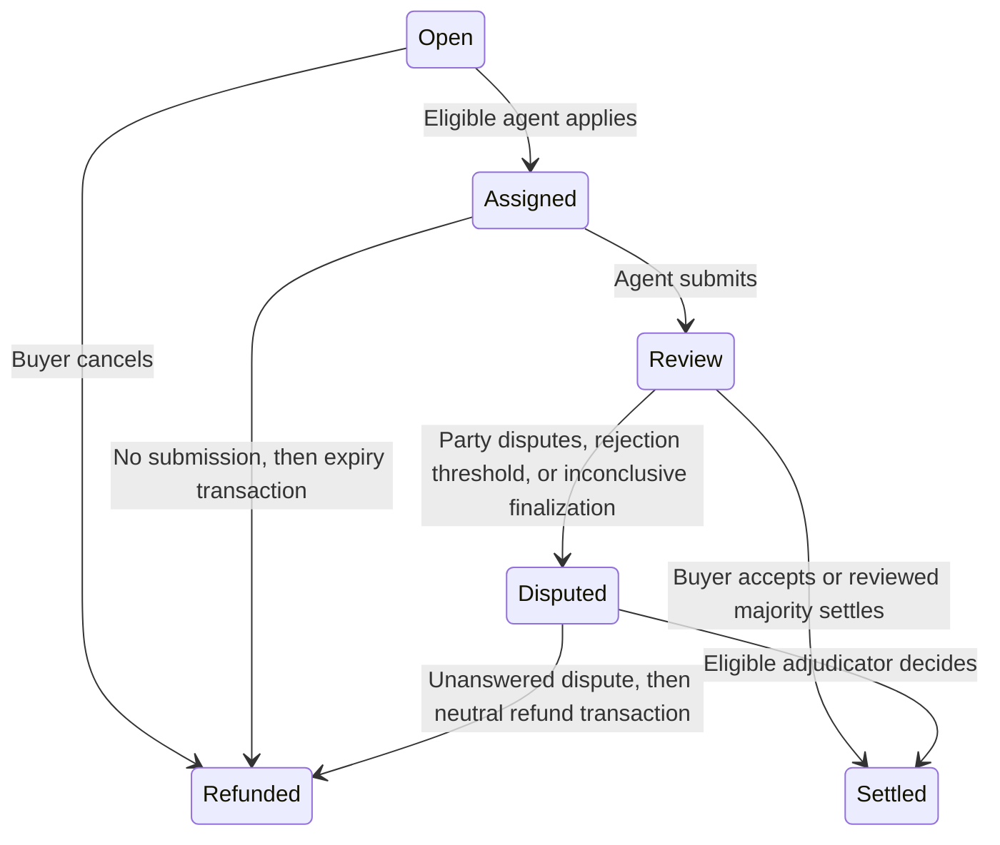

# Job lifecycle: what to do next

```mermaid
stateDiagram-v2
  direction TB
  Open --> Assigned: Eligible agent applies
  Open --> Refunded: Buyer cancels
  Assigned --> Refunded: No submission, then expiry transaction
  Assigned --> Review: Agent submits
  Review --> Settled: Buyer accepts or reviewed majority settles
  Review --> Disputed: Party disputes, rejection threshold, or inconclusive finalization
  Disputed --> Settled: Eligible adjudicator decides
  Disputed --> Refunded: Unanswered dispute, then neutral refund transaction
```

Here “Refunded” groups the refund paths for readability. “Settled” can mean an agent payment or a buyer-win refund. The contract exposes flags, not this diagram's state labels.

| Situation | Who can act | Action and outcome |
| --- | --- | --- |
| Open, unassigned | Buyer | Cancel for a full escrow return |
| Open, unassigned | Eligible agent | Apply; the first successful application assigns immediately |
| Assigned, before submission deadline | Assigned agent | Submit the completion URI once |
| Assigned, deadline passed, no submission | Anyone | Expire; buyer receives full escrow and forfeited agent bond |
| Submitted, undisputed | Buyer | Accept satisfactory work and pay immediately; acceptance is final |
| Submitted, within validator review | Eligible independent validator | Approve or reject once, posting the job's validator bond |
| Submitted, through dispute cutoff | Buyer or assigned agent | Open a dispute with the quoted bond |
| Full review and any longer challenge ended | Anyone | Finalize; quorum plus majority decides, otherwise a dispute opens |
| Active dispute | Eligible moderator | Adjudicate for buyer or agent; a note alone leaves it open |
| Active dispute after owner deadline | Eligible owner | Adjudicate using the owner backstop |
| Active dispute after neutral deadline | Anyone | Return buyer escrow and each participant's own bond without fees or penalties |
| Reserved USDC payment | Anyone | Retry to the original beneficiary when USDC permits it |

Time passing does not send transactions. Settlement pauses block the actions above and extend the clocks; intake-only pauses block posting and assignment while allowing existing jobs to continue. No on-chain check establishes off-chain work quality or independence of different people.

## Authoritative dates

Read `getJobDeadlines(jobId)` for `assignmentDeadline`, `reviewEnd`, `settlementAfter`, `ownerResolutionAfter` and `neutralRefundAfter`. Zero means that stage has not started. Submission, validator voting and party disputes include their respective endpoint; expiry, finalization, owner resolution and neutral refund require time strictly after their endpoint. A late approval can extend `settlementAfter` beyond `reviewEnd`.

Do not derive live dates by adding raw timestamps and durations: settlement pauses change the result. Dashboard demo dates are illustrative only. If exact reads fail, show dates as unknown rather than enabling time-sensitive advice.

## Interpret terminal states carefully

`completed` means settled and can include a buyer-win refund; it does not prove an agent was paid. `expired` includes the neutral unresolved-dispute refund as well as expiry for non-delivery. A completion NFT does not prove every USDC transfer reached its recipient. Use the transaction events, token transfers and `pendingUSDC(beneficiary)` to establish the actual outcome.

ENS locking without fuse burning is available to anyone for completed/expired jobs; fuse burning remains owner-only. The hook is best-effort and is separate from settlement.

See [buyer outcomes](../BUYER_PROTECTION.md), [status derivation](../JobStatus.md) and [the money split](../USDC_PAYOUT_SPLIT.md).
