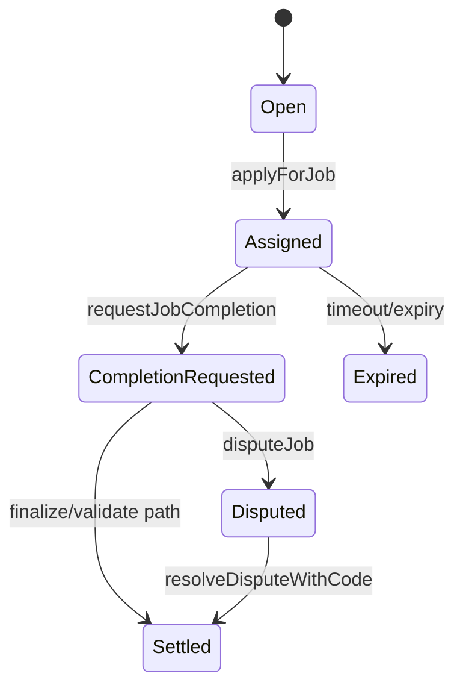

# Job Lifecycle

## Permissions matrix
| Action | Employer | Agent | Validator | Moderator | Owner |
|---|---|---|---|---|---|
| cancelJob | Open/Assigned | - | - | - | - |
| finalizeJob | CompletionRequested | - | - | - | - |
| applyForJob | - | Open | - | - | - |
| requestJobCompletion | - | Assigned | - | - | - |
| validateJob/disapproveJob | - | - | CompletionRequested | - | - |
| resolveDisputeWithCode | - | - | - | Disputed | - |
| lockJobENS | - | - | - | - | Settled |

## Timing windows
| Window | Formula | Notes |
|---|---|---|
| Job expiry | `assignedAt + duration` | Empty when unassigned |
| Completion review end | `completionRequestedAt + completionReviewPeriod` | Inclusive edge messaging in UI |
| Dispute review end | `disputedAt + disputeReviewPeriod` | Used for moderator guidance |
