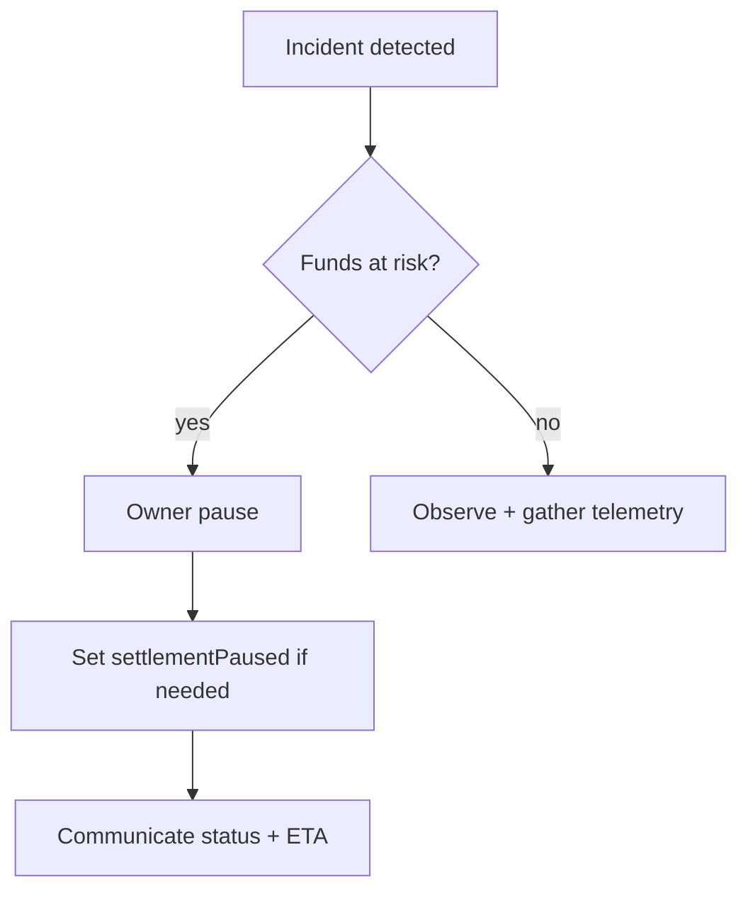
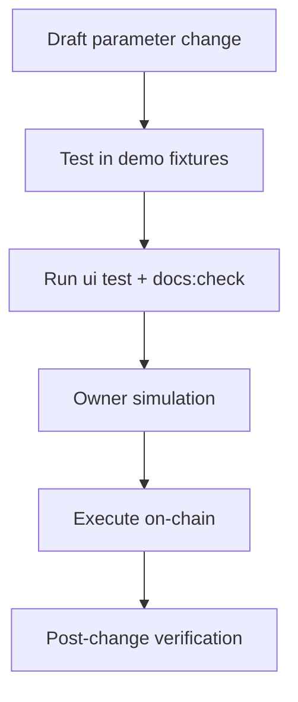

# Ops Runbook

## Incident response (pause control)

## Safe parameter change

## Operational checklists
- **Pause / unpause**: typed confirmation, simulation success, broadcast, verify banners.
- **Dispute moderation**: record reason code (0/1/2), attach rationale, verify final state.
- **Identity lock**: dry-run once, formal sign-off, execute only after registry wiring is final.
- **Treasury withdrawal**: only while `paused && !settlementPaused`, verify `withdrawableAGI` and escrow solvency.
