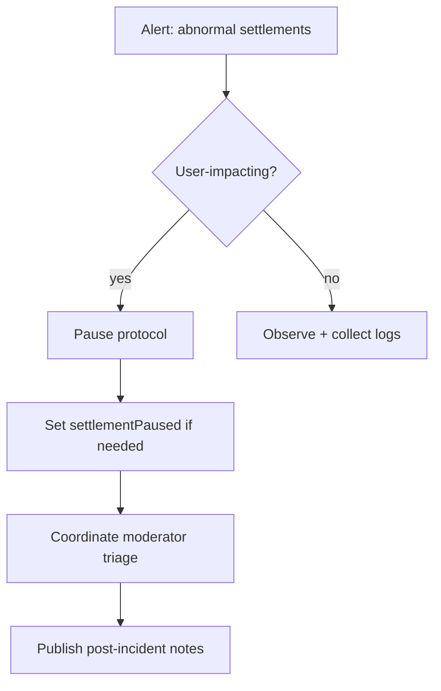
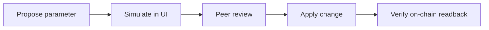

# Ops Runbook

## Incident response

## Safe parameter changes

## Checklist table
| Procedure | Preconditions | Confirmation phrase |
|---|---|---|
| Pause/Unpause | Owner role verified | `PAUSE` |
| Settlement pause toggle | Owner role verified | `SETTLEMENT` |
| Lock identity config | Final ENS/merkle values frozen | `LOCK` |
| Withdraw AGI | paused=true and settlementPaused=false | `WITHDRAW` |
