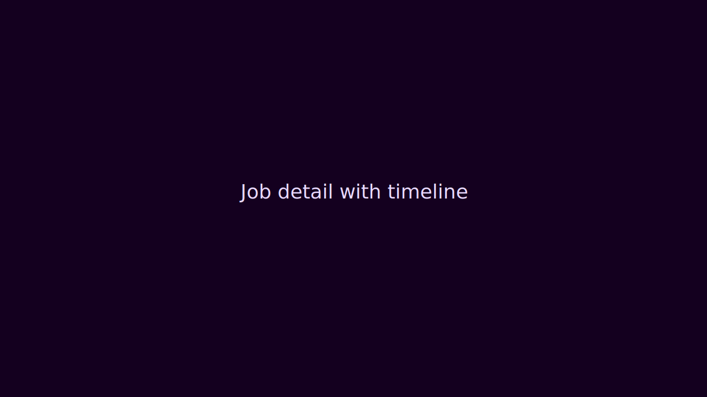

# AGIJobManager Institutional UI Overview

This Next.js UI is a read-only-first dapp + ops console for employers, agents, validators, moderators, and owners.

## Modes

- **Read-only mode**: no wallet required; all dashboards and job pages work.
- **Wallet mode**: write actions are role-gated and simulation-first.
- **Demo mode** (`NEXT_PUBLIC_DEMO_MODE=1`): deterministic fixtures, writes disabled.

## Screenshot gallery

