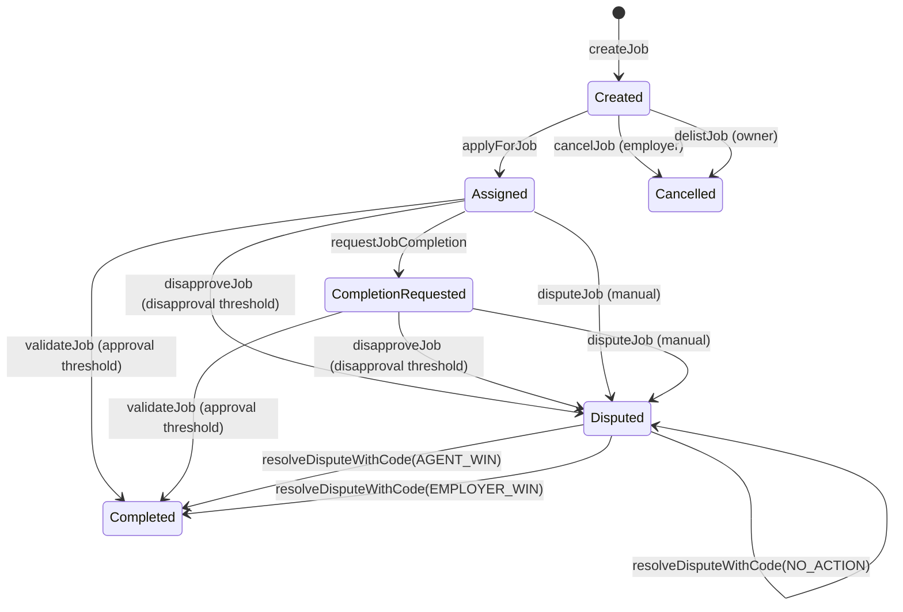

# Happy path walkthrough (end‑to‑end)

This walkthrough shows a full job lifecycle for **Employer → Agent → Validator → Moderator**. It avoids Solidity and focuses on real actions.

## Before you start

1. **Confirm the network** (e.g., Sepolia vs Mainnet) matches the deployment.
2. **Confirm the contract address** from a trusted source (deployment output, official announcement, or UI page).
3. **Read the token address** directly from the contract:
   - `agiToken()` (read‑only)
4. **Approve token spend** for actions that move AGI tokens:
   - Employer: `createJob` (escrow payout)
   - Buyer: `purchaseNFT`
   - Contributor: `contributeToRewardPool`

> **Label‑only rule (important):** When the UI asks for a subdomain or identity, enter the **label only**.
> - ✅ `helper`
> - ❌ `helper.agent.agi.eth`
> The contract derives the ENS node from a **fixed root node + your label**, so full names won’t match.

## Happy path (full lifecycle)

### Employer flow
1. **Approve token spend** for the payout amount.
2. **Create job** with:
   - IPFS hash (job details)
   - Payout
   - Duration
   - Details string
3. **Wait** for an agent to apply.
4. **Optional:** dispute if needed.
5. **Receive job NFT** upon completion.

### Agent flow
1. **Check eligibility** (allowlist/Merkle/ENS) using label only.
2. **Apply** to the job.
3. **Deliver work off‑chain.**
4. **Request completion** with updated IPFS hash.

### Validator flow
1. **Check eligibility** (allowlist/Merkle/ENS) using label only.
2. **Approve or disapprove** the job.
3. **Repeat** until approval/disapproval threshold is reached.

### Moderator flow (only if disputed)
1. **Confirm the job is disputed.**
2. **Resolve** with:
   - `"agent win"` → agent paid + job complete
   - `"employer win"` → employer refunded + job closed

## Job status overview (state machine)

## If something fails

Go straight to the [Common revert reasons](common-reverts.md) table for fixes and checklists.
